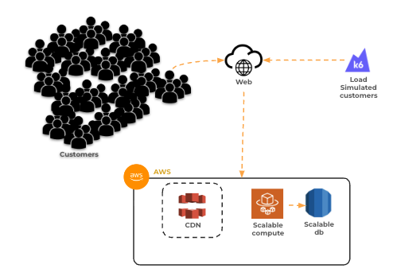
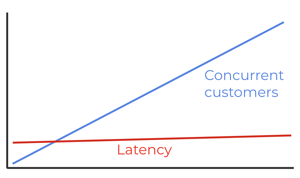
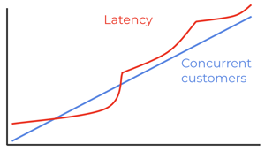

# Load Testing

🔑 **Key points**

- Load testing is a critical protection against system failure.

---

Load testing is the process of placing demands on an application in order to determine its performance, scalability, and elasticity. Load testing can identify performance bottlenecks in your application. If we are expecting 1,000 customers to be using our server at the same time, but our server can only handle 100 concurrent requests, it's helpful to know this before we make it available to our customers. We don't want to wait until we have success to realize our system can't handle success.

By deploying to AWS, we have taken steps to create a scalable application that allows us to automatically allocate more resources as demand increases. However, there is always some latency involved in deploying extra resources. We need to know how the application reacts when a new advertising promotion for JWT Pizza is wildly successful, and the number of customers spikes exponentially. Will the application scale up in time to handle the increased number of requests, or will customers be staring impatiently at their screen, waiting for their pizza to be delivered? Similarly, how well can the application handle many requests over an extended period of time?

With load testing you should be able to answer questions such as how does your number of concurrent customers impact request latency.

Is latency linear?

Or is it constant with usage, but it spikes as new resources come online?

Or does it go exponential and completely collapse at a certain level of usage?

The key value of load testing is that you can know how your application will perform before your company's reputation comes into question.

## Comparison to other types of testing

Load testing is similar to integration or end-to-end testing in that you can test how well the application works as a whole. The main difference is that load testing measures the performance of these systems by simulating large numbers of customers. For example, in the JWT Pizza application, an important load test would simulate ordering hundreds of pizzas at the same time.

## Types of load testing

There are several varieties of load testing that focus on different load characteristics.

| Type       | Purpose                                    | Description                                                                                                                                                                                               |
| ---------- | ------------------------------------------ | --------------------------------------------------------------------------------------------------------------------------------------------------------------------------------------------------------- |
| **Load**   | Expected load                              | Tests that the application can handle the expected number of customers.                                                                                                                                   |
| **Soak**   | Expected load over an extended time period | Tests that resource consumption does not increase over time. This commonly happens when you have memory, connection, or handle leaks.                                                                     |
| **Smoke**  | Low load                                   | A quick test that the application works for at least a single user. This is usually done as a prerequisite to deployment, or as a periodic customer simulation test.                                      |
| **Spike**  | Sudden increase in load                    | Tests how quickly your application can scale up and down.                                                                                                                                                 |
| **Stress** | Higher than expected load                  | Tests where your application fails to acquire the necessary resources for proper execution. There is always a bottleneck in every application. A good stress test will tell you where that bottleneck is. |

## Load testing

When testing JWT Pizza, we will focus on basic load testing, or testing with a normal expected load. In following instruction will discuss how to execute a load test using Grafana's open source load testing tool, K6.
