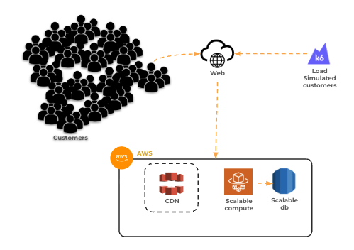
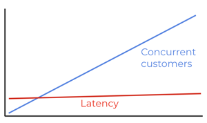
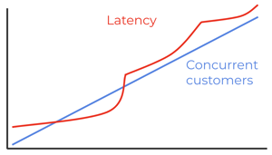
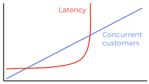

# Load Testing

🔑 **Key points**

- Load testing is a critical protection against system failure.
- It identifies performance bottlenecks before they affect real users.
- It validates that automated scaling (like AWS) responds quickly enough to meet demand.

---

Load testing is the process of simulating demand on an application to determine its performance, scalability, and elasticity. By putting the system under pressure, you can identify performance bottlenecks. For example, if you expect 1,000 concurrent customers but your server can only handle 100, it is vital to know this before launch. You don't want to wait until your application is successful to realize it cannot handle the weight of that success.

By deploying to a cloud provider like AWS, you can create a scalable application that automatically allocates more resources as demand increases. However, there is always some latency involved in provisioning extra resources. You need to know how the application reacts when a new promotion for JWT Pizza goes viral and the number of customers spikes exponentially. Will the application scale up in time to handle the surge, or will customers be left waiting impatiently for their pizza? Similarly, you must determine how well the application handles high traffic over an extended period.

Load testing helps you answer questions such as how the number of concurrent customers impacts request latency. 

Is your latency linear?

Is it constant during usage but prone to spikes as new resources come online?

Or does it grow exponentially and cause the system to collapse at a certain level of usage?

The primary value of load testing is the ability to predict application performance before your company's reputation is at stake.

## Comparison to other types of testing

Load testing is similar to integration or end-to-end testing because it evaluates the application as a whole. The main difference is that load testing specifically measures performance by simulating large numbers of users. For example, while an end-to-end test ensures a single pizza order works, a load test simulates ordering hundreds of pizzas simultaneously to see if the system holds up.

## Types of load testing

There are several varieties of load testing, each focusing on different performance characteristics.

| Type       | Purpose                                    | Description                                                                                                                                                                                               |
| ---------- | ------------------------------------------ | --------------------------------------------------------------------------------------------------------------------------------------------------------------------------------------------------------- |
| **Load**   | Expected load                              | Verifies that the application can handle the anticipated number of concurrent customers.                                                                                                                   |
| **Soak**   | Expected load over an extended time period | Tests that resource consumption remains stable over time. This identifies memory leaks, connection leaks, or file handle exhaustion.                                                                     |
| **Smoke**  | Low load                                   | A quick test to ensure the application works for at least a single user. This is often used as a deployment prerequisite or a periodic "heartbeat" test.                                                  |
| **Spike**  | Sudden increase in load                    | Evaluates how quickly the application scales up and down during rapid, extreme changes in traffic.                                                                                                        |
| **Stress** | Higher than expected load                  | Determines the breaking point where the application fails to acquire necessary resources. Every application has a bottleneck; a stress test identifies exactly where it is.                               |

## Executing a load test

When testing JWT Pizza, we will focus on basic load testing using a normal expected load. The following sections will discuss how to execute a load test using Grafana's open-source tool, k6.