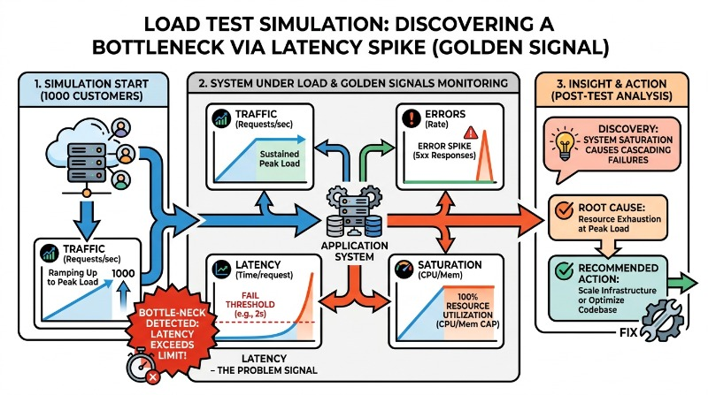

# Load Testing

🔑 **Key points**

- Load testing is a critical protection against system failure.
- It identifies performance bottlenecks before they affect real users.
- It validates that automated scaling (like AWS) responds quickly enough to meet demand.

---


## Understanding Load Testing: Purpose, Applications, and Pitfalls

Load testing is a non-functional testing technique designed to evaluate how a system performs under both normal and anticipated peak conditions. Unlike stress testing, which aims to find the "breaking point" of an application, load testing focuses on whether the system can handle a specific volume of transactions while maintaining acceptable response times. The primary goal is to identify performance bottlenecks before they affect end-users in a production environment.



For example, if you expect 1,000 concurrent customers but your server can only handle 100, it is vital to know this before launch. You don't want to wait until your application is growing in popularity to realize it cannot handle the weight of that success.


### Why We Load Test
The purpose of load testing extends beyond just checking if a server stays online. It provides critical data for capacity planning and service level agreement (SLA) validation. By simulating concurrent users, organizations can:
*   **Measure Response Times:** Determine if the application remains snappy as the user count increases.
*   **Identify Bottlenecks:** Pinpoint exactly where the system slows down—be it the database, the network, or the application logic.
*   **Ensure Stability:** Verify that the infrastructure (like load balancers and auto-scaling groups) reacts correctly to traffic spikes.

### Where Load Testing Excels
Load testing is most effective when applied to systems with high concurrency or variable traffic patterns. Common scenarios include:
1.  **E-commerce Platforms:** Preparing for massive traffic events like Black Friday or Cyber Monday.
2.  **API Services:** Ensuring that microservices can handle the aggregate request volume from multiple front-end clients.
3.  **Database-Heavy Applications:** Validating that connection pooling and query execution times remain stable under pressure.

### Common Pitfalls to Avoid
Even with the best tools, load testing can yield misleading results if not executed carefully. Here are some common traps:
*   **Unrealistic Test Environments:** Running tests on a staging environment that has 10% of the CPU/RAM of production will not provide actionable data.
*   **Ignoring "Think Time":** Real users don't click buttons every 10 milliseconds. Failing to include realistic delays between actions (think time) results in an artificially high load that doesn't mirror reality.
*   **Testing in a Vacuum:** Only monitoring the application while ignoring the health of the database, cache layers, or third-party integrations.
*   **The "Warm-up" Oversight:** Many systems (like those running on the JVM) require a "warm-up" period to optimize code. Starting measurements immediately can result in skewed, pessimistic data.

### Example: A Basic Load Test Script
Using a tool like **k6**, a simple load test might look like this. It defines a "ramp-up" period to simulate users entering the system gradually.

```javascript
import http from 'k6/http';
import { sleep, check } from 'k6';

export const options = {
  stages: [
    { duration: '30s', target: 20 }, // Ramp-up to 20 users
    { duration: '1m', target: 20 },  // Stay at 20 users
    { duration: '20s', target: 0 },  // Ramp-down to 0 users
  ],
};

export default function () {
  const res = http.get('https://api.example.com/v1/products');
  
  // Validate that the system responded correctly
  check(res, {
    'status is 200': (r) => r.status === 200,
    'transaction time < 500ms': (r) => r.timings.duration < 500,
  });

  // Simulate realistic user behavior
  sleep(1);
}
```

## Leveraging cloud providers

By deploying to a cloud provider like AWS, you can create a scalable application that automatically allocates more resources as demand increases. However, there is always some latency involved in provisioning extra resources. You need to know how the application reacts when a new promotion for JWT Pizza goes viral and the number of customers spikes exponentially. Will the application scale up in time to handle the surge, or will customers be left waiting impatiently for their pizza? Similarly, you must determine how well the application handles high traffic over an extended period.


## Determining latency shape

Load testing helps you answer questions such as how the number of concurrent customers impacts request latency. 

Is your latency linear?


Is it constant during usage but prone to spikes as new resources come online?


Or does it grow exponentially and cause the system to collapse at a certain level of usage?


The primary value of load testing is the ability to predict application performance before your company's reputation is at stake.

## Comparison to other types of testing

Load testing is similar to integration or end-to-end testing because it evaluates the application as a whole. The main difference is that load testing specifically measures performance by simulating large numbers of users. For example, while an end-to-end test ensures a single pizza order works, a load test simulates ordering hundreds of pizzas simultaneously to see if the system holds up.

## Types of load testing

There are several varieties of load testing, each focusing on different performance characteristics.

| Type       | Purpose                                    | Description                                                                                                                                                                                               |
| ---------- | ------------------------------------------ | --------------------------------------------------------------------------------------------------------------------------------------------------------------------------------------------------------- |
| **Load**   | Expected load                              | Verifies that the application can handle the anticipated number of concurrent customers.                                                                                                                   |
| **Soak**   | Expected load over an extended time period | Tests that resource consumption remains stable over time. This identifies memory leaks, connection leaks, or file handle exhaustion.                                                                     |
| **Smoke**  | Low load                                   | A quick test to ensure the application works for at least a single user. This is often used as a deployment prerequisite or a periodic "heartbeat" test.                                                  |
| **Spike**  | Sudden increase in load                    | Evaluates how quickly the application scales up and down during rapid, extreme changes in traffic.                                                                                                        |
| **Stress** | Higher than expected load                  | Determines the breaking point where the application fails to acquire necessary resources. Every application has a bottleneck; a stress test identifies exactly where it is.                               |

## Executing a load test

When testing JWT Pizza, we will focus on basic load testing using a normal expected load. Subsequent topics will discuss how to execute a load test using Grafana's open-source tool, k6.


## ☑ Exercise

```masteryls
{"id":"2fe84494-417b-41c0-8a1d-0ab3619af125","title":"Identifying Load Testing Goals","type":"multiple-choice"}
What is the primary distinction between general load testing and stress testing?

- [x] Load testing validates performance under expected peak volume, while stress testing pushes the system beyond its limits to observe how it fails.
- [ ] Load testing determines the absolute breaking point of a system, while stress testing checks for SLA compliance.
- [ ] Load testing is performed by developers, while stress testing is only performed by QA engineers.
- [ ] Load testing ignores response times and only focuses on whether the server crashes.
```
