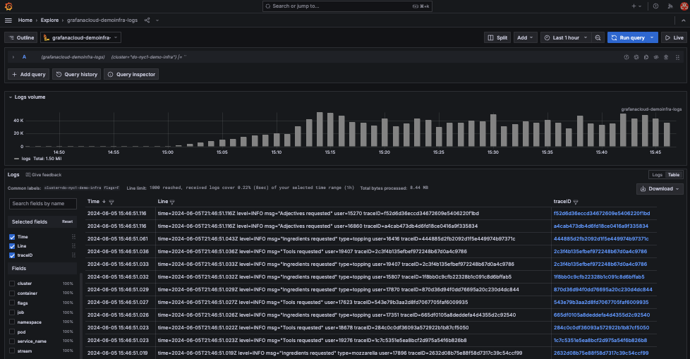

# Logging

🔑 **Key points**

- Logs provide the details that are missing in metrics
- Your logging design makes a big difference.

---

Metrics give you a good overview of how well the system is operating, but sometimes you need to dig into the details to full understand what is going on. For example, you might see that your request latency is going up unexpectedly. However, the latency metric only tells you that the overall system latency is increasing. It doesn't tell you why it is increasing. Is it a really long single request? Is it requests from a specific user? Or is it requests being handled by a specific server?

A good logging system gives you a record of individual events that are tagged with information that you can use to aggregate similar events. You can also use the timestamp of the events to see what is going on in the system at the same time.

Many of the topics that are important when considering what makes a good logging system were already covered in the [Observability](../observability/observability.md) topic and include the following: centralized aggregation, immutability, removal of credentials and personally identifiable information, and a performant search system. These should all be considered when deciding on how you acquire and persist your logs.

## The impact of logging design

One topic that we haven't discussed is the actual mechanism for capturing, normalizing, and transmitting logs in a way that doesn't overly impact the actual processing of the application without creating serious lag in the reporting of events.

You will soon use a very simple system for reporting log events to the observability system. Basically every time a log event is triggered, the generation and transmission of the log record happens synchronously with the triggered event. For example, when an HTTP request is received the log event will be sent to the logging system over the network as part of the processing of the HTTP request. To be fair, the log event is actually sent asynchronously, but there is still a very real possibility that the act of logging will detrimentally impact the latency of customer requests.

There are lots of things that we can do to remedy this situation. One possibility is to cache multiple log events in memory and send them in bulk at periodic intervals. For example, you could have a 500 KB buffer that sends when it gets full or when 15 seconds have passed. This reduces the overhead of communication a single log event at a time and gains efficiency because the bulk delivery can be compressed more efficiently and thereby decreasing the cost of transmission significantly.

Another alternative to the logging design could be to store the logs locally on disk instead of memory and have a separate process transmit the logs asynchronously. The logging process could be set at a lower priority so that it only transmits when there is excess CPU available. There are several dangers with this design. First off, you are actually incurring additional processing overhead by writing and reading from and to disk. Second, you run a real danger of consuming too much disk space, which would kill the operating system, or dropping logs because you could not report them within the disk space allocated. Finally, the logging process might never be allocated CPU time in situations where the application service is struggling. That is the time when you need your logs the most.

In some ways, critical log events are as important as processing user requests. Knowing that requests rates are spiking so that you can elastically allocate additional resources is the only way that you can continue serving the customer in a satisfactory way.

This leads to an additional strategy that you might consider for your logging, or metrics, system. You can prioritize your metric and log events. When resources are constrained only report a percentage of events, or only report the ones that are most vital to trigger actions that will resolve the resource bottleneck.

## Additional considerations

Here is a list of additional things that you should consider in your logging design.

- How often?
- How much?
- In bulk?
- Synchronously or asynchronously?
- As part of your application, or as part of an out of process daemon?
- Can you transform or normalize the data to reduce overhead while still providing value?
- What format do you use?
- Are you transmitting redundant information that could be assumed or derived?

Whatever your design is, the most important thing is that you start logging. You can always enhance the system as your application grows, but without some sort of reasonable logging information you will not know how to enhance or protect your application from failure or attack.
