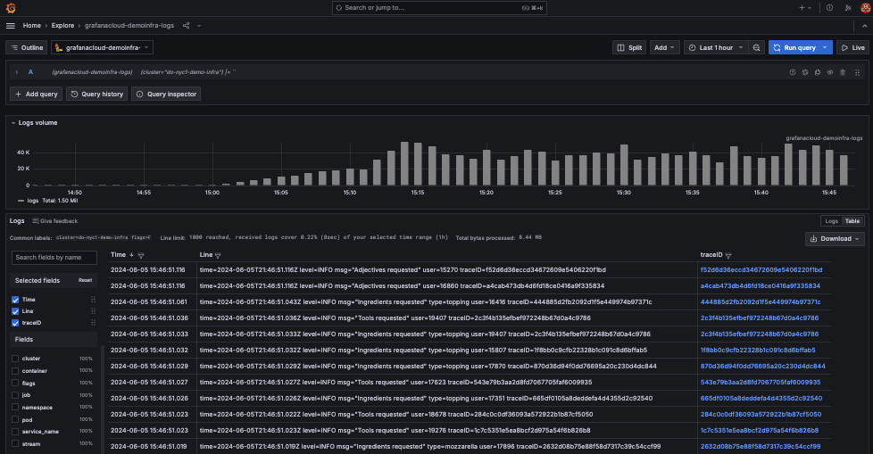
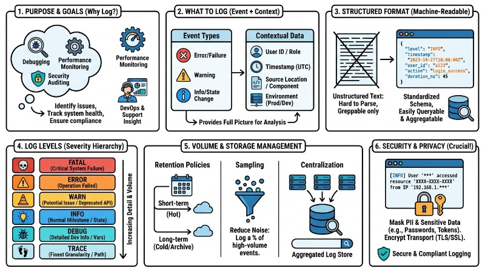

# Logging

🔑 **Key points**

- Logs provide the context and granular detail that metrics lack.
- Logging architecture significantly impacts application performance and reliability.

---

Metrics provide a high-level overview of system health, but you often need to dig into specific details to understand the root cause of an issue. For example, metrics might show that request latency is increasing, but they won't explain *why*. Is the delay caused by a single long-running request, a specific user's activity, or a bottleneck on a particular server?

A robust logging system records individual events, tagging them with metadata that allows you to aggregate and filter related data. By using timestamps, you can correlate events across different parts of the system to reconstruct the sequence of actions leading up to an issue.



Many essential logging characteristics were introduced in the [Observability](../observability/observability.md) topic, including centralized aggregation, immutability, the removal of sensitive information (credentials and PII), and performant search capabilities. These factors should guide how you acquire and persist your logs.



## The impact of logging design

An often overlooked aspect of observability is the mechanism used to capture, normalize, and transmit logs. The goal is to report events with minimal lag without degrading the performance of the application itself.

In many simple implementations, log generation and transmission happen synchronously with the event. For example, when an HTTP request is received, the application might attempt to send a log record over the network as part of that request's processing cycle. Even if the transmission is technically handled by a background thread (asynchronously), the overhead of creating the log object and managing the network buffer can still increase customer request latency.

There are several strategies to mitigate this impact:

### Buffering and batching
Instead of sending every log entry individually, you can cache multiple events in memory and transmit them in bulk. For example, you might configure a 500 KB buffer that flushes when it is full or after 15 seconds have passed. This reduces network overhead and allows for better compression, significantly decreasing transmission costs.

### Out-of-process transmission
Another approach is to write logs to local disk or a local pipe, then use a separate process (a "logging agent" or "daemon") to transmit them to the central server. This allows the logging process to run at a lower CPU priority. However, this design has risks:
1. **I/O Overhead:** Writing to and reading from a disk adds processing and latency.
2. **Resource Exhaustion:** If the logging agent falls behind, logs could consume all available disk space, potentially causing the operating system to crash.
3. **CPU Starvation:** If the application is struggling and consuming all CPU resources, the logging process might never get the time it needs to report data—exactly when you need those logs the most.

### Prioritization and sampling
Critical log events are often as important as the user requests themselves. For instance, knowing that request rates are spiking is the only way to trigger the elastic scaling required to maintain service. 

To balance visibility with performance, you can prioritize events. When resources are constrained, you might choose to drop low-priority "Info" logs and only report "Error" logs, or use sampling to report only a percentage of successful events while capturing 100% of failures.

## Additional considerations

When designing your logging strategy, consider the following:

- **Frequency:** How often are events generated?
- **Volume:** How much data is being produced per second?
- **Batching:** Should logs be sent individually or in bulk?
- **Concurrency:** Is logging synchronous (blocking) or asynchronous (non-blocking)?
- **Architecture:** Should logging be handled within the application process or by an external daemon?
- **Transformation:** Can you normalize or truncate data to reduce overhead while maintaining its value?
- **Format:** Are you using a structured format (like JSON) that is easy for machines to parse?
- **Efficiency:** Are you transmitting redundant information that could be derived elsewhere?

Regardless of the specific design, the most important step is to start logging. You can refine the system as your application grows, but without a baseline of log data, you cannot effectively protect your application from failure or security threats.


## ☑ Exercise


```masteryls
{"id":"fc0b7743-74ac-45f2-a6a6-fd4e4fc4b265","title":"Determining Log Volume","type":"multiple-choice"}
When determining the appropriate volume of data to include in application logs, which principle best balances the needs of observability with system constraints?

- [ ] Log every variable change and function entry/exit point in production to ensure total visibility into the execution flow.
- [ ] Only log critical errors and stack traces to minimize storage costs and avoid any impact on application performance.
- [ ] Include full request and response payloads for every transaction to facilitate the reproduction of user-reported issues.
- [x] Log enough context to reconstruct the application state during an event while excluding sensitive information and redundant high-frequency data.
```
