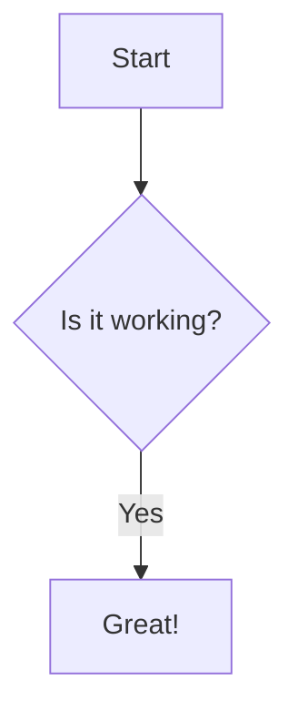

# Instruction Title

This is the content of the instruction. It can include **bold text**, _italic text_, <sub>sub</sub>, <sup>super</sup>, and even [links](https://example.com).

## Quiz

This is a quiz in Mastery LS format

```masteryls
{"id":"39283", "title":"Multiple choice", "type":"multiple-choice" }
- [ ] This is **not** the right answer
- [x] This is _the_ right answer
- [ ] This one has a [link](https://cow.com)
- [ ] This one has an image 
```

## Lists

- Item 1
- Item 2

* Item 1
* Item 2

- nested
  1. cow
  1. rat
  1. dog
- more
  1. apple
  1. pie

## Color circles

`#0969DA`

## Section links

[Link to mentions](#mentions)

## Code Block

```javascript
function example() {
  console.log('This is a code block');
}
```

## Mermaid Diagram



## Blockquote and Important Note

> This is a blockquote.

> [!IMPORTANT]
>
> This is an important note that should be highlighted.

## Tables

| Syntax    | Description |
| --------- | ----------- |
| Header    | Title       |
| Paragraph | Text        |

## Task Lists

- [x] Feature 1
- [ ] Feature 2
- [ ] Feature 3

## Strikethrough

~~This was mistaken text~~

## Emoji

:smile: :rocket: :tada: :+1:

## Images


## Mentions

@leesjensen - you are needed

## Issue/PR References

#1 - relative

leesjensen/masteryls#1 - absolute

softwareconstruction240/softwareconstruction#297 - absolute

## Autolinked URLs

https://github.com

## Inline HTML

<span style="color: red;">This is red text</span>
cow</br>rat

## Footnotes

Here is a footnote reference.[^1]

[^1]: This is the footnote.

## Collapsed summary

<details>
<summary>My top languages</summary>

| Rank | Languages  |
| ---: | ---------- |
|    1 | JavaScript |
|    2 | Python     |
|    3 | SQL        |

</details>

## Horizontal lines

---
