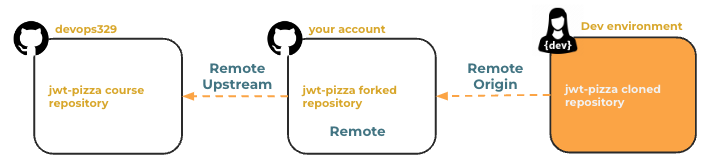

# Merge conflicts

🔑 **Key points**

- Conflicts happen. Know how to deal with them.

---

When you created a fork of the course repository and then cloned the repository to your local development environment, this resulted in three copies of the repository. From the perspective of the repository in your development environment, your fork in GitHub is the remote **origin**. Your fork in GitHub has an **upstream** that is the course repository.



You can reference your fork in GitHub with `remote.origin.url` and the course repository with `remote.upstream.url` from your development environment.

```sh
git config --get remote.origin.url
git config --get remote.upstream.url
```

As the application team makes changes to the frontend code you will need to sync your fork of the repository. As long as you are only adding tests and **not changing the core code**, you shouldn't have to merge any code.

## Merging your fork

In the case where you make a change to your fork that causes a conflict with the course repository, you will need to resolve the conflict from your development environment.

Open a command console window in your development environment and navigate to the directory containing your fork. The first time you resolve a merge conflict you will need to associate your repository with the remote's upstream repository that the fork was created from. You can do that with this command:

```sh
git remote add upstream https://github.com/devops329/jwt-pizza.git
```

Now, when every you need to resolve a merge conflict you can use the following commands.

```sh
cd jwt-pizza # Substitute the location of your clone
git checkout main
git fetch upstream
git merge upstream/main

# Open the files with conflicts and resolve the problems

git add .
git commit -m "merge() conflict due to ..."
git push
```

## Exercises

```masteryls
{"id":"5b2bcb09-4ed8-43dd-935b-ec6e8640d2d5","title":"Forking vs. Cloning","type":"multiple-choice"}
When collaborating on projects that may eventually require resolving merge conflicts, it is essential to understand how you access the code. What is the primary difference between a **fork** and a **clone**?

- [ ] A fork is a core Git command used to manage local branches, while a clone is a platform-specific feature used to delete remote repositories.
- [ ] A clone provides a way to resolve merge conflicts automatically on the server, whereas a fork requires all conflicts to be handled via the command line interface.
- [ ] Forking is the process of downloading a repository's history as a static ZIP file, while cloning establishes a live connection for real-time peer-to-peer coding.
- [x] A fork creates a copy of the repository on the hosting service (server-side) under your account, while a clone creates a local copy of the repository on your physical machine.
```
