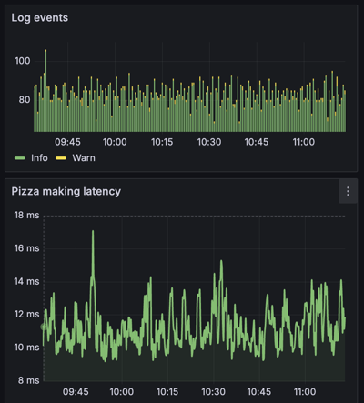
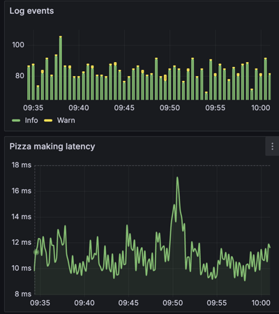
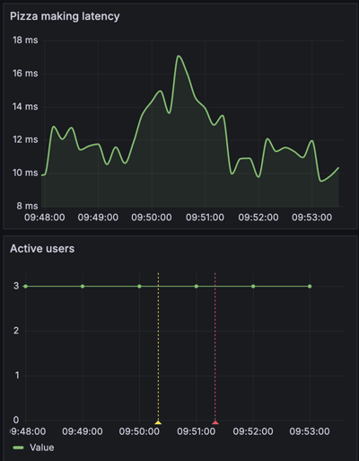
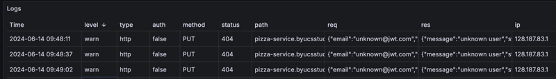

# Metrics

🔑 **Key points**

- Metrics surface anomalies and diagnose system health
- Historical metrics enable resource planning
- Sampling can reduce the cost of historical metrics

---

The first observability tool to consider is metrics. They allow you to determine the health of a system at a glance. They serve as evidence that the application is over provisioned, behaving as designed, is approaching saturation, or is completely compromised. Good metrics will allow you to start at a high level aggregation and then drill into specific details. They will also allow you to drill in temporarily from a view of trends over a week period to a detailed five-minute window.

## Using metrics to diagnose system health

Consider the following metrics for log events and pizza making latency. There is a spike on the left side of each visualization that is happening between 9:30 and 10:00. Is this a problem?

The graphs' horizontal axes don't quite match up, but if we drill in we can see more clearly what is going on. The spike in log events happens around 9:37 while the spike in latency happens almost exactly at 9:50. They could still correlate if the log spike happened after the latency spike since you would back up on log entries due to an increase in latency, but it is not likely to happen the other way around.

This still leaves the question: Why did latency jump from 10 ms to 18 ms at 10:5?. Now I'm starting to feel like a detective hot on the trail of a crime. If we drill in to a five-minute window we notice that the active users metric has an annotation that an alert was triggered around this time.

The log event graph also shows a slight spike in log warnings just before the latency spike. Checking the log warnings at this time shows that they are failed authentication requests.

When I check the alerting system I see that the alert was a false alarm triggered by an improperly set threshold on active user counts and is not related to either the invalid authorization requests or the increased latency. One final check of the CPU shows that it was well below saturation. In the end everything checks out as normal. Even the invalid authorization attempts seem to historically be happening at about the same rate. This is attributed to people mistyping their passwords.

I am left with the assumption that the latency was an insignificant momentary anomaly. However, the exercise is instructive. You can see how multiple metrics taken together help to draw a picture of what is going on in the system. In a situation where the spikes were higher, or the logs revealed a more definitive intrusion, we would be in a good position to resolve the issue before it escalated out of control.

# Resource planning

Another valuable contribution that you can derive from metrics is their aid to resource planning. Over months or years your metrics will reveal trends in customer behavior. They will show when users are most active, when they are most likely to have problems, and when the system is wasting money because it is over provisioned. This insight is incredibly valuable when you are trying to reduce costs while still ensuring a satisfactory experience for your customers.

# The cost of metrics

Keeping detailed metrics at the per second level is expensive. In a system that tracks 1000 metrics every second, you will accumulate _86 million_ values every day. 1000 metrics seems like a lot, but if you have 10 servers each reporting system values (easily 20 metrics), individual endpoint counts (another 50), and other service values such as purchases, authentication attempts, errors, and HTTP status codes (another 30), you will easily get to 100 metrics per server. Not to press the point, but for a large scale system 10 servers is a very small number.

When you throw the costs of storing metrics on top of that, things can get expensive really quickly. One way to deal with this expense is to decrease the granularity of the stored metrics as time goes on. For example, keeping the metrics at one second as they are reported for the last 15 days, and then sampling down the metrics that are stored to one minute for the last 6 months, and then finally sampling down to 15 minutes for metrics that are stored for the past 10 years. This gives you the greatest granularity for the period that you are likely to need it, without incurring significant cost when you are more interested in broad historical trends.
