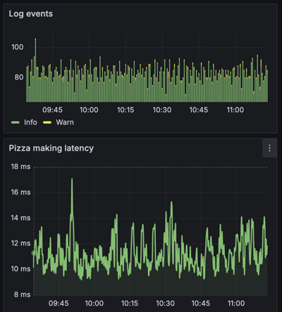
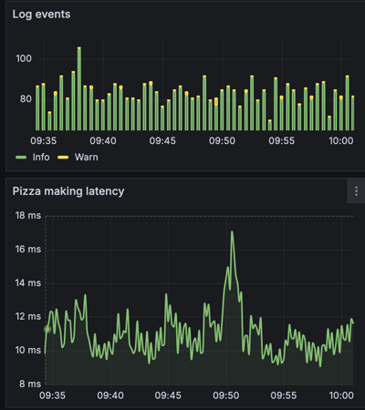
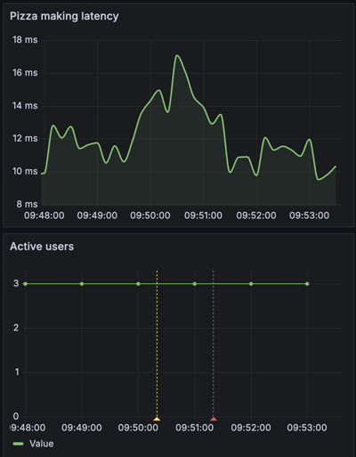
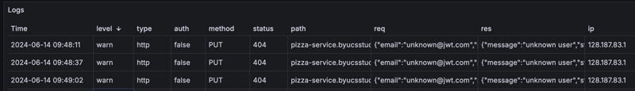

# Metrics

🔑 **Key points**

- Metrics help surface anomalies and diagnose system health.
- Historical metrics enable effective resource planning.
- Downsampling and retention policies reduce the cost of storing historical data.

---

Metrics are often the first observability tool a team implements. They allow you to determine the health of a system at a glance, providing evidence of whether an application is over-provisioned, behaving as designed, approaching saturation, or compromised. Effective metrics allow you to start with high-level aggregations and then drill down into specific details—for instance, shifting from a view of weekly trends to a detailed five-minute window.

## Using metrics to diagnose system health

Consider the following metrics for log events and pizza-making latency. A spike appears on the left side of each visualization between 9:30 and 10:00. Is this a problem?



The graphs' horizontal axes do not match up perfectly, but drilling in reveals the timing more clearly. The spike in log events occurs around 9:37, while the latency spike happens almost exactly at 9:50. These could still correlate if the log spike followed the latency spike (as a backup of log entries due to increased latency), but the reverse is unlikely.



This still leaves the question: Why did latency jump from 10 ms to 18 ms around 9:50? At this stage, investigating metrics feels like being a detective on the trail of a crime. If we drill into a five-minute window, we notice that the active users metric includes an annotation indicating an alert was triggered during this time.



The log event graph also shows a slight spike in log warnings just before the latency spike. Checking the log warnings reveals they are failed authentication requests.



However, upon checking the alerting system, it appears the alert was a false alarm triggered by an improperly set threshold on active user counts. It is unrelated to either the invalid authorization requests or the increased latency. A final check of the CPU shows it was well below saturation. In the end, everything checks out as normal. Even the invalid authorization attempts appear to happen historically at about the same rate, usually attributed to users mistyping their passwords.

In this case, the latency was likely an insignificant, momentary anomaly. However, the exercise is instructive. Multiple metrics taken together help build a comprehensive picture of system behavior. In a situation where spikes are higher or logs reveal a definitive intrusion, metrics put you in a position to resolve the issue before it escalates.

# Resource planning

Metrics are also essential for resource planning. Over months or years, metrics reveal trends in customer behavior. They show when users are most active, when they are most likely to encounter problems, and when the system is wasting money due to over-provisioning. This insight is invaluable for reducing costs while maintaining a high-quality user experience.

# The cost of metrics

Keeping detailed metrics at a per-second level is expensive. In a system that tracks 1,000 metrics every second, you will accumulate *86 million* values every day. While 1,000 metrics may sound like a lot, it is easily reached: 10 servers each reporting system values (20 metrics), individual endpoint counts (50), and service values such as purchases, authentication attempts, errors, and HTTP status codes (30) results in 100 metrics per server. For a large-scale system, 10 servers is a very small number.

When you factor in the cost of long-term storage, expenses can rise quickly. One way to manage this is to decrease the granularity of stored metrics over time, a process known as downsampling. For example, you might keep per-second metrics for 15 days, downsample them to one-minute intervals for six months, and finally store them at 15-minute intervals for up to 10 years. This provides high granularity for immediate troubleshooting without incurring significant costs for broad historical trend analysis.

## ☑ Exercise

```masteryls
{"id":"45430638-d394-4b7f-a14f-5cacb7b7dc7a","title":"Determining Metric Volume","type":"multiple-choice"}
When designing a monitoring or performance measurement framework, what is the most effective strategy for determining the quantity of metrics to capture?

- [ ] Capture every possible data point available to ensure that any potential issue can be diagnosed through retrospective analysis.
- [x] Focus on a concise set of actionable metrics that align with specific goals and provide clear signals for decision-making.
- [ ] Maintain a strict limit of exactly five metrics per system to ensure consistency and simplicity across the organization.
- [ ] Only collect metrics related to system failures or errors to minimize data noise and reduce storage costs.
```