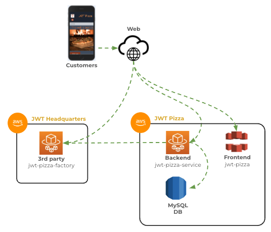
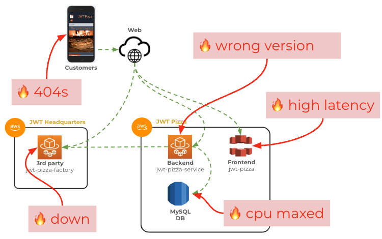
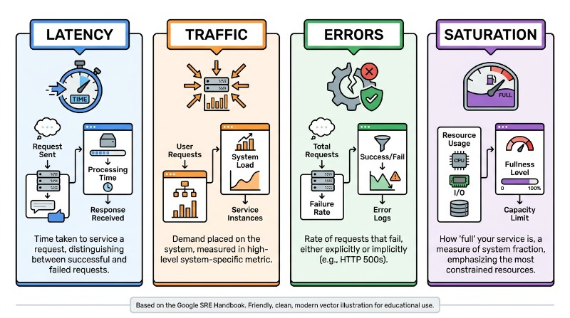
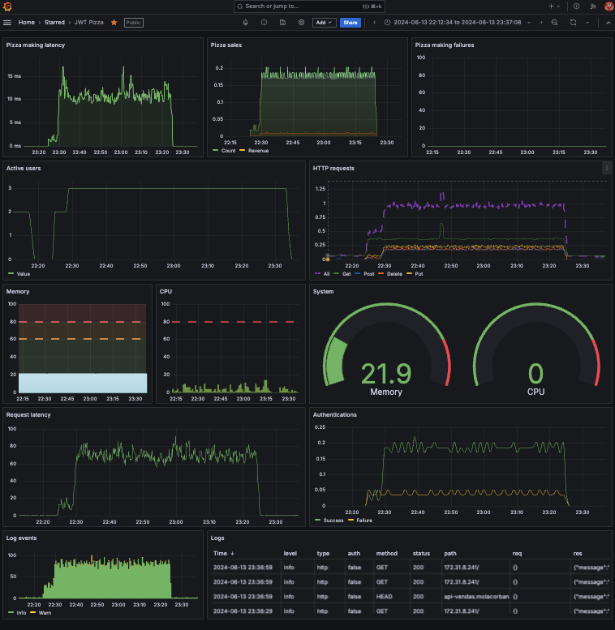

# Observability

🔑 **Key points**

- Metrics, logs, and traces are the standard pillars of observability.
- The "Four Golden Signals" for monitoring are latency, traffic, errors, and saturation.
- Effective observability requires specific characteristics, including immutability, performance, and elasticity.

---

In a local development environment, you are typically the sole user, making debugging straightforward via console output or breakpoints. Complexity increases exponentially when you deploy an application to a production environment serving millions of customers. In a distributed architecture—where components run on customer devices, backend clusters, and third-party servers—identifying the root cause of a failure is incredibly difficult.



Has the database exhausted its memory? Was an outdated version of the frontend deployed? Has a backend service lost network connectivity? Is a third-party API experiencing a slowdown, or is there a logic bug in the code?



Without the ability to observe the internal state of a system, you are forced to guess the problem based on external symptoms. This often results in frustrated customers reporting vague issues or, more likely, users silently migrating to a competitor like OAuth Pizza.


## Observability tools

Observability is generally built upon three types of data, often called the "three pillars."

1.  **Metrics**: Raw numerical data, such as request rates and CPU utilization, aggregated to analyze system health and performance over time.
2.  **Logs**: Immutable records of discrete events passing through the system, including details like request IP addresses, SQL queries, and authentication attempts.
3.  **Traces**: Data that tracks the path of a single request as it moves through a distributed system. Tracing allows you to follow a request from a customer's device, through various backend services, and into the database.

## Golden signals

As defined in the [Google SRE Handbook](https://sre.google/sre-book/monitoring-distributed-systems/), there are four "Golden Signals" that engineers must observe closely:

-   **Latency**: The time it takes to service a request.
-   **Traffic**: The demand placed on the system (e.g., HTTP requests per second).
-   **Errors**: The rate of requests that fail, whether explicitly (e.g., HTTP 500s), implicitly (e.g., HTTP 200 but with the wrong content), or by policy (e.g., exceeding a timeout).
-   **Saturation**: A measure of how "full" your service is, emphasizing the resources that are most constrained (e.g., memory or I/O).



Each signal indicates a different aspect of system health. For instance, a system might respond quickly (low latency) while generating a high volume of errors. Alternatively, error counts might seem high in isolation but represent a very low percentage of total traffic.

## Vital observability characteristics

The value of an observability tool is defined by several vital characteristics. While simple systems with short retention periods are cheaper, they are less valuable than real-time dashboards that support complex queries and historical analysis. Your choice of tools should align with the critical nature of the system being observed.

### Correct interpretation

Calculating signals accurately is vital. Oftentimes, percentages (rates) are more important than raw values. For example, failing 0.0001% of authentication requests might seem negligible, but if those 10,000 failures originate from a single IP address, it may indicate a targeted attack.

Latency data can be particularly misleading. An average latency of 10ms might look healthy, but if the 99th percentile (p99) is 30,000ms, a segment of your users is experiencing a complete system stall.

### Immutability

The records created by observability tools must be immutable; they cannot be altered or deleted. This is critical for security and auditing. If an attacker can modify logs to cover their tracks, they can remain undetected within the system indefinitely.

### Performance

There must be minimal lag between an event occurring and it appearing in the observability tool. While a few seconds of delay is acceptable, a delay of minutes or hours significantly diminishes the tool's value. If website latency spikes, you need to know immediately—not an hour later when customers have already abandoned the site.

### Elasticity

Observability systems must be as elastic as the applications they monitor. They must handle sudden spikes in log volume or metric data without manual intervention. If the observability system fails exactly when the production system is under stress, it becomes useless at the moment it is needed most.

### Aggregation and accessibility

Historically, logs were stored locally on individual servers. If a problem occurred, engineers had to SSH into specific machines and manually grep through files. This is impossible in a modern distributed system where a single transaction might span dozens of containers. Observability data must be aggregated into a central, accessible location for cross-system analysis.

### Visualization

Insightful dashboards allow for faster diagnosis. When one metric spikes, engineers need to correlate it with other metrics to rule out false positives.



Effective dashboards use color, font size, and scale to highlight anomalies. They must also allow users to change timeframes easily. A dashboard showing only the last hour cannot help you determine if a measurement is a unique anomaly or a recurring seasonal trend (e.g., a spike every Black Friday).

### Cost

High-fidelity logs and metrics are expensive to ingest, store, and query. However, the cost of poor observability is often much higher, resulting in extended downtime or undetected security breaches. The goal is to balance the investment in observability against the business value of system stability and engineering velocity.

## Incident response

In the early days of monitoring, humans in a Network Operations Center (NOC) watched dashboards 24/7 to catch anomalies. This evolved into the use of automated alerts that trigger when specific thresholds are exceeded, allowing "on-call" engineers to respond only when necessary.

When an incident occurs, responders examine the data to determine the scope and severity. Severity is typically categorized into levels:

| Severity | Description | Response | Expected Resolution |
| :--- | :--- | :--- | :--- |
| **Critical** | System is offline or operationally ineffective (e.g., entire site is down). | Entire staff paged | Immediate |
| **High** | Major subsystems are malfunctioning (e.g., new users cannot sign up). | Entire associated team | Immediate |
| **Moderate** | Periodic loss of functionality for many customers (e.g., intermittent 404s). | Member from associated team | Immediate |
| **Low** | Minor functionality issues affecting few users (e.g., profile pictures failing to load). | Priority ticket for team | 24 hours |
| **Informational** | Benign observations or minor metric changes. | Non-urgent communication | 1–7 days |

### Self-healing

The DevOps mindset shifts response from human intervention to automated correction. If a container stops responding, the orchestrator replaces it. If traffic spikes, the system auto-scales. If a regional data center fails, traffic is automatically rerouted. Automated scripts allow responders to resolve complex incidents with a single command, restoring normalcy in moments rather than hours.

### Use of AI

Incident response is increasingly driven by AI and Machine Learning (AIOps). AI systems can sift through massive volumes of logs to find subtle anomalies that humans might miss. Today, many low-to-mid-level failures are handled automatically by AI, which then generates a post-mortem report for human review. This cycle allows for long-term system improvements and greater overall stability.

💡 **Activity**: Researching how AI can be used to detect "log anomalies" or "outlier detection" in metrics to trigger self-healing workflows is an excellent way to explore the future of DevOps.


## ☑ Exercise


```masteryls
{"id":"04ffb66a-bd89-4e22-9737-ff27eba52837","title":"Defining Golden Signals","type":"multiple-choice"}
According to the Google Site Reliability Engineering (SRE) handbook, which of the "Four Golden Signals" measures how "full" your service is, typically by tracking the utilization of the system's most constrained resources?

- [ ] Latency
- [ ] Traffic
- [x] Saturation
- [ ] Errors
```
