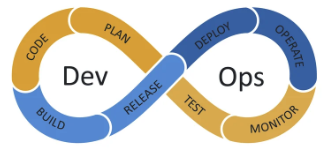

# Overview

Welcome to **Computer Science 329**: _Quality Assurance and Developer Operations_!

This course covers everything necessary to successfully take an application from the developer's development environment and deliver it into a customer accessible production environment.

> _Source: [wikimedia.org](https://commons.wikimedia.org/wiki/File:Devops-toolchain.svg)_

Beyond the work necessary to build the actual application, there are two additional roles that are required to deliver the application to a customer.

1. **Quality Assurance (QA)** - Quality assurance provides an independent review of the application team's deliverables. Their job is to provide assurance that the application follows the design specification and is free from any critical issues that would harm the company or its customers.
1. **Developer Operations (DevOps)** - DevOps provides the automated pipeline that takes the application team's deliverables and puts them into the hands of the customer. The term DevOps stems from the idea that the team is taking a developer mindset for deployment operations. They are essentially building an application for product delivery.

In a small company, the application team will often assume the additional roles of QA and DevOps. However, the function of these teams is often more successful when they operate independently.

The course assumes that you already have the skill necessary to build a reasonable web application. What this course will teach you is how to test, deploy, and manage an application in production.

Your efforts will focus on playing the role of both a QA and DevOps engineer. You will ensure the quality of the software provided by the application team, and deploy the software to a production environment.

## Why this matters to you

We often think of computer science as coding functions and implementing algorithms, but that is only one part of the picture. Unless you can create a symphony of tools that successfully deploy and manage an application as a whole, your algorithmic coding abilities will have decreasing value.

As the benefits of AI coding continues to increase, it will be the system level architectural and management skills that will grow in high demand. This course will teach you to start thinking at the system level and give you experience creating tool chains that combine to produce amazing value.

## Outcomes

By the end of the course you can expect the following outcomes in your personal development.

- **Quality**: Implement comprehensive automated testing strategies, including unit, UI, E2E, performance, and load testing.
- **Deployment**: Deploy various automated CI/CD pipeline strategies to reliably deliver software that is resilient, scalable, and secure.
- **Management**: Monitor, detect anomalies, alter, and automatically correct system behavior.
- **Curious**: Characterize and address gaps in understanding related to DevOps techniques and principles.
- **Creative**: Discuss and generate alternate DevOps designs.
- **Collaborative**: Work as a team to discover DevOps design weaknesses.
- **Christlike**: Strive for gratitude for, inspiration in, and the ability to apply capabilities to, celestial pursuits.

## Your deliverables

Multiple phases of development releases and changes to the devOps pipeline will occur as different technologies and strategies are employed. As part of this process, you will create the following deliverables that demonstrate your mastery of the course concepts.

| Deliverable                                                                                 | Description                                                                |
| ------------------------------------------------------------------------------------------- | -------------------------------------------------------------------------- |
| [⓵ Development deploy](../deliverable1DevelopmentDeploy/deliverable1DevelopmentDeploy.md)   | Deploy frontend to GitHub Pages manually                                   |
| [⓶ Automated deploy](../deliverable2AutomatedDeploy/deliverable2AutomatedDeploy.md)         | Deploy frontend to GitHub Pages using GitHub Actions                       |
| [⓷ Unit test](../deliverable3UnitTesting/deliverable3UnitTesting.md)                        | Backend unit testing and analysis using Jest and GitHub Actions automation |
| [⓸ UI test](../deliverable4UiTesting/deliverable4UiTesting.md)                              | User interface unit testing using Playwright and GitHub Actions automation |
| [⓹ CDN deploy](../deliverable5CdnDeploy/deliverable5CdnDeploy.md)                           | Deploy frontend to AWS CloudFront                                          |
| [⓺ Scalable deploy](../deliverable6ScalableDeploy/deliverable6ScalableDeploy.md)            | Deploy backend to AWS Fargate and RDS MySQL                                |
| [⓻ Environments](../deliverable7Environments/deliverable7Environments.md)                   | Deploy to staging and production environments                              |
| [⓼ Metrics](../deliverable8Metrics/deliverable8Metrics.md)                                  | Provide metrics with Grafana Prometheus                                    |
| [⓽ Logging](../deliverable9Logging/deliverable9Logging.md)                                  | Provide logging with Grafana Loki                                          |
| [⓾ Load test](../deliverable10LoadTesting/deliverable10LoadTesting.md)                      | Execute end to end load testing with K6                                    |
| [⑪ Chaos test](../deliverable11ChaosTesting/deliverable11ChaosTesting.md)                   | Chaos testing                                                              |
| [⑫ Penetration test](../deliverable12PenetrationTesting/deliverable12PenetrationTesting.md) | Penetration testing using Burp Suite                                       |

You will also create three reports as part of your work.

1. **Penetration test report** - Work with a peer to attack each other's JWT Pizza applications.
1. **Curiosity report** - Independent research on a QA/DevOps topic
1. **Christlike introspection** - Introspection into your relationship with the divine.

## Technologies

The course covers a full spectrum of devOps technologies.

- **Testing**

  - Unit, integration, end to end, coverage (Jest),
  - UI (Playwright)
  - Synthetic (Grafana)
  - Load (K6)
  - Chaos
  - Penetration (Burp suite)

- **Deployment**

  - Software version control (GitHub)
  - Static deployment (GitHub Pages)
  - Continuous integration/continuous delivery (GitHub Actions)
  - CDN, load balancers, and containers (AWS EC2, CloudFront, ECR, ECS, Fargate)
  - Infrastructure as code (CloudFormation)
  - Elasticity (ECS, CloudFront)
  - Versioning (N-1)
  - Strategies (Blue/green, rolling, replacement)

- **Management**
  - Logging, Metrics (Grafana)
  - Alerts (Grafana OnCall)
  - Recovery, RTO, RPO, playbooks (AWS RDS)
  - Self healing (AWS ECS)
  - Failure reporting

## Your work in the course

This course follows the path that a real world software company would follow.

1. The _development team_ provides you access to their application code. You fork the code using GitHub.
1. _You_ will act as the QA team to create the tests and analyze the code in order to assure its **quality**.
1. _You_ will act as the DevOps team to create the continuous integration (CI) pipeline to **deploy** the application.
1. _you_ will **monitor** its use and **resolve** incidents as they occur.

## Well rounded software engineers

The key to learning how to be an exceptional software engineer rests in your ability to continually improve in four areas.

1. **`Capable`** - You need to know the technology. The better you know it the better you will be able to leverage its abilities and apply it correctly. Knowing who the experts are, and discerning between meaningful technology and marketeer-driven fads, allows you to quickly find the valuable and avoid the distractions. Knowing technology will enable you to find the right tool for the job, maximize its performance, and automate its execution.
1. **`Creative`** - We often think of artistic skills when considering creativity. However, there is just as much art in making software usable, efficient, and maintainable. Knowing how to organize and sculpt your code is incredibly creative. Well designed systems are often referred to as beautiful or elegant, and a reflection of the creativity of their authors.
1. **`Collaborative`** - Web applications are rarely created and used by one person. Usually you build an application for a large group of customers, and they are almost always created by a team of contributors with different backgrounds and roles. The ability for that team to work together and interact with customers is essential. These are social skills. The more skilled you are at talking, writing, reading, presenting, expressing body language, projecting a good appearance, and most importantly, listening, the more successful you will be.
1. **`Curious`** - Having a mind that is always questioning will make all the difference. Simply doing the job is not enough. Wanting to know why the job is useful, searching for alternative directions, digging into the inner workings of a black box, and questioning accepted facts are all where progress is made. Cultivating a love for life long learning will take you from adequate to exceptional.

> “When hiring we look for the ability to collaborate, creativity, curiosity, and expertise”
>
> — Tim Cook, ([source](https://appleinsider.com/articles/22/10/03/if-you-want-to-work-for-apple-you-need-these-four-traits))

## Thinking Celestial

By developing and utilizing software engineering skills you can have a significant impact for good. However, you can take this to a whole new level by learning additional principles.

1. **Gratitude** - Understanding where you came from and who you have to thank for the position you are in is a foundational mindset for growth.
1. **Divine inspiration** - Seeking for divine help and direction in your efforts, enables you to avoid paths that would otherwise diminish your impact, and instead create results that otherwise would have been beyond your abilities.
1. **Eternal action** - If you look beyond a project due date, problem to solve, diploma, employer, career, or even this mortal existence, you will find your focus gravitating towards a purpose that is guided by the eternal rather than the moment. This will guide you to apply your talents to causes that have eternal significance.

As you learn to tap into these principles, you will find greater motivation and enjoyment in your efforts to acquire and apply your skills as a software engineer. Make sure you emphasize being `Christlike` when making your journey through life.

> “The temple is a place of revelation. There you are shown how to progress toward a celestial life. There you are drawn closer to the Savior and given greater access to His power. There you are guided in solving the problems in your life, even your most perplexing problems.”
>
> — President Russell M. Nelson, ([source](https://www.churchofjesuschrist.org/study/general-conference/2023/10/51nelson))

## Making mistakes

Making mistakes is a key component for learning. Recognizing and embracing the power of making mistakes will help you learn faster, and at a deeper level. Just decide that you are going to make mistakes and that is fine, even preferable. Many of the most important discoveries of all time were a result of making and understanding mistakes. No one learns to walk without falling down. With that said, you should acquire a framework where you can make mistakes while minimizing their ability to slow your progress. Things such as version repositories, notebooks, simulations, working with peers, automation, and reproducibility are all useful for safely making mistakes.

Whenever you approach something new, approach it with the attitude that you will learn by making mistakes. This will keep them from being a barrier to your progress.

> “To make no mistakes is not in the power of man; but from their errors and mistakes the wise and good learn wisdom for the future.”
>
> — Plutarch

## Energy!

The class should have the energy of a startup. We are on the cutting edge of technology. With the skills you learn to build entire systems, you will change the world. I will do my best to bring all my energy to our time together, and hope you will do likewise. Together, as a team, we are going to have a lot of fun.

## ☑ Exercise

We often send out critical notifications for the course using the Canvas email announcements. Log into the Canvas course and check to make sure you have the correct email address and notification setting associated with your user.
