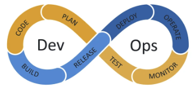

# Overview

Welcome to **Computer Science 329**: _Quality Assurance and Development Operations_!

This course covers the essential processes required to take an application from a local development environment and deliver it to a customer-accessible production environment.



> _Source: [wikimedia.org](https://commons.wikimedia.org/wiki/File:Devops-toolchain.svg)_

Beyond building the core application, two distinct roles are required to deliver software effectively to a customer:

1.  **Quality Assurance (QA)**: QA provides an independent review of the application team's deliverables. Their goal is to ensure the application follows the design specification and is free from critical issues that could harm the company or its customers.
2.  **Developer Operations (DevOps)**: DevOps provides the automated pipeline that takes the application team's deliverables and places them in the hands of the customer. The term "DevOps" stems from the idea of applying a developer mindset to deployment operations—essentially building an application for product delivery.

In a small company, the application team often assumes the roles of QA and DevOps. However, these functions are typically more successful when they operate independently.

This course assumes you already possess the skills necessary to build a functional web application. You will learn how to test, deploy, and manage that application in production.

Throughout the semester, you will act as both a QA and DevOps engineer. You will ensure the quality of the software provided by the application team and deploy that software to a production environment.

## Why this matters to you

We often think of computer science as coding functions and implementing algorithms, but that is only one part of the picture. Unless you can create a symphony of tools that successfully deploy and manage an application as a whole, your algorithmic coding abilities will have decreasing value.

As the benefits of AI-assisted coding continue to increase, system-level architectural and management skills will grow in high demand. This course will teach you to think at the system level and provide experience creating toolchains that combine to produce significant value.

## Your deliverables

You will navigate multiple phases of development releases and DevOps pipeline iterations as you employ different technologies and strategies. As part of this process, you will create the following deliverables to demonstrate your mastery of the course concepts.


| Deliverable                                                                                  | Description                                                                |
| -------------------------------------------------------------------------------------------- | -------------------------------------------------------------------------- |
| [⓵ Development deploy](../deliverable1DevelopmentDeploy/deliverable1DevelopmentDeploy.md)    | Deploy the frontend to GitHub Pages manually                                   |
| [⓶ Automated deploy](../deliverable2AutomatedDeploy/deliverable2AutomatedDeploy.md)          | Deploy the frontend to GitHub Pages using GitHub Actions                       |
| [⓷ Unit testing](../deliverable3UnitTesting/deliverable3UnitTesting.md)                         | Backend unit testing and analysis using Jest and GitHub Actions automation |
| [⓸ UI testing](../deliverable4UiTesting/deliverable4UiTesting.md)                               | User interface testing using Playwright and GitHub Actions automation |
| [⓹ Test-driven development](../deliverable5Tdd/deliverable5Tdd.md)                           | Add new features using test-driven development (TDD)                        |
| [⓺ Frontend deployment](../deliverable6FrontendDeployment/deliverable6FrontendDeployment.md) | Deploy the frontend to AWS CloudFront                                          |
| [⓻ Backend deployment](../deliverable7BackendDeployment/deliverable7BackendDeployment.md)    | Deploy the backend to AWS Fargate and RDS MySQL                                |
| [⓼ Metrics](../deliverable8Metrics/deliverable8Metrics.md)                                   | Provide metrics with Grafana and Prometheus                                    |
| [⓽ Logging](../deliverable9Logging/deliverable9Logging.md)                                   | Provide logging with Grafana and Loki                                          |
| [⓾ Load testing](../deliverable10LoadTesting/deliverable10LoadTesting.md)                       | Execute end-to-end load testing with K6                                    |
| [⑪ Chaos testing](../deliverable11ChaosTesting/deliverable11ChaosTesting.md)                    | Execute chaos testing                                                              |
| [⑫ Penetration testing](../deliverable12PenetrationTesting/deliverable12PenetrationTesting.md)  | Perform penetration testing using Burp Suite                                       |

You will also create three reports as part of your work:

1.  **Penetration test report**: Work with a peer to attack each other's JWT Pizza applications.
2.  **Curiosity report**: Conduct independent research on a QA/DevOps topic.
3.  **Christlike introspection**: Reflect on your relationship with the divine.

## Technologies

The course covers a full spectrum of DevOps technologies.

*   **Testing**
    *   Unit, integration, end-to-end, and coverage (Jest)
    *   UI (Playwright)
    *   Test-driven development (Playwright, Jest)
    *   Synthetic monitoring (Grafana)
    *   Load testing (K6)
    *   Chaos testing
    *   Penetration testing (Burp Suite)

*   **Deployment**
    *   Version control (GitHub)
    *   Static deployment (GitHub Pages)
    *   Continuous Integration/Continuous Delivery (GitHub Actions)
    *   CDNs, load balancers, and containers (AWS ECR, ECS, Fargate, CloudFront)
    *   Infrastructure as Code (CloudFormation)
    *   Elasticity (ECS, CloudFront)
    *   Versioning (N-1)
    *   Strategies (Blue/Green, Rolling, Replacement)

*   **Management**
    *   Logging and Metrics (Grafana)
    *   Alerts (Grafana OnCall)
    *   Recovery, RTO, RPO, and playbooks (AWS RDS)
    *   Self-healing (AWS ECS)
    *   Failure reporting

## Your work in the course

This course follows the path of a real-world software company:

1.  The _development team_ provides access to their application code. You fork the code using GitHub.
2.  _You_ act as the QA team to create tests and analyze the code to ensure its **quality**.
3.  _You_ act as the DevOps team to create the continuous integration (CI) pipeline to **deploy** the application.
4.  _You_ **monitor** its use and **resolve** incidents as they occur.


## Well-rounded software engineers

The key to becoming an exceptional software engineer rests in your ability to continually improve in four areas:


1.  **`Capable`**: You need to know the technology. The better you understand it, the better you can leverage its abilities and apply it correctly. Discerning between meaningful technology and marketing-driven fads allows you to find value quickly and avoid distractions. Technical mastery enables you to find the right tool for the job, maximize performance, and automate execution.
2.  **`Creative`**: We often think of artistic skills when considering creativity, but there is just as much art in making software usable, efficient, and maintainable. Knowing how to organize and sculpt your code is incredibly creative. Well-designed systems are often referred to as beautiful or elegant—a reflection of the creativity of their authors.
3.  **`Collaborative`**: Web applications are rarely created and used by one person. Usually, you build applications for large groups of customers, and they are almost always created by a team of contributors with different backgrounds and roles. The ability for that team to work together and interact with customers is essential. These are social skills. The more skilled you are at talking, writing, reading, presenting, and listening, the more successful you will be.
4.  **`Curious`**: Having a mind that is always questioning makes all the difference. Simply doing the job is not enough. Wanting to know why a task is useful, searching for alternative directions, digging into the inner workings of a "black box," and questioning accepted facts are where progress is made. Cultivating a love for lifelong learning will take you from adequate to exceptional.

> “When hiring we look for the ability to collaborate, creativity, curiosity, and expertise”
>
> — Tim Cook, ([source](https://appleinsider.com/articles/22/10/03/if-you-want-to-work-for-apple-you-need-these-four-traits))

## Thinking Celestial

By developing and utilizing software engineering skills, you can have a significant impact for good. However, you can take this to a higher level by learning additional principles:

1.  **Gratitude**: Understanding where you came from and who you have to thank for your position is a foundational mindset for growth.
2.  **Divine Inspiration**: Seeking divine help and direction in your efforts enables you to avoid paths that would diminish your impact and instead create results that would otherwise be beyond your abilities.
3.  **Eternal Action**: If you look beyond a project due date, a diploma, or a career, you will find your focus gravitating toward a purpose guided by the eternal. This will guide you to apply your talents to causes of eternal significance.

As you learn to tap into these principles, you will find greater motivation and enjoyment in your efforts to acquire and apply your skills as a software engineer. Emphasize being `Christlike` throughout your journey.

> “The temple is a place of revelation. There you are shown how to progress toward a celestial life. There you are drawn closer to the Savior and given greater access to His power. There you are guided in solving the problems in your life, even your most perplexing problems.”
>
> — President Russell M. Nelson, ([source](https://www.churchofjesuschrist.org/study/general-conference/2023/10/51nelson))

## Making mistakes

Making mistakes is a key component of learning. Recognizing and embracing the power of mistakes will help you learn faster and at a deeper level. Decide now that you are going to make mistakes and that it is preferable to do so. Many of the most important discoveries were the result of understanding mistakes. No one learns to walk without falling down. 

With that said, you should acquire a framework where you can make mistakes while minimizing their impact on your progress. Tools such as version repositories, notebooks, simulations, peer reviews, and automation are all useful for safely making mistakes.

Whenever you approach something new, do so with the attitude that you will learn by making mistakes. This will keep them from being a barrier to your progress.

> “To make no mistakes is not in the power of man; but from their errors and mistakes the wise and good learn wisdom for the future.”
>
> — Plutarch

## Energy!

This class should have the energy of a startup. We are on the cutting edge of technology. With the skills you learn to build entire systems, you will change the world. I will do my best to bring my energy to our time together, and I hope you will do the same. Together, as a team, we are going to have a lot of fun.

## ☑ Exercise

```masteryls
{"id":"60d98115-3f79-4d55-a0b5-3787be46ffca", "title":"Canvas notifications", "type":"multiple-choice" }
We often send out critical notifications for the course using Canvas announcements. Log into the Canvas course and check to make sure you have the correct email address and notification settings associated with your account.

- [x] My email address is associated with Canvas and I check for notifications frequently.
- [ ] I want to stay in the dark and miss important notifications.
```