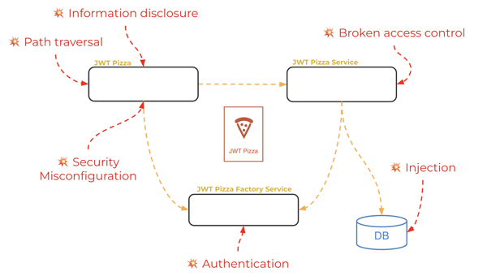

# Penetration Testing

🔑 **Key points**

- Penetration testing helps you find vulnerabilities before an attacker does.
- CVE and CVSS provide a common format for reporting vulnerabilities.

---

📖 **Deeper dive reading**: [PortSwigger Academy](https://portswigger.net/web-security/all-topics)

Penetration testing focuses on preventing any action that would:

1. Allow abnormal execution of the application
1. Allow unauthorized access to functionality or data
1. Expose non-public data
1. Reduce administrator visibility of the application

Modern software applications are globally accessible, complex, and updatable. They are also often high value targets for either monetary or informational purposes. That means that there is significant motivation and opportunity for nefarious actors to penetrate an application's security barrier and cause significant harm to both the company and its users.

In some ways penetration testing is the most important testing that you can perform. If a piece of an application's functionality doesn't work, but provides no loss of revenue or information then it has little inherent harm. However, if your application is extremely successful and provides significant functional value but leaks data or revenue, then it would probably be better if it was never born.

Taking security seriously means taking penetration testing seriously. Don't let others be harmed by systems you create simply because you neglected to be intentionally security-minded in the design and testing of your application.

> “Constant vigilance”
>
> — Barty Crouch Jr. (_man-in-the-middle attack on Mad-Eye Moody_)

## Putting on your white hat

An attacker with evil designs is often characterized as wearing a **black hat**. Alternatively, security researchers who think like an attacker, but mitigate resulting vulnerabilities instead of exploiting them, are characterized as wearing a **white hat**.

Successful penetration testing requires you to think like an attacker. It is almost the opposite of your normal operational design approach. Instead of asking: "What parameters does this component need to get a desired result", you ask: "What parameters can I abuse, exclude, or overload to get a result that the component was not designed to provide?"

It often helps to make a game out of it. If it is an application that you wrote, then you are playing a game of chess with yourself. Otherwise, you need to get into the head of the application author and figure out where the blind spots are.

Remember that you have a responsibility to disclose whatever vulnerabilities you are able to exploit to the application author so that they can mitigate them. If you discovered a flaw than it is likely that a black hat will also, or has already discovered it. It is better to make it public and get it fixed, whatever the cost, then to leave it lurking in the shadows.

## Automation

As with any QA or DevOps action, it is critical to take advantage of automation. To be effective you have to let data and algorithms do the hard work for you. Once the automation discovers potential holes in the system, you can manually examine the possibilities, but conducting a brute force attack manually will usually get you nowhere.

## Testing phases

The following are the suggested phases that you should execute in order to successfully conduct penetration testing.

### Planning and Reconnaissance

Get to know everything about the application. The more you know about the application the easier it will be to discover exploits.

| Area                                                               | JWT Example                                                                                                                                                                                     |
| ------------------------------------------------------------------ | ----------------------------------------------------------------------------------------------------------------------------------------------------------------------------------------------- |
| Document all application user roles                                | Diner, franchisee, and an administrator.                                                                                                                                                        |
| Know how the application is designed to works                      | Build a sitemap that shows the interaction between pages.                                                                                                                                       |
| Know all the public endpoints                                      | Both JWT Pizza Service and JWT Pizza Factory.                                                                                                                                                   |
| Read any available documentation                                   | In addition to public documentation, there are often developer blogs and technical white papers that provide interesting insights. For JWT this includes the /api/docs endpoint and /docs view. |
| Know what OS, programming language, and 3rd party software is used | Linux ARM, JavaScript, Express, and UUID.                                                                                                                                                       |
| Know what services the application uses                            | AWS CloudFront and ECS.                                                                                                                                                                         |
| Know how the application is deployed                               | GitHub Actions.                                                                                                                                                                                 |

### Probing

Use automated tools to probe the application. This includes checking for open ports on the server, discovering IP Addresses, attempting to explore public directory files, requesting application views with different roles, and calling endpoints.

You should also attempt to provide overloaded parameters, exclude parameters, and note undocumented request or response parameters.

Focus your efforts on the common areas of failure defined by the [OWASP top 10](../securityCommunity/securityCommunity.md).

### Weaponization

Once you have discovered an exploit you need to weaponize it. This usually consists of creating a parameterized payload that allows you to deliver and execute the exploit. Make sure you give it a cool name like `pepperonikiller`, `crustydb`, or `jwtsucker`.

You also need to consider how persistent the threat is. Can you keep it hidden and derive long term value from it? Does it stay hidden until a desired triggered action? Is the attack simply meant to disrupt the application?

Ultimately you want to cover your tracks. That means disrupting the observability of the system is crucial. Many times you want to execute multiple exploits in concert with each other. For example, a gateway exploit that allows administrative access, a log shim that hides or deletes your behavior, a data capture exploit, and possibly a time bomb that encrypts or deletes data or overwhelms the system.

The goal here is not to actually use the weapon on the production system, but to use it with further testing to render the weapon ineffective.

## Vulnerability reporting

There is great value in sharing information about best practices, vulnerabilities, and attempted and successful penetrations. Only by working together as a community can hope to protect the integrity of the global information infrastructure. The two main tools for sharing vulnerability information are the [Common Vulnerabilities and Exposures](https://en.wikipedia.org/wiki/Common_Vulnerabilities_and_Exposures) (CVE) report, and the [Common Vulnerability Scoring System](https://en.wikipedia.org/wiki/Common_Vulnerability_Scoring_System) (CVSS).

💡 You might consider doing your curiosity report on the design of CWE, CVE, and CVSS as well as its usefulness in supporting the security community.

### CVSS

The Common Vulnerability Scoring System creates a normalized score for identifying the risk presented by a vulnerability. This allows the security community to respond appropriately. A CVSS score is broken into three individual scores based on the following metrics. Each metric is given a value of Low, Medium, or High that corresponds to the contribution it makes to the composite score.

1. **Base**: How easy the attack is and its potential impact.
   1. _Attack Vector_: How the attack is initiated.
   1. _Attack Complexity_: How easy it is to execute.
   1. _Privileges Required_: The required initial rights.
   1. _User Interaction_: If a human needs to be involved.
   1. _Scope_: How much of the system is impacted.
   1. _Confidentiality Impact_: How much data is impacted.
   1. _Integrity Impact_: Can it destroy the component.
   1. _Availability Impact_: Can it make the component inaccessible.
1. **Temporal**: How mature the attack is and how easy it is to prevent.
1. **Environmental**: Modification of the base metric for a specific environment.

Each metric results in a score from 0-10. A score of 9 would be considered a threat that requires immediate action, while a score of 3 might only deserve action for specific circumstances.

Commonly, only the _base_ metric is computed since the other two metrics are situational and the base metric assesses that actual threat.

### Examples

#### Heartbleed

Heartbleed is a vulnerability in the OpenSSL cryptographic software library. It allows an attacker to read sensitive data from the memory of the affected servers.

| Data        | Value                      |
| ----------- | -------------------------- |
| CVE         | CVE-2014-0160              |
| CVSS Vector | AV:N/AC:L/Au:N/C:P/I:N/A:N |
| Base Score  | 5.0 (Medium)               |

#### WannaCry

WannaCry is a ransomware attack that spread rapidly across numerous systems, encrypting files and demanding ransom payments in Bitcoin. It exploits a vulnerability in Windows SMB protocol.

| Data        | Value                               |
| ----------- | ----------------------------------- |
| CVE         | CVE-2017-0144                       |
| CVSS Vector | AV:N/AC:L/PR:N/UI:N/S:U/C:H/I:H/A:H |
| Base Score  | 8.8 (High)                          |

#### Spectre

Spectre is a vulnerability that affects modern microprocessors that perform branch prediction. It allows attackers to trick a processor into executing instructions that should not have been executed, leading to information leakage.

| Data        | Value                                |
| ----------- | ------------------------------------ |
| CVE         | CVE-2017-5753 and CVE-2017-5715      |
| CVSS Vector | AV:L/AC:H/PwR:N/UI:N/S:C/C:H/I:N/A:N |
| Base Score  | 5.6 (Medium)                         |

## JWT Pizza

You want to make JWT Pizza as secure as possible. In order to make that happen you need to conduct penetration testing. Start thinking about how you would attack JWT Pizza. Study the source code and consider the possible attack vectors.

Here is a list of questions you can ask to help you find vulnerabilities that would deprive the world of the joy of JWT pizzas.

| Name                                       | Vector                                                                       |
| ------------------------------------------ | ---------------------------------------------------------------------------- |
| Broken Access Control                      | Can I bypass security with a URL or discoverable parameter?                  |
| Cryptographic Failures                     | Can I access unencrypted data in transit or at rest?                         |
| Injection                                  | Can I overload input parameters to execute code in the services?             |
| Insecure Design                            | Is there a design flaw that I can exploit for a DOS attack?                  |
| Security Misconfiguration                  | Are there known default configurations that are still in place?              |
| Vulnerable and Outdated Components         | Does the application use components with known vulnerabilities?              |
| Identification and Authentication Failures | Is there an endpoint that doesn't have the proper authentication controls?   |
| Software and Data Integrity Failures       | Can I discover credentials or configuration by observing the CI/CD pipeline? |
| Software Logging and Monitoring Failures   | Can I overload or disable the metrics and logging to hide my tracks?         |
| Server side request forgery                | Can I execute a fetch or console command with the server execution rights?   |
