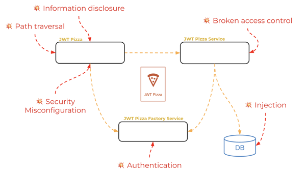

# Penetration Testing

🔑 **Key points**

- Penetration testing helps you identify vulnerabilities before an attacker does.
- CVE and CVSS provide a common format for reporting and scoring vulnerabilities.

---

📖 **Deeper dive reading**: [PortSwigger Academy](https://portswigger.net/web-security/all-topics)

Penetration testing focuses on preventing actions that would:

1.  Allow abnormal execution of the application
2.  Allow unauthorized access to functionality or data
3.  Expose non-public data
4.  Reduce administrator visibility into the application

Modern software applications are globally accessible, complex, and frequently updated. They are also high-value targets for both monetary and informational purposes. This means there is significant motivation and opportunity for nefarious actors to penetrate an application's security barriers and cause significant harm to both the organization and its users.

In some ways, penetration testing is the most important testing you can perform. If a piece of an application's functionality fails but results in no loss of revenue or data, it has little inherent harm. However, if your application is extremely successful and provides significant functional value but leaks sensitive data or revenue, it would have been better if it were never deployed.

Taking security seriously means taking penetration testing seriously. Do not let others be harmed by the systems you create simply because you neglected to be intentionally security-minded during the design and testing of your application.

> “Constant vigilance!”
>
> — Barty Crouch Jr. (_referencing a man-in-the-middle attack on Mad-Eye Moody_)

## Putting on your white hat

An attacker with malicious intent is often characterized as wearing a **black hat**. Alternatively, security researchers who think like an attacker but mitigate vulnerabilities instead of exploiting them are characterized as wearing a **white hat**.

Successful penetration testing requires you to think like an attacker. It is almost the opposite of a standard operational design approach. Instead of asking, "What parameters does this component need to get a desired result?", you ask, "What parameters can I abuse, exclude, or overload to get a result that the component was not designed to provide?"

It often helps to gamify the process. If it is an application you wrote, you are essentially playing a game of chess against yourself. Otherwise, you need to get into the head of the application's author to identify their blind spots.

Remember that you have a responsibility to disclose whatever vulnerabilities you are able to exploit to the application author so they can mitigate them. If you discovered a flaw, it is likely that a "black hat" will also discover it, or perhaps already has. It is better to make it public and get it fixed, whatever the cost, than to leave it lurking in the shadows.

## Automation

As with any QA or DevOps action, it is critical to take advantage of automation. To be effective, you must let data and algorithms do the heavy lifting. Once automation discovers potential holes in the system, you can manually examine the possibilities. However, conducting a brute-force attack manually is rarely productive.

## Testing phases

The following phases are suggested to successfully conduct penetration testing.

### Planning and Reconnaissance

Learn everything possible about the application. The more you know about the system, the easier it will be to identify potential exploits.

| Area                                                               | JWT Example                                                                                                                                                                                     |
| ------------------------------------------------------------------ | ----------------------------------------------------------------------------------------------------------------------------------------------------------------------------------------------- |
| Document all application user roles                                | Diner, franchisee, and administrator.                                                                                                                                                           |
| Know how the application is designed to work                       | Build a sitemap that shows the interaction between pages.                                                                                                                                       |
| Know all public endpoints                                          | Both the JWT Pizza Service and the JWT Pizza Factory.                                                                                                                                           |
| Read any available documentation                                   | In addition to public documentation, check developer blogs and technical white papers for insights. For JWT, this includes the `/api/docs` endpoint and `/docs` view.                            |
| Know what OS, programming language, and 3rd-party software is used | Linux ARM, JavaScript, Express, and UUID.                                                                                                                                                       |
| Know what services the application uses                            | AWS CloudFront and ECS.                                                                                                                                                                         |
| Know how the application is deployed                               | GitHub Actions.                                                                                                                                                                                 |

### Probing

Use automated tools to probe the application. This includes checking for open ports on the server, discovering IP addresses, attempting to explore public directory files, requesting application views with different roles, and calling endpoints.

You should also attempt to provide overloaded parameters, exclude required parameters, and look for undocumented request or response parameters.

Focus your efforts on the common areas of failure defined by the [OWASP Top 10](../securityCommunity/securityCommunity.md).

### Weaponization

Once you have identified a vulnerability, you need to "weaponize" it to prove the risk. This usually consists of creating a parameterized payload that allows you to deliver and execute an exploit. Researchers often give these payloads names like `pepperonikiller`, `crustydb`, or `jwtsucker`.

You also need to consider threat persistence. Can the exploit remain hidden to provide long-term access? Does it stay dormant until a specific trigger occurs? Is the attack meant to disrupt the application (DoS)?

Ultimately, attackers want to cover their tracks, which makes disrupting the observability of the system crucial. In a professional penetration test, you might demonstrate how multiple exploits work in concert: for example, a gateway exploit that allows administrative access, a log shim that hides your behavior, and a data capture exploit.

The goal here is not to actually damage the production system, but to use the exploit in a controlled environment to develop effective defenses and render the "weapon" ineffective.

## Vulnerability reporting

There is great value in sharing information about best practices, vulnerabilities, and attempted penetrations. Only by working together as a community can we hope to protect the integrity of the global information infrastructure. The two primary tools for sharing vulnerability information are the [Common Vulnerabilities and Exposures](https://en.wikipedia.org/wiki/Common_Vulnerabilities_and_Exposures) (CVE) report and the [Common Vulnerability Scoring System](https://en.wikipedia.org/wiki/Common_Vulnerability_Scoring_System) (CVSS).

💡 You might consider doing your curiosity report on the design of CWE, CVE, and CVSS, as well as their usefulness in supporting the security community.

### CVSS

The Common Vulnerability Scoring System creates a normalized score for identifying the risk presented by a vulnerability. This allows the security community to respond appropriately. A CVSS score is calculated based on several metrics, typically categorized into three groups. Each metric is assigned a value (such as Low, Medium, or High) that contributes to the composite score.

1.  **Base**: Represents the intrinsic qualities of a vulnerability.
    1.  _Attack Vector_: How the attack is initiated (e.g., Network, Physical).
    2.  _Attack Complexity_: How difficult it is to execute the exploit.
    3.  _Privileges Required_: The level of rights required to start the attack.
    4.  _User Interaction_: Whether a human must participate for the attack to succeed.
    5.  _Scope_: Whether the vulnerability affects resources beyond the security scope of the component.
    6.  _Confidentiality Impact_: The impact on the privacy of the data.
    7.  _Integrity Impact_: Whether the attack can alter or destroy data.
    8.  _Availability Impact_: Whether the attack can make the component inaccessible.
2.  **Temporal**: Reflects the current state of exploit techniques or code availability.
3.  **Environmental**: Allows analysts to customize the score based on the importance of the affected IT asset to their organization.

Each metric results in a score from 0 to 10. A score of 9.0+ is considered a critical threat requiring immediate action, while a score of 3.0 might only require action under specific circumstances.

Commonly, only the _Base_ metric is computed, as the other two are situational.

### Examples

#### Heartbleed

Heartbleed is a vulnerability in the OpenSSL cryptographic software library. It allows an attacker to read sensitive data from the memory of affected servers.

| Data        | Value                      |
| ----------- | -------------------------- |
| CVE         | CVE-2014-0160              |
| CVSS Vector | AV:N/AC:L/Au:N/C:P/I:N/A:N |
| Base Score  | 5.0 (Medium)               |

#### WannaCry

WannaCry is a ransomware attack that spread rapidly across numerous systems, encrypting files and demanding ransom payments in Bitcoin. It exploits a vulnerability in the Windows SMB protocol.

| Data        | Value                               |
| ----------- | ----------------------------------- |
| CVE         | CVE-2017-0144                       |
| CVSS Vector | AV:N/AC:L/PR:N/UI:N/S:U/C:H/I:H/A:H |
| Base Score  | 8.8 (High)                          |

#### Spectre

Spectre is a vulnerability affecting modern microprocessors that perform branch prediction. It allows attackers to trick a processor into executing instructions that should not have been executed, leading to information leakage.

| Data        | Value                                |
| ----------- | ------------------------------------ |
| CVE         | CVE-2017-5753 and CVE-2017-5715      |
| CVSS Vector | AV:L/AC:H/PR:N/UI:N/S:C/C:H/I:N/A:N |
| Base Score  | 5.6 (Medium)                         |

## JWT Pizza

You want to make JWT Pizza as secure as possible. To achieve that, you need to conduct penetration testing. Start thinking about how you would attack JWT Pizza. Study the source code and consider potential attack vectors.

Here is a list of questions based on the OWASP Top 10 to help you find vulnerabilities in the JWT Pizza ecosystem:

| Name                                       | Vector                                                                       |
| ------------------------------------------ | ---------------------------------------------------------------------------- |
| Broken Access Control                      | Can I bypass security with a URL or a discoverable parameter?                |
| Cryptographic Failures                     | Can I access unencrypted data in transit or at rest?                         |
| Injection                                  | Can I overload input parameters to execute code in the services?             |
| Insecure Design                            | Is there a design flaw that I can exploit for a DoS attack?                  |
| Security Misconfiguration                  | Are there known default configurations still in place?                       |
| Vulnerable and Outdated Components         | Does the application use components with known vulnerabilities?              |
| Identification and Authentication Failures | Is there an endpoint that lacks proper authentication controls?              |
| Software and Data Integrity Failures       | Can I discover credentials or configurations by observing the CI/CD pipeline? |
| Software Logging and Monitoring Failures   | Can I overload or disable metrics and logging to hide my tracks?             |
| Server-Side Request Forgery (SSRF)         | Can I execute a fetch or console command with the server's execution rights?  |