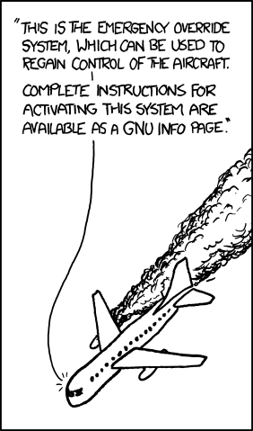

# Playbooks

🔑 **Key points**

- Playbooks are an essential piece of your disaster recovery plan.
- To be useful they must be exercised.

---

Failure recovery playbooks serve as essential guides for organizations to efficiently respond to and manage unexpected system failures or disruptions. These playbooks provide detailed, step-by-step procedures and protocols that outline the necessary actions to be taken when a failure occurs, ensuring a swift and effective response. They help mitigate the impact of outages by detailing roles and responsibilities, communication plans, and escalation paths. By having well-defined recovery processes, organizations can minimize downtime, reduce data loss, and maintain service continuity. Additionally, these playbooks are crucial for training staff, standardizing recovery efforts, and ensuring compliance with industry regulations and best practices, ultimately enhancing the overall resilience and reliability of the organization’s infrastructure.

A good playbook will include the following.

- **Playbook objective**: What systems and types of failures does the playbook cover? RTO and RPO metrics are defined.
- **Roles and responsibilities**: Who are the key teams and personnel that are responsible to respond to the failure?
- **Communication plan**: How will the team communicate, and where can you find the team's contact information?
- **Incident detection and notification**: Defines the pertinent observability metrics, altering thresholds, and escalation paths.
- **Diagnostic process**: Detailed instructions for diagnosing the failure, along with the tools and resources that can assist in the process.
- **Recovery procedures**: Detailed instructions for resolving the failure. This includes variations for temporal-recovery, reboot, and replacement strategies. Processes for manual intervention, initiation of automation, or self-healing automation are defined. Data recovery and roll back processes are detailed.
- **Post-recovery actions**: Steps for verifying the recovery, documenting its impact, and defining prevention tasks.

## Example playbook

The following is an example playbook that should give you a pretty good idea of the level of detail necessary to take quick, systematic, action when a failure occurs.

### Database Outage Failure Recovery Playbook

#### Playbook Objective

This playbook provides a structured approach for managing and recovering from database outages. It covers failures related to database crashes, connectivity issues, and data corruption. The RTO (Recovery Time Objective) is set to 1 hour, and the RPO (Recovery Point Objective) is set to 15 minutes.

#### Roles and Responsibilities

- **Incident Manager**: Oversees the recovery process and ensures all steps are followed. Contact: Jane Doe, (555) 123-4567
- **Database Administrator (DBA)**: Executes technical recovery steps and manages database integrity. Contact: John Smith, (555) 234-5678
- **Communication Lead**: Handles communication with stakeholders and customers. Contact: Sarah Lee, (555) 345-6789
- **Backup Operator**: Manages backup verification and data restoration. Contact: Tom Brown, (555) 456-7890

#### Communication Plan

- **Internal Communication**: Use Discord channel #db-outage-response for team updates.
- **External Communication**: Notify affected customers via email within 1 hour of the outage.
- **Contact Information**: Maintain an updated contact list in the team's shared drive [here](http://example.com/contact-list).

#### Incident Detection and Notification

- **Observability Metrics**:
  - Database response time
  - Connection success rates
  - Error rates in application logs
- **Alerting Thresholds**:
  - Response time > 2 seconds
  - Connection success rate < 95%
  - Error rates > 5% of requests
- **Escalation Paths**:
  - Alert DBA via monitoring tool (e.g., Nagios) SMS and email
  - Notify Incident Manager via Slack and SMS

#### Diagnostic Process

1. **Identify Issue**:
   - Check Grafana database server logs for errors.
   - Review Grafana monitoring tool alerts and metrics.
2. **Tools and Resources**:
   - `mysql` command-line tool
   - Monitoring dashboard (Grafana)
   - Application logs
3. **Initial Diagnosis**:
   - Confirm if the database server is running. AWS RDS Dashboard
   - Check network connectivity to the database: `ping db-server`

#### Recovery Procedures

1. **Temporal Recovery**:
   - Restart database service: `systemctl restart mysql`
   - Verify service health: `systemctl status mysql`
2. **Reboot Strategy**:
   - If temporal recovery fails, reboot the database server:
     ```
     aws rds reboot-db-instance --db-instance-identifier test-mysql-instance
     ```
   - Upon restart, verify database service:
     ```
      aws dms test-connection
      --replication-instance-arn arn:aws:dms:us-east-1:123456789012:rep:T3OM7OUB5NM2LCVZF7JPGJRNUE
      --endpoint-arn arn:aws:dms:us-east-1:123456789012:endpoint:6GGI6YPWWGAYUVLKIB732KEVWA`
     ```
3. **Replacement Strategy**:
   - Provision a new database server from snapshot: Use AWS RDS console or CLI
   - Update application configuration to point to the new server
4. **Data Recovery**:
   - Find the latest snapshot
   - Restore data:
     ```
     aws rds restore-db-instance-from-db-snapshot
     --db-instance-identifier db7-new-instance
     --db-snapshot-identifier db7-test-snapshot
     --db-instance-class db.t3.small
     ```
   - Validate data consistency with application tests
5. **Automation and Self-Healing**:
   - Initiate automated failover if configured
   - Run self-healing scripts for common issues

#### Post-Recovery Actions

1. **System Validation**:
   - Perform end-to-end application tests to ensure full functionality
   - Monitor system for 30 minutes to confirm stability
2. **Incident Documentation**:
   - Log incident details, recovery steps, and impact in the incident management system
   - Collect logs and relevant data for analysis
3. **Prevention Tasks**:
   - Conduct a post-mortem meeting within 48 hours
   - Identify root cause and implement preventive measures
   - Update this playbook with lessons learned and improvements

## Exercising your playbook

A common mistake for DevOps teams is to create a playbook and then put it on the shelf. In order for a playbook to justify its usefulness it must be exercised under a real or simulated failure. A playbook that has never been exercised runs the real risk of actually slowing down a response because it might lead the team down a path that makes the problem worse.

The common DevOps phrase is to "test your system to failure". This should be coupled with "test your system to recovery".

## A bit of fun



> _source: [XKCD](https://xkcd.com/912/)_
