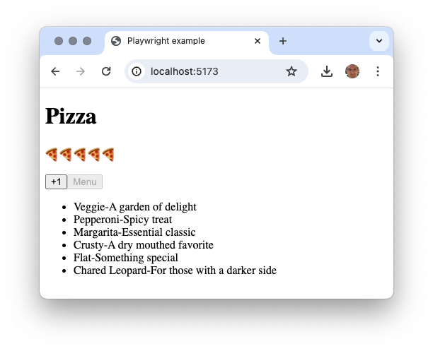
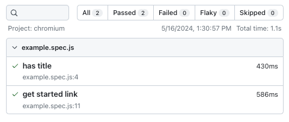
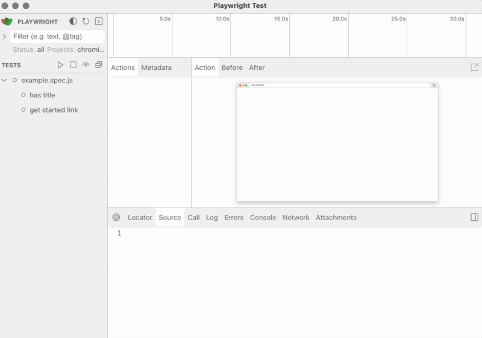
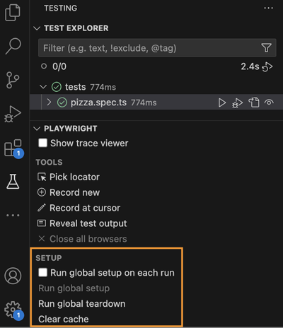
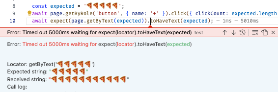
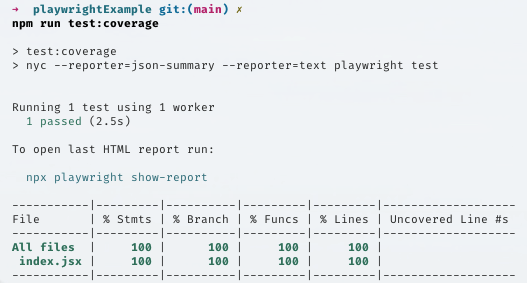

# Playwright

🔑 **Key points**

- How to install Playwright
- Understand the functionality of Playwright
- Gain experience with Playwright by testing a simple application

---

📖 **Deeper dive reading**:

- [Playwright](https://playwright.dev/)
- [Testing best Practices](https://playwright.dev/docs/best-practices)
- [Writing tests](https://playwright.dev/docs/writing-tests)
- [VS Code Playwright extension](https://playwright.dev/docs/getting-started-vscode)

---


For the purposes of this course, we could pick any of the top UI testing frameworks. However, we are going to pick a newcomer, Playwright. Playwright has some major advantages. It is backed by Microsoft, it integrates really well with VS Code, and it runs as a Node.js process. It is also considered one of the least flaky of the testing frameworks.

Playwright gets its speed and stability by running directly against each of the major browsers' DevTool API. This is a major advantage over other tools that either directly or indirectly use the Selenium WebDriver or only support a single browser.

## Tutorial project

In order to have something that we can use to demonstrate how to use Playwright, we need to first create an example project. Take the following steps:

1. Create a test directory
   ```sh
   mkdir playwrightExample && cd playwrightExample
   ```
1. Create the basic Vite React app
   ```sh
   npm init -y
   npm install vite@latest -D
   npm install react react-dom
   ```
1. Modify `package.json` to include the following
   ```json
     "type": "module",
     "scripts": {
       "dev": "vite",
       "test": "playwright test"
     },
   ```
1. Create a very simple `index.html` home page in the root of the project.

   ```html
   <!DOCTYPE html>
   <html lang="en">
     <head>
       <title>Playwright example</title>
       <style>
         div {
           padding-bottom: 10px;
           font-family: sans-serif;
         }
       </style>
     </head>
     <body>
       <div id="root"></div>
       <script type="module" src="/src/index.tsx"></script>
     </body>
   </html>
   ```

1. Create a `src` directory and then add a file named `index.tsx` that contains the following.

   ```jsx
   import React from 'react';
   import ReactDOM from 'react-dom/client';

   ReactDOM.createRoot(document.getElementById('root')).render(<App />);

   function App() {
     const [count, setCount] = React.useState(1);
     const [menu, setMenu] = React.useState([]);

     async function getMenu() {
       const response = await fetch('https://pizza-service.cs329.click/api/order/menu');
       const data = await response.json();
       setMenu(
         data.map((item, i) => (
           <li key={i}>
             {item.title} - {item.description}
           </li>
         ))
       );
     }

     return (
       <div>
         <h1>Pizza</h1>
         <p>{'🍕'.repeat(count)}</p>
         <button onClick={() => setCount(count + 1)}>+1</button>
         <button disabled={!!menu.length} onClick={getMenu}>
           Menu
         </button>
         <ul>{menu}</ul>
       </div>
     );
   }
   ```

Now you can run `npm run dev` and experiment with the demonstration application. Notice that you can order pizzas by pressing the `+1` button and get the JWT pizza menu by pressing `Menu`. Once the menu is displayed it will disable the menu option. Get familiar with the code so that you are ready to start writing your UI tests.



## Installing Playwright

With our demonstration app created we are ready to install Playwright. When going through the installation steps, choose TypeScript, `tests` for the test directory, ignore the GitHub Actions workflow for now, and do not install any Playwright browsers.

```sh
npm init playwright@latest
```

This will update `package.json` with the `playwright` package, create a `playwright.config.ts` file, and create some sample tests in the `test` and `tests-examples` directories. This will also update your `.gitignore` file so that you don't accidentally check in test coverage or report information.

### Install a testing browser

Now review the playwright configuration file: `playwright.config.ts`. In there you will find the specification for which browser drivers to use.

```js
  /* Configure projects for major browsers */
  projects: [
    {
      name: 'chromium',
      use: { ...devices['Desktop Chrome'] },
    },

    {
      name: 'firefox',
      use: { ...devices['Desktop Firefox'] },
    },

    {
      name: 'webkit',
      use: { ...devices['Desktop Safari'] },
    },
```

For simplicity's sake, we will only run tests with `chromium`, so delete the other entries. Once you have modified the file you can install the `chromium` driver.

```sh
npx playwright install --with-deps chromium
```

## Running your first test

The easiest way to run your first Playwright test is to use the examples that came with the Playwright installation.

```sh
└── tests
    └── example.spec.ts

```

Playwright will run any test found in the testing directory as defined by the `testDir` property in the `playwright.config.ts` file. You chose `tests` to be the testing directory during the installation. Playwright follows the common convention of including `.spec.` in test names. You can also use `.test.` if you want to be consistent with your Jest tests.

The `example.spec.ts` found in the `tests` directory contains two simple tests. Here is what the first one looks like.

```js
test('has title', async ({ page }) => {
  await page.goto('https://playwright.dev/');
  await expect(page).toHaveTitle(/Playwright/);
});
```

This test navigates to the Playwright website and checks to make sure the resulting page has the title `Playwright`. You can run the tests from your project directory with the following console command.

```sh
npm test

Running 2 tests using 2 workers
  2 passed (1.1s)
```

**Congratulations!** You have just ran your first Playwright test.

### Viewing the results

In addition to outputting the result to the console, Playwright creates a file named `test-results/.last-run.json` that contains the result of running the test.

If you want to see a visual report in a browser window you can run:

```
npx playwright show-report
```

This will allow you to interactively review what happened with the test.



### Interactive execution

You can also run the test using the Playwright UI mode.

```sh
npx playwright test --ui
```

This opens up a window that shows all the tests found in the `tests` directory and allows you to interactively execute them and review the results. This includes a time-lapse overview of what the browser was doing while it executed and the ability to see the state of the browser during each step of the test.

> 

## Configuring to test with Vite

Before we can write our own tests we need to finish configuring Playwright. Open the `playwright.config.ts` file and modify it so that it will launch our service whenever a test needs to run. This is done by adding a `webServer` section to the config that provides the startup command for Vite and the URL that our service is running from.

```js
  webServer: {
    command: 'npm run dev',
    url: 'http://localhost:5173',
    reuseExistingServer: !process.env.CI,
    timeout: 5000,
  },
```

You can also remove all the comments in order to make the file easier to read. When you are done your configuration file should look like the following. Make sure you understand what all of this [configuration](https://playwright.dev/docs/test-configuration) is doing so that you can get the maximum value that Playwright provides.

```js
import { defineConfig, devices } from '@playwright/test';

export default defineConfig({
  testDir: './tests',
  fullyParallel: true,
  forbidOnly: !!process.env.CI,
  retries: process.env.CI ? 2 : 0,
  workers: process.env.CI ? 1 : undefined,
  reporter: 'html',
  timeout: 5000,
  use: {
    baseURL: 'http://localhost:5173',
    trace: 'on-first-retry',
  },

  /* Configure projects for major browsers */
  projects: [
    {
      name: 'chromium',
      use: { ...devices['Desktop Chrome'], viewport: { width: 800, height: 600 } },
    },
  ],

  /* Run your local dev server before starting the tests */
  webServer: {
    command: 'npm run dev',
    url: 'http://localhost:5173',
    reuseExistingServer: !process.env.CI,
    timeout: 5000,
  },
});
```

## Coverage

In order to add coverage reporting we have to install the coverage utilities and instrument the code. Unlike Jest, where they have coverage built into the application, Playwright requires you to install the coverage utility of your choice. This gives you freedom to customize things as you would like, but it is a bit painful to set up.

The coverage tools we are going to use are called Istanbul and NYC.

- **Istanbul** is a JavaScript code coverage tool that computes statement, line, function, and branch coverage with module loader hooks to transparently add coverage when running tests. It can handle all types of testing including unit, functional, and end-to-end testing.

- **NYC** is the official command-line interface for Istanbul. It's a top-level wrapper around Istanbul, adding further capabilities and features. It hooks into your testing framework to track coverage information and then generates detailed reports.

### Install the coverage packages

First we need to install all the packages required for generating coverage. In addition to NYC we include `vite-plugin-istanbul` and `playwright-test-coverage` to have Vite execute istanbul in order to instrument the code for coverage gathering.

```sh
npm install -D nyc vite-plugin-istanbul playwright-test-coverage
```

### Create the coverage configuration

We create a `.nycrc.json` file in order to specify the required coverage thresholds.

```js
{
  "check-coverage": true,
  "branches": 100,
  "lines": 100,
  "functions": 100,
  "statements": 100
}
```

NYC will output coverage information to a directory named `.nyc_output`. We definitely don't want push that to GitHub, so we add it to our growing list of coverage files found in `.gitignore`

```txt
coverage
node_modules
/test-results/
/playwright-report/
/blob-report/
/playwright/.cache/
.nyc_output
```

Vite needs to know to include Istanbul as a plugin when bundling, so we create/modify `vite.config.js` to include instructions on which files you want to have Istanbul analyze.

```js
import { defineConfig } from 'vite';
import istanbul from 'vite-plugin-istanbul';

export default defineConfig({
  build: { sourcemap: true },
  plugins: [
    istanbul({
      include: ['src/**/*'],
      exclude: ['node_modules'],
      requireEnv: false,
    }),
  ],
});
```

Finally, we add another `package.json` script so that NYC runs the Playwright tests and reports the coverage results. We tell NYC to use two reporters: one that will save a high level JSON file, and another one that prints the details to the console.

```json
"scripts": {

  ...

  "test:coverage": "nyc --reporter=json-summary --reporter=text playwright test"
}
```

### Instrument the tests

The last step is to replace the Playwright `test` function with one that wraps the `test` function and generates coverage data. You need to do this on every test file that you want to report coverage.

```js
// import { test, expect } from '@playwright/test' <- Replace this with the line below
import { test, expect } from 'playwright-test-coverage';
```

### Create a real test

If we replace the test that calls the Playwright website with one that actually hits our React application we can determine the amount of coverage we get from loading the homepage.

```sh
test('test', async ({ page }) => {
  await page.goto('http://localhost:5173/');
});
```

### Run the tests with coverage

With these changes, you are all set to run the tests and report coverage information.

```sh
➜  npm run test:coverage

ERROR: Coverage for lines (44.44%) does not meet global threshold (80%)
ERROR: Coverage for functions (25%) does not meet global threshold (80%)
ERROR: Coverage for statements (44.44%) does not meet global threshold (80%)
-----------|---------|----------|---------|---------|-------------------
File       | % Stmts | % Branch | % Funcs | % Lines | Uncovered Line #s
-----------|---------|----------|---------|---------|-------------------
All files  |   44.44 |      100 |      25 |   44.44 |
 index.tsx |   44.44 |      100 |      25 |   44.44 | 11-15,26
-----------|---------|----------|---------|---------|-------------------
```

It looks like we have 44.5% line coverage. That is pretty good for just having one line of testing code. Next we will look at using VS Code to write and run tests, and then dive deeper into what the Playwright testing framework provides so that we can bump up our coverage percentage.

## VS Code Playwright extension

The [VS Code extension for Playwright](https://marketplace.visualstudio.com/items?itemName=ms-playwright.playwright) is well worth the time to install and master. You can actually use it to install Playwright for your project instead of using the manual steps defined above.

Just like the Jest VS Code extension, the Playwright extension will detect that you have Playwright tests and allow you to run them from the `flask` menu of the sidebar.

Some cool features include:

- Installing other browsers
- In context error messages
- Debugging tests
- Picking a locator by clicking on an element
- Recording a new tests
- Record starting at the cursor
- Displaying the trace viewer

You can also debug your tests by placing a break point and walking through test code in VS Code and the frontend code in the browser's dev tools.

> [!NOTE]
>
> Configuring Playwright to automatically start your application and using the Playwright extension to run tests will often leave it running in the background. If left running, it will also use previously defined configuration settings. If you want to make sure you start with a clean global configuration then make sure you run the global setup on each run.



### Visual code coverage

If you want to be able to visually see in VS Code which lines are covered by the NYC report you can install a VS Code extension such as [Cover](https://marketplace.visualstudio.com/items?itemName=hindlemail.cover).

## Writing your own tests

Now you are ready to write your first test against our demonstration service.

Let's start by getting rid of the example tests. To do this you can either delete the `example.spec.ts` file or move it to the `tests-examples` directory where it will be ignored.

### Recording a test

We can create our test by using the VS Code Playwright extension's ability to record the interactions with the browser. To start the recording press the `Record new` new option found under the `Playwright panel` of the Test Explorer side pane.

> 

When you start the recording it will open up a browser window and connect to the server that you specified in the Playwright configuration file.

You can then navigate to the desired webpage, interact with the page components and add assertions from the recording toolbar.

When you are done, press the stop button and view the resulting test case.

### Examining the test

Here is the test that resulted from the recording.

```js
test('test', async ({ page }) => {
  await page.goto('http://localhost:5173/');
  await page.getByRole('button', { name: '+' }).click();
  await page.getByRole('button', { name: '+' }).click();
  await expect(page.getByText('🍕🍕🍕')).toBeVisible();
  await page.getByRole('button', { name: 'Menu' }).click();
  await expect(page.getByRole('list')).toContainText('Veggie - A garden of delight');
});
```

You can see how Playwright tries to abstract away as much of the locating of page elements as possible. Instead of using a CSS selector to find an element, it tries to find things by roles that have some distinguishing characteristic. For example, the different buttons are located by finding a role of button with a `+` or `Menu` in their text.

```sh
  await page.getByRole('button', { name: '+' }).click();
```

Using the `expect` function we can assert that the desired changes happened in reaction to our clicks, either that something was visible or that it contained certain text.

```sh
  await expect(page.getByText('🍕🍕🍕')).toBeVisible();
  await expect(page.getByRole('list')).toContainText('Veggie - A garden of delight');
```

### Modifying the test

Let's improve the test a bit.

```js
test('test', async ({ page }) => {
  await page.goto('http://localhost:5173/');
  await expect(page.getByText('Pizza')).toBeVisible();
  await expect(page.getByText('🍕')).toBeVisible();

  const expected = '🍕🍕🍕🍕🍕';
  await page.getByRole('button', { name: '+' }).click({ clickCount: expected.length });
  await expect(page.getByText(expected)).toHaveText(expected);

  await expect(page.getByRole('button', { name: 'Menu' })).toBeEnabled();
  await page.getByRole('button', { name: 'Menu' }).click();
  await expect(page.getByRole('list')).toContainText('Veggie - A garden of delight');
  await expect(page.getByRole('button', { name: 'Menu' })).toBeDisabled();
});
```

We add some validation of preconditions such that a pizza is already displayed at the start and that menu button goes from **enabled** to **disabled**.

We also use data driven JavaScript to control how many times we push the pizza button and then to assert that the right number of pizzas occur, and we change the locator to find an exact text value rather than some possible substring.

### Debugging the test

When we run the new test we get an error saying that it couldn't find the pizzas after we added them all. The error is showing that we made way more pizzas than we imagined.



If we debug the test by placing a breakpoint on the first line and then stepping through we can see our error.


We are using the `length` operation on a string with emojis in it. Length is not going to take into account the unicode size of the emoji. So we need to convert it to an array of characters first and then get the length.

```js
await page.getByRole('button', { name: '+' }).click({ clickCount: [...expected].length });
```

Running the test again reveals another error. We were not taking into account the original 🍕 that existed before we inserted the new ones. To solve this we just insert one less pizza than we expect to be there in the end.

```js
await page.getByRole('button', { name: '+' }).click({ clickCount: [...expected].length - 1 });
```

### Mocking

We can demonstrate how mocking works with Playwright by replacing our actual call to the `jwt-pizza-service` with a mocked HTTP response. We want to mock out the call because we don't want our test to fail whenever the menu changes. However, the danger here is that the JSON response might change and the test will no longer detect the failure.

Mocking the call turns out to be really easy. You just call the `route` method on the page object that is passed to the test and provide a function that can both validate the request and return a response.

```js
// Mock out the service
const menuResponse = [{ title: 'Veggie', description: 'A garden of delight' }];
await page.route('*/**/api/order/menu', async (route) => {
  expect(route.request().method()).toBe('GET');
  await route.fulfill({ json: menuResponse });
});
```

This doesn't return all the data that the actual endpoint was returning, but it is just what we need to validate that the UI is behaving properly.

### Final test version

Here is the full test that we created.

```js
import { test, expect } from 'playwright-test-coverage';

test('test', async ({ page }) => {
  const menuResponse = [{ title: 'Veggie', description: 'A garden of delight' }];

  // Mock out the service
  await page.route('*/**/api/order/menu', async (route) => {
    expect(route.request().method()).toBe('GET');
    await route.fulfill({ json: menuResponse });
  });

  await page.goto('http://localhost:5173/');
  await expect(page.getByText('Pizza')).toBeVisible();
  await expect(page.getByText('🍕')).toBeVisible();

  const expected = '🍕🍕🍕🍕🍕';
  await page.getByRole('button', { name: '+' }).click({ clickCount: [...expected].length - 1 });
  await expect(page.getByText(expected)).toHaveText(expected);

  await expect(page.getByRole('button', { name: 'Menu' })).toBeEnabled();
  await page.getByRole('button', { name: 'Menu' }).click();
  await expect(page.getByRole('list')).toContainText('Veggie - A garden of delight');
  await expect(page.getByRole('button', { name: 'Menu' })).toBeDisabled();
});
```

With these changes, you are all set to run the tests again and see what percentage of coverage we are getting.

```sh
➜  npm run test:coverage

Running 1 test using 1 worker
  1 passed (1.1s)

-----------|---------|----------|---------|---------|-------------------
File       | % Stmts | % Branch | % Funcs | % Lines | Uncovered Line #s
-----------|---------|----------|---------|---------|-------------------
All files  |     100 |      100 |     100 |     100 |
 index.tsx |     100 |      100 |     100 |     100 |
-----------|---------|----------|---------|---------|-------------------
```

It looks like we have 💯% line coverage. I'm feeling good!

## Learning Playwright

It is highly suggested that you review the [Playwright instruction](https://playwright.dev/docs/writing-tests) for writing tests. This includes creating `locators` to find page elements, `actions` to interact with a locator, and `expect` operations to test your assertions.

### Locators

Generally a locator starts with the `page` object passed to the test function. The locators attempt to abstract the structure of the page and instead focus on things such as roles, text, and labels.

If you need to locate a specific element it is good practice to add a `data-testid` to an element instead of using the DOM ID. That allows you the freedom to change the element ID that your code interacts with, without breaking your test.

```html
<p data-testid="generated-copy">Lorem ipsum</p>
```

```js
await expect(page.getByTestId('generated-copy').toBe('Lorem ipsum');
```

Experiment with the different locators until you feel comfortable with the unique abilities of each type.

| Locator                 | Description                                                                                |
| ----------------------- | ------------------------------------------------------------------------------------------ |
| page.getByRole()        | Locate by explicit and implicit accessibility attributes.                                  |
| page.getByText()        | Locate by text content.                                                                    |
| page.getByLabel()       | Locate a form control by associated label's text.                                          |
| page.getByPlaceholder() | Locate an input by placeholder.                                                            |
| page.getByAltText()     | Locate an element, usually image, by its text alternative.                                 |
| page.getByTitle()       | Locate an element by its title attribute.                                                  |
| page.getByTestId()      | Locate an element based on its data-testid attribute (other attributes can be configured). |

### Actions

Actions allow you to interact with an element in order to simulate a user. Here are the most commonly used locators.

| Action                  | Description                     |
| ----------------------- | ------------------------------- |
| locator.check()         | Check the input checkbox        |
| locator.click()         | Click the element               |
| locator.uncheck()       | Uncheck the input checkbox      |
| locator.hover()         | Hover mouse over the element    |
| locator.fill()          | Fill the form field, input text |
| locator.focus()         | Focus the element               |
| locator.press()         | Press single key                |
| locator.setInputFiles() | Pick files to upload            |
| locator.selectOption()  | Select option in the drop-down  |

Here is an example of clicking on a button.

```js
await page.getByRole('button').click();
```

### Expect

The expect method provides the validation that your assertions are correct. Playwright provides many assertions.

| Assertion                         | Description                       |
| --------------------------------- | --------------------------------- |
| expect(locator).toBe()            | Equality                          |
| expect(locator).toBeChecked()     | Checkbox is checked               |
| expect(locator).toBeEnabled()     | Control is enabled                |
| expect(locator).toBeVisible()     | Element is visible                |
| expect(locator).toContainText()   | Element contains text             |
| expect(locator).toHaveAttribute() | Element has attribute             |
| expect(locator).toHaveCount()     | List of elements has given length |
| expect(locator).toHaveText()      | Element matches text              |
| expect(locator).toHaveValue()     | Input element has value           |
| expect(page).toHaveTitle()        | Page has title                    |
| expect(page).toHaveURL()          | Page has URL                      |

You can negate any of the above assertions by inserting the `not` in front of the assertion function.

```js
await expect(page.getByTestId('generated-copy').not.toBe('Lorem ipsum');
```

## ☑ Exercise

Create a project based on the instructions provided above. Change the `App` component to be the following. Install Playwright and create tests until you get 100% code coverage with this new code.

**index.tsx**

```jsx
import React from 'react';
import ReactDOM from 'react-dom/client';

ReactDOM.createRoot(document.getElementById('root')).render(<App />);

function App() {
  const [count, setCount] = React.useState(0);
  const [pizzaType, setPizzaType] = React.useState('');
  const [order, setOrder] = React.useState('Choose your pizza!');
  const [menu, setMenu] = React.useState([]);

  async function getMenu() {
    const response = await fetch('https://pizza-service.cs329.click/api/order/menu');
    const data = await response.json();
    setMenu(
      data.map((item, i) => (
        <li key={i}>
          {item.title} - {item.description}
        </li>
      ))
    );
  }

  async function handleOrder() {
    setOrder(`Ordering ${count} ${pizzaType} pizzas`);
  }

  return (
    <div>
      <h1>Pizza</h1>
      <p>{'🍕'.repeat(count) || '👨‍🍳'}</p>
      <label htmlFor='order'>Pizza:</label>
      <div>
        <input type='text' id='pizza-type' value={pizzaType} placeholder='type' onChange={(e) => setPizzaType(e.target.value)} />
        &nbsp;<button onClick={() => setCount(count + 1)}>+1</button>
        &nbsp;
        <button disabled={!count || !pizzaType} onClick={handleOrder}>
          Order
        </button>
      </div>
      <div id='orderValue'>
        <i>{order}</i>
      </div>
      <button disabled={!!menu.length} onClick={getMenu}>
        Menu
      </button>
      <ul>{menu}</ul>
    </div>
  );
}
```

Once you are done, you should have 100% coverage. This will look something like the following.


