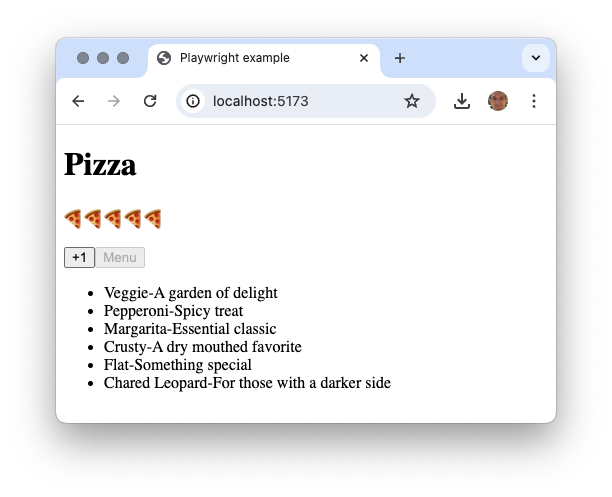
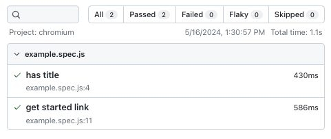
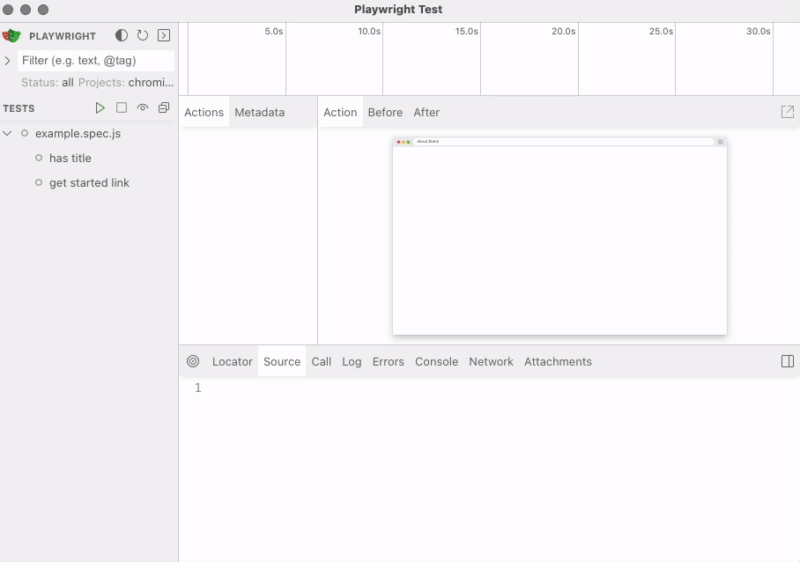
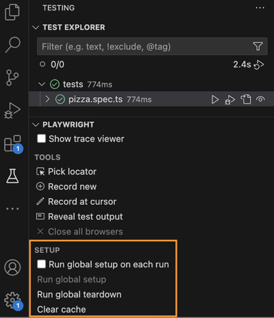
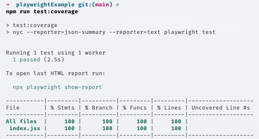

# Playwright

🔑 **Key points**

- How to install Playwright
- Understand the functionality of Playwright
- Gain experience with Playwright by testing a simple application

---

📖 **Deeper dive reading**:

- [Playwright Official Site](https://playwright.dev/)
- [Testing Best Practices](https://playwright.dev/docs/best-practices)
- [Writing Tests](https://playwright.dev/docs/writing-tests)
- [VS Code Playwright Extension](https://playwright.dev/docs/getting-started-vscode)

---


While there are many excellent UI testing frameworks available, we will use Playwright for this course. Playwright offers several major advantages: it is backed by Microsoft, integrates seamlessly with VS Code, and runs as a Node.js process. It is also widely considered one of the most stable and reliable testing frameworks available today.

Playwright achieves its speed and stability by communicating directly with the DevTools APIs of all major browsers. This provides a significant advantage over tools that rely on the Selenium WebDriver or those that only support a single browser engine.

## Tutorial project

To demonstrate how to use Playwright, we first need to create an example project. Follow these steps:

1.  **Create a project directory**
    ```sh
    mkdir playwrightExample && cd playwrightExample
    ```
2.  **Initialize a basic Vite React app**
    ```sh
    npm init -y
    npm install vite@latest -D
    npm install react react-dom
    ```
3.  **Modify `package.json`** to include the following fields:
    ```json
    "type": "module",
    "scripts": {
      "dev": "vite",
      "test": "playwright test"
    },
    ```
4.  **Create a simple `index.html`** file in the root of the project:
    ```html
    <!DOCTYPE html>
    <html lang="en">
      <head>
        <title>Playwright example</title>
        <style>
          div {
            padding-bottom: 10px;
            font-family: sans-serif;
          }
        </style>
      </head>
      <body>
        <div id="root"></div>
        <script type="module" src="/src/index.jsx"></script>
      </body>
    </html>
    ```
5.  **Create a `src` directory** and add a file named `index.jsx` with the following content:
    ```jsx
    import React from 'react';
    import ReactDOM from 'react-dom/client';

    ReactDOM.createRoot(document.getElementById('root')).render(<App />);

    function App() {
      const [count, setCount] = React.useState(1);
      const [menu, setMenu] = React.useState([]);

      async function getMenu() {
        const response = await fetch('https://pizza-service.cs329.click/api/order/menu');
        const data = await response.json();
        setMenu(
          data.map((item, i) => (
            <li key={i}>
              {item.title} - {item.description}
            </li>
          ))
        );
      }

      return (
        <div>
          <h1>Pizza</h1>
          <p>{'🍕'.repeat(count)}</p>
          <button onClick={() => setCount(count + 1)}>+1</button>
          <button disabled={!!menu.length} onClick={getMenu}>
            Menu
          </button>
          <ul>{menu}</ul>
        </div>
      );
    }
    ```

You can now run `npm run dev` to explore the demonstration application. You can "order" pizzas by clicking the `+1` button and fetch the pizza menu by clicking `Menu`. Note that once the menu is displayed, the button becomes disabled. Familiarize yourself with the code before moving on to writing UI tests.



## Installing Playwright

With the demonstration app ready, we can install Playwright. Run the following command and choose these options: **JavaScript**, use `tests` for the test directory, skip the GitHub Actions workflow for now, and **do not** install the default browsers (we will do this manually).

```sh
npm init playwright@latest
```

This command updates your `package.json`, creates a `playwright.config.js` file, and generates sample tests in the `tests` and `tests-examples` directories. It also updates your `.gitignore` to prevent test reports and coverage data from being committed.

### Install a testing browser

Review the configuration file: `playwright.config.js`. You will see a list of browser projects:

```js
  /* Configure projects for major browsers */
  projects: [
    {
      name: 'chromium',
      use: { ...devices['Desktop Chrome'] },
    },

    {
      name: 'firefox',
      use: { ...devices['Desktop Firefox'] },
    },

    {
      name: 'webkit',
      use: { ...devices['Desktop Safari'] },
    },
```

For simplicity, we will only run tests using `chromium`. Delete the other entries in the `projects` array. After saving the file, install the Chromium driver:

```sh
npx playwright install --with-deps chromium
```

## Running your first test

Playwright includes sample tests to help you get started. You should see an example file in your test directory:

```sh
└── tests
    └── example.spec.js
```

Playwright runs any test file found in the directory defined by the `testDir` property in `playwright.config.js`. By convention, test files include `.spec.` or `.test.` in their filenames.

The `example.spec.js` file contains a test that looks like this:

```js
test('has title', async ({ page }) => {
  await page.goto('https://playwright.dev/');
  await expect(page).toHaveTitle(/Playwright/);
});
```

This test navigates to the Playwright website and asserts that the page title contains "Playwright". Run the tests from your project directory:

```sh
npm test

Running 2 tests using 2 workers
  2 passed (1.1s)
```

**Congratulations!** You have successfully run your first Playwright test.

### Viewing the results

Playwright outputs results to the console and saves detailed data in `test-results/`. To view a visual, interactive report in your browser, run:

```sh
npx playwright show-report
```

This report allows you to drill down into each test step to see exactly what happened.



### Interactive execution

Playwright also features a "UI Mode" for a more interactive experience:

```sh
npx playwright test --ui
```

This opens a window where you can run tests individually, watch a time-lapse of the browser execution, and inspect the DOM at every step of the test.

> 

## Configuring to test with Vite

To test our local React application, we need to configure Playwright to launch our development server automatically. Open `playwright.config.js` and add a `webServer` section. This tells Playwright how to start the app and which URL to wait for.

```js
  webServer: {
    command: 'npm run dev',
    url: 'http://localhost:5173',
    reuseExistingServer: !process.env.CI,
    timeout: 5000,
  },
```

You can also remove the default comments to make the file cleaner. Your final configuration should look similar to this:

```js
import { defineConfig, devices } from '@playwright/test';

export default defineConfig({
  testDir: './tests',
  fullyParallel: true,
  forbidOnly: !!process.env.CI,
  retries: process.env.CI ? 2 : 0,
  workers: process.env.CI ? 1 : undefined,
  reporter: 'html',
  timeout: 5000,
  use: {
    baseURL: 'http://localhost:5173',
    trace: 'on-first-retry',
  },

  /* Configure projects for major browsers */
  projects: [
    {
      name: 'chromium',
      use: { ...devices['Desktop Chrome'], viewport: { width: 800, height: 600 } },
    },
  ],

  /* Run your local dev server before starting the tests */
  webServer: {
    command: 'npm run dev',
    url: 'http://localhost:5173',
    reuseExistingServer: !process.env.CI,
    timeout: 5000,
  },
});
```

## Coverage

To add code coverage reporting, we must instrument our code. Unlike Jest, which has coverage built-in, Playwright requires external utilities. This offers flexibility but requires a bit more setup. We will use **Istanbul** and **NYC**.

- **Istanbul**: A JavaScript code coverage tool that tracks statement, line, function, and branch coverage.
- **NYC**: The command-line interface for Istanbul.

### Install the coverage packages

Install the necessary packages, including a Vite plugin to instrument the code and a Playwright wrapper to collect the data:

```sh
npm install -D nyc vite-plugin-istanbul playwright-test-coverage
```

### Create the coverage configuration

Create a `.nycrc.json` file in your root directory to define coverage thresholds:

```json
{
  "check-coverage": true,
  "branches": 100,
  "lines": 100,
  "functions": 100,
  "statements": 100
}
```

Update your `.gitignore` to include the `.nyc_output` directory:

```txt
coverage
node_modules
/test-results/
/playwright-report/
/blob-report/
/playwright/.cache/
.nyc_output
```

Modify `vite.config.js` to include the Istanbul plugin. This ensures that the code served during tests contains the necessary instrumentation.

```js
import { defineConfig } from 'vite';
import istanbul from 'vite-plugin-istanbul';

export default defineConfig({
  build: { sourcemap: true },
  plugins: [
    istanbul({
      include: ['src/**/*'],
      exclude: ['node_modules'],
      requireEnv: false,
    }),
  ],
});
```

Finally, add a coverage script to `package.json`. This script tells NYC to run Playwright and then generate a summary report.

```json
"scripts": {
  "test:coverage": "nyc --reporter=json-summary --reporter=text playwright test"
}
```

### Instrument the tests

In every test file where you want to collect coverage, replace the standard Playwright import with the `playwright-test-coverage` wrapper:

```js
// import { test, expect } from '@playwright/test'
import { test, expect } from 'playwright-test-coverage';
```

### Create a local test

Create a test that targets your local Vite application instead of an external website:

```js
test('homepage loads', async ({ page }) => {
  await page.goto('http://localhost:5173/');
});
```

### Run the tests with coverage

Run your new coverage script:

```sh
npm run test:coverage

ERROR: Coverage for lines (44.44%) does not meet global threshold (80%)
...
-----------|---------|----------|---------|---------|-------------------
File       | % Stmts | % Branch | % Funcs | % Lines | Uncovered Line #s
-----------|---------|----------|---------|---------|-------------------
All files  |   44.44 |      100 |      25 |   44.44 |
 index.jsx |   44.44 |      100 |      25 |   44.44 | 11-15,26
-----------|---------|----------|---------|---------|-------------------
```

A 44% coverage rate is a good start for a single test. Next, we will use the VS Code extension to improve our testing workflow and increase this percentage.

## VS Code Playwright extension

The [VS Code extension for Playwright](https://marketplace.visualstudio.com/items?itemName=ms-playwright.playwright) is a powerful tool. It allows you to run tests directly from the **Testing** (beaker icon) sidebar.

Key features include:
- Generating locators by clicking elements in the browser
- Debugging tests with breakpoints
- Recording new tests based on your interactions
- Viewing the trace viewer directly in the editor

> [!NOTE]
>
> When using the extension, Playwright might keep your application running in the background. If you change your configuration, ensure you restart the test runner to pick up the changes.



### Visual code coverage

To see which lines are covered directly in your editor, you can install a VS Code extension like [Cover](https://marketplace.visualstudio.com/items?itemName=hindlemail.cover), which reads the NYC reports.

## Writing your own tests

Let's write a comprehensive test for our pizza application.

### Recording a test

Use the "Record new" feature in the Playwright sidebar. This opens a browser window where your interactions (clicks, typing) are automatically converted into test code.

> 

### Examining the test

The recorded test might look like this:

```js
test('test', async ({ page }) => {
  await page.goto('http://localhost:5173/');
  await page.getByRole('button', { name: '+' }).click();
  await page.getByRole('button', { name: '+' }).click();
  await expect(page.getByText('🍕🍕🍕')).toBeVisible();
  await page.getByRole('button', { name: 'Menu' }).click();
  await expect(page.getByRole('list')).toContainText('Veggie - A garden of delight');
});
```

Playwright uses **Locators** like `getByRole` or `getByText` to find elements. This is more robust than using CSS selectors because it mimics how a user or screen reader perceives the page.

### Modifying the test

Let's refine the recorded test to be more descriptive and robust:

```js
test('test', async ({ page }) => {
  await page.goto('http://localhost:5173/');
  await expect(page.getByText('Pizza')).toBeVisible();
  await expect(page.getByText('🍕')).toBeVisible();

  const expected = '🍕🍕🍕🍕🍕';
  // Note: We need to handle emoji unicode length correctly
  await page.getByRole('button', { name: '+' }).click({ clickCount: [...expected].length - 1 });
  await expect(page.getByText(expected)).toHaveText(expected);

  await expect(page.getByRole('button', { name: 'Menu' })).toBeEnabled();
  await page.getByRole('button', { name: 'Menu' }).click();
  await expect(page.getByRole('list')).toContainText('Veggie - A garden of delight');
  await expect(page.getByRole('button', { name: 'Menu' })).toBeDisabled();
});
```

### Debugging the test

If a test fails, you can set a breakpoint in VS Code and step through the execution. This allows you to inspect the state of the app in the browser and the variables in your test code simultaneously.


### Mocking

Playwright can intercept network requests and provide mocked responses. This is useful for isolating your UI from backend changes or network instability.

```js
const menuResponse = [{ title: 'Veggie', description: 'A garden of delight' }];
await page.route('*/**/api/order/menu', async (route) => {
  expect(route.request().method()).toBe('GET');
  await route.fulfill({ json: menuResponse });
});
```

### Final test version

Here is the completed test file using coverage and mocking:

```js
import { test, expect } from 'playwright-test-coverage';

test('pizza app flow', async ({ page }) => {
  const menuResponse = [{ title: 'Veggie', description: 'A garden of delight' }];

  // Mock the menu API call
  await page.route('*/**/api/order/menu', async (route) => {
    expect(route.request().method()).toBe('GET');
    await route.fulfill({ json: menuResponse });
  });

  await page.goto('http://localhost:5173/');
  await expect(page.getByText('Pizza')).toBeVisible();
  
  const expected = '🍕🍕🍕🍕🍕';
  await page.getByRole('button', { name: '+' }).click({ clickCount: [...expected].length - 1 });
  await expect(page.getByText(expected)).toHaveText(expected);

  await expect(page.getByRole('button', { name: 'Menu' })).toBeEnabled();
  await page.getByRole('button', { name: 'Menu' }).click();
  await expect(page.getByRole('list')).toContainText('Veggie - A garden of delight');
  await expect(page.getByRole('button', { name: 'Menu' })).toBeDisabled();
});
```

Running `npm run test:coverage` should now show 100% coverage.

## Learning Playwright

Review the [Playwright documentation](https://playwright.dev/docs/writing-tests) to master the three pillars of testing: Locators, Actions, and Assertions.

### Locators

Locators are the central piece of Playwright's auto-waiting and retry-ability.

| Locator | Description |
| --- | --- |
| `page.getByRole()` | Locate by accessibility attributes (button, heading, etc.). |
| `page.getByText()` | Locate by visible text content. |
| `page.getByLabel()` | Locate a form control by its label text. |
| `page.getByPlaceholder()` | Locate an input by its placeholder text. |
| `page.getByAltText()` | Locate an element (usually an image) by its alt text. |
| `page.getByTestId()` | Locate an element by its `data-testid` attribute. |

### Actions

Actions simulate user interaction.

| Action | Description |
| --- | --- |
| `locator.click()` | Click the element. |
| `locator.fill()` | Clear the field and type text. |
| `locator.check()` | Check a checkbox or radio button. |
| `locator.hover()` | Hover the mouse over the element. |
| `locator.press()` | Press a specific keyboard key. |
| `locator.selectOption()` | Select an option in a `<select>` dropdown. |

### Assertions

The `expect` function provides many built-in matchers.

| Assertion | Description |
| --- | --- |
| `expect(locator).toBeVisible()` | Element is visible on the page. |
| `expect(locator).toBeEnabled()` | Form control is not disabled. |
| `expect(locator).toContainText()` | Element contains specific text. |
| `expect(locator).toHaveValue()` | Input element has a specific value. |
| `expect(page).toHaveURL()` | The browser is at the expected URL. |

## ☑ Exercise

Create a project based on the instructions above. Update the `App` component in `index.jsx` to the code provided below. Install Playwright and write tests until you achieve 100% code coverage.

**index.jsx**

```jsx
import React from 'react';
import ReactDOM from 'react-dom/client';

ReactDOM.createRoot(document.getElementById('root')).render(<App />);

function App() {
  const [count, setCount] = React.useState(0);
  const [pizzaType, setPizzaType] = React.useState('');
  const [order, setOrder] = React.useState('Choose your pizza!');
  const [menu, setMenu] = React.useState([]);

  async function getMenu() {
    const response = await fetch('https://pizza-service.cs329.click/api/order/menu');
    const data = await response.json();
    setMenu(
      data.map((item, i) => (
        <li key={i}>
          {item.title} - {item.description}
        </li>
      ))
    );
  }

  async function handleOrder() {
    setOrder(`Ordering ${count} ${pizzaType} pizzas`);
  }

  return (
    <div>
      <h1>Pizza</h1>
      <p>{'🍕'.repeat(count) || '👨‍🍳'}</p>
      <label htmlFor='pizza-type'>Pizza:</label>
      <div>
        <input type='text' id='pizza-type' value={pizzaType} placeholder='type' onChange={(e) => setPizzaType(e.target.value)} />
        &nbsp;<button onClick={() => setCount(count + 1)}>+1</button>
        &nbsp;
        <button disabled={!count || !pizzaType} onClick={handleOrder}>
          Order
        </button>
      </div>
      <div id='orderValue'>
        <i>{order}</i>
      </div>
      <button disabled={!!menu.length} onClick={getMenu}>
        Menu
      </button>
      <ul>{menu}</ul>
    </div>
  );
}
```

When finished, your coverage report should look like this:




```masteryls
{"id":"c2d59460-aeaf-4c2e-b4bb-3a78e1c7ed7c", "title":"Playwright", "type":"essay", "gradingCriteria":"100% line coverage represented" }
Paste the result of your final coverage report.
```
