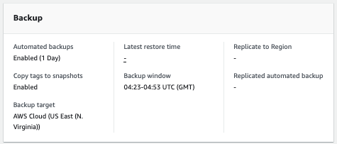
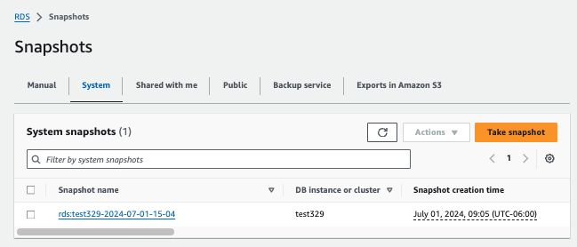
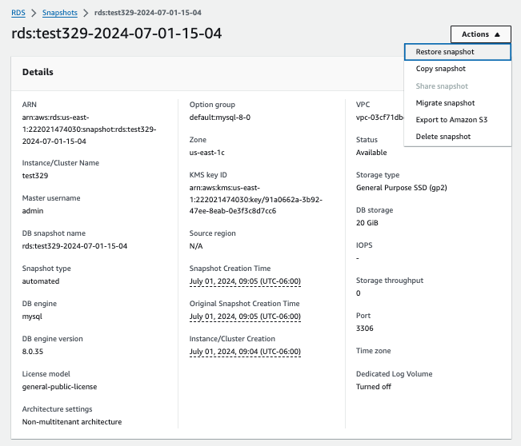
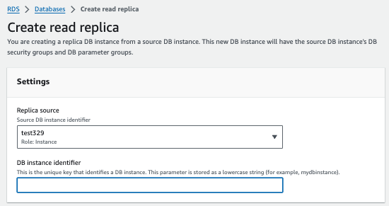
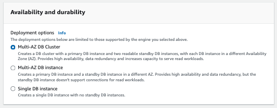

# Backup and Recovery

🔑 **Key points**

- You must design and validate a recovery strategy.
- RTO and RPO are common metrics that define your recovery strategy.
- Frequent database backups help reduce your RPO.
- Hot and warm standbys help reduce your RTO.

---

When failure happens there are three types of recovery that can happen.

1. **Temporal-recovery**: Given time, the system returns to a nominal state. This usually happens because the triggering event, such as being overloaded, passes with time.
1. **Reboot**: The system is in a bad computational state that can be resolved by clearing out any persistent state. This may include state that is stored temporarily in memory or persisted state in a database or cache.
1. **Replace**: The underlying system hardware has failed and needs to be replaced, or the software contains a bug that must be corrected.

If the triggering event was an anomaly, caused by a hardware failure for example, then you may not see the failure again for an undetermined period. If the triggering event is periodic, Black Friday shopping for example, then you can expect a similar situation to occur again.

No matter the resolution, you usually want to deploy an **immediate** fix to recover from the failure, and also develop a **long** term solution to keep the failure from repeating.

## RTO & RPO

There are two main metrics that help guide your backup and recovery design: RTO (Recovery Time Objective) and RPO (Recovery Point Objective). By publicly releasing your objectives, you indicate that they have been tested and therefore your organization and customers can reasonably expect that the objectives will be met as part of the failure resolution.

### Recovery Point Objective (RPO)

RPO is the maximum acceptable amount of data loss measured in time. It represents the point in time to which data must be recovered after a failure to resume acceptable customer interactions.

RPO helps determine the frequency of backups or data replication needed to ensure that data loss is within acceptable limits.

#### Example

An RPO of 5 minutes means that a failure will cause no more than 5 minutes of lost data. With JWT Pizza, that might mean that any pizza that was ordered during that time might not get delivered, recorded, or billed.

### Recovery Time Objective (RTO)

RTO is the published maximum time that can elapse before a system is restored to functional health. This does not necessarily mean that all of the customer's data will be accessible. That is covered by the RPO.

RTO helps determine the amount of architectural redundancy necessary to replace failing components in the desired amount of time.

#### Example

If JWT Pizza has an RTO of 15 minutes, it means that after a failure, the website must be back online within 15 minutes.

## Customer Data

When failure occurs, data corruption or loss is probable. When this happens, the common solution is to restore it from a previous copy. This presents several interesting questions.

1. Do you have a backup copy of the customer's data?
1. How recent is the backup?
1. How long does it take to restore the data?
1. Can the customer continue using the application during the restoration?
1. Does the restoration create a situation where new data is inconsistent with the restored data?
1. What do you do if you can only restore part of the customer's data?

A successful data recovery plan will have considered each of these questions before a failure occurs and have a verified plan for recovery.

## Database backup and Recovery

When you create a database using AWS RDS, it automatically has a backup policy. By default, a backup is created once a day and the backup is kept for one day. That means your RPO is 1 day.

Depending on the size of the data contained in your database, it can take anywhere from a few minutes or several hours to restore your database from a backup. The time it takes to restore the database determines your RTO.

RDS backups show up in the `Snapshots` view of the RDS service.

When you click on the snapshot, you can see all the details and select the option to `Restore snapshot`.

Note that this will create a new database instance with the restored data. Without automation, you will have to manually reconfigure your computing infrastructure to reference the restored database. This may further increase your RTO. That is why automation is so important. Every minute counts during a failure. When you make the decision to restore a backup, you want it to happen as quickly as possible. That usually means that you have something like a CloudFormation template that will deploy the recovery for you.

## Alternatives to backup restoration

If you need a smaller RTO then you can employ one of many alternative solutions. For example, you can create a read replica of your database. This creates what is called a **hot standby** that is actively taking read requests and can replace the primary database when a failure occurs. RDS will automatically write data to both your primary database and your read replica. You can also use both copies to handle read requests from your application, which has the benefit of doubling your read throughput.

When your primary database fails you simply redirect the write requests from the primary to the replica and promote the replica to be the primary. This only takes a few seconds and has a very small window where data loss due to failed write attempts may occur. That means that your RTO and your RPO are both around 30 seconds.

You can also create multi-availability zone deployments where you can create a cluster of databases that are either hot or **warm standby** in different data centers. A warm standby does not take active requests, but is available to quickly replace the primary.

Other RDS database types, such as Aurora, automatically create multiple copies of your database data in multiple regions that are kept in sync with each other. This greatly reduces the need to ever restore your database. With Aurora, you can also create multiple read compute instances that increase the load that your cluster can handle and also provide automatic failover when the write head becomes unresponsive.

There is a cost for all of this redundancy, but the cost of failure can be much higher.

## A bit of fun

> _source: [XKCD](https://xkcd.com/1739/)_
