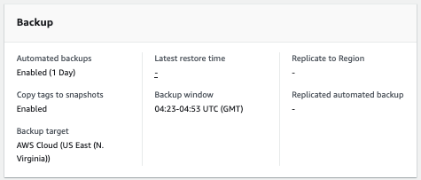
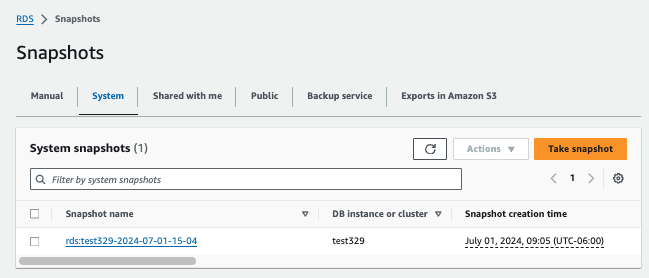
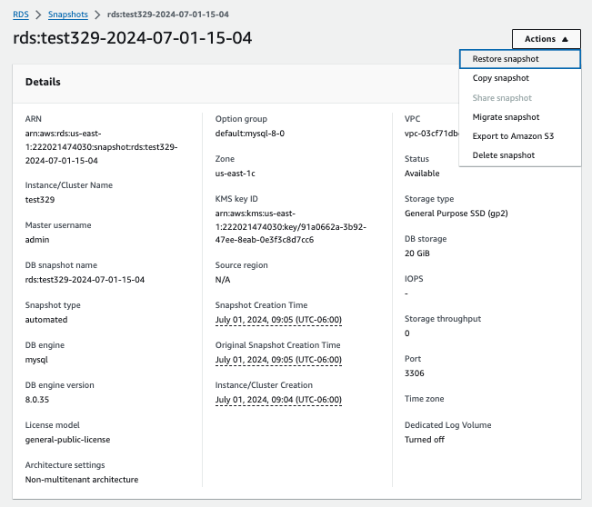
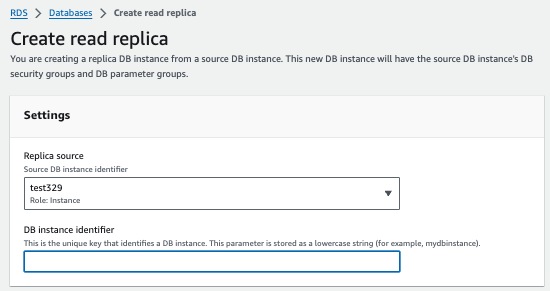
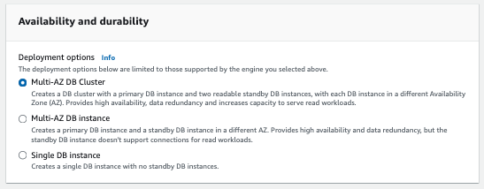

# Backup and Recovery

🔑 **Key points**

- Design and validate a recovery strategy before a failure occurs.
- RTO and RPO are the primary metrics used to define a recovery strategy.
- Frequent database backups reduce your RPO (data loss).
- Hot and warm standbys reduce your RTO (downtime).

---

When a failure occurs, recovery typically follows one of three patterns:

1.  **Temporal recovery**: Given enough time, the system returns to a nominal state. This usually happens when the triggering event—such as a traffic spike or resource overload—subsides on its own.
2.  **Reboot**: The system enters a corrupted computational state that can be resolved by clearing volatile memory or resetting temporary state. This involves restarting services or clearing caches to return to a known "clean" starting point.
3.  **Replace**: The underlying hardware has failed or the software contains a critical bug. Recovery requires deploying new infrastructure or patching the code.

If the triggering event was an anomaly, such as a localized hardware failure, you may not see it again for a long time. However, if the event is periodic—such as a Black Friday shopping surge—you must prepare for it to recur.

Regardless of the resolution, you should deploy an **immediate** fix to restore service and then develop a **long-term** solution to prevent the failure from repeating.

## RTO & RPO

Two main metrics guide the design of backup and recovery systems: **RTO** (Recovery Time Objective) and **RPO** (Recovery Point Objective). Defining and testing these objectives allows your organization and customers to set realistic expectations for service availability.

### Recovery Point Objective (RPO)

**RPO** is the maximum acceptable amount of data loss measured in time. It represents the point in time to which data must be recovered to resume acceptable operations. 

RPO determines how frequently you must back up or replicate your data.

#### Example

An RPO of 5 minutes means that a failure should result in no more than 5 minutes of lost data. In the context of JWT Pizza, any order placed within that 5-minute window before the crash might be lost and would not be delivered, recorded, or billed.

### Recovery Time Objective (RTO)

**RTO** is the maximum duration of time allowed to restore a system to functional health after a failure. While the system is "up" once the RTO is met, it does not guarantee that all historical data is immediately accessible (which is the concern of the RPO).

RTO determines the level of architectural redundancy required to replace failing components quickly.

#### Example

If JWT Pizza has an RTO of 15 minutes, the website must be back online and capable of taking orders within 15 minutes of an outage.

## Customer Data

When a failure occurs, data corruption or loss is a significant risk. The standard solution is to restore data from a previous copy. However, this raises several critical questions:

1.  Do you have a current backup of the customer's data?
2.  How recent is that backup?
3.  How long does the restoration process take?
4.  Can the customer continue using the application while data is being restored?
5.  Does the restoration create "data drift," where new data is inconsistent with restored data?
6.  What is the protocol if only a partial restoration is possible?

A successful recovery plan addresses these questions through a verified, step-by-step process.

## Database Backup and Recovery

When you create a database using AWS RDS, it includes an automated backup policy. By default, a backup is created once a day and retained for one day. Under these default settings, your **RPO is 24 hours**.

The time required to restore a database depends on the volume of data; it can range from a few minutes to several hours. This restoration duration defines your **RTO**.

RDS backups are managed in the `Snapshots` view of the RDS console.

When you select a snapshot, you can choose the **Restore snapshot** option.

**Note:** Restoring a snapshot creates a **new** database instance with a different endpoint. Without automation, you must manually update your application's configuration to point to this new database, which significantly increases your RTO. Using Infrastructure as Code (IaC) tools like CloudFormation or Terraform allows you to automate this redirection, ensuring recovery happens as quickly as possible.

## Alternatives to Backup Restoration

If your application requires a lower RTO, you can implement high-availability solutions:

### Read Replicas (Hot Standby)
A **read replica** is a "hot standby" that actively processes read requests and stays synchronized with the primary database. If the primary database fails, you can promote the replica to become the new primary.

Promoting a replica typically takes only a few seconds. This approach provides an RTO and RPO of nearly zero (often around 30 seconds), as the standby is already running and contains nearly all the data from the primary.

### Multi-AZ Deployments (Warm Standby)
You can also create **Multi-Availability Zone (Multi-AZ)** deployments. This creates a "warm standby" in a different data center. While a warm standby does not usually serve active traffic, it is kept in sync and is ready to take over automatically if the primary instance fails.

### Aurora Global Databases
Advanced database engines like Amazon Aurora automatically replicate data across multiple Availability Zones and can even replicate across different geographic regions. Aurora handles compute and storage separately, allowing for automatic failover to a "read head" if the primary "write head" becomes unresponsive.

While redundancy increases infrastructure costs, those costs are often much lower than the financial and reputational damage caused by an extended outage.

## A bit of fun

> _source: [XKCD](https://xkcd.com/1739/)_