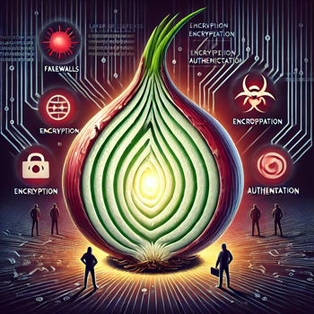
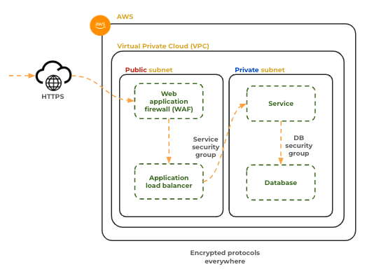

# Security

🔑 **Key points**

- Security is a critical skill for any software engineer.
- There are many aspects of security that you should be familiar with.

---

Now that you are preparing to deploy your application with a cloud service provider, it is important that we take a moment to discuss security. Security should be a foundational piece of your application design. An application that is not secure is an application that will eventually do more harm than good. It doesn't matter that your application provides hours of entertainment, increases your customer's financial wealth, or obtains world peace if it eventually leads to compromised credentials, the loss of personal information, or monetary theft.

You should seriously consider that God has given you talents that are meant to do eternal good. That includes watching out for those who have been entrusted to your care. Providing for their security is an important part of the responsibility.

## Security minded development

There are four major themes that you should consider when building a secure application.

1. **Education**: Become familiar with common and current attacks. Know industry best practices. Help educate all the members of your team.
1. **Prevention**: Instrument your code to reduce the attack surface area, secure credentials, encrypt data, authorize access, harden configurations, validate dependencies, and prevent injections.
1. **Detection**: Log usage, track metrics, and alert on anomalies.
1. **Remediation**: Deploy corrections quickly, notify impacted customers, report penetrations, and share attack vectors and vulnerabilities.

The important thing is that you are constantly including these themes in your design discussion and implementing them in your architectures. Hopefully you will see these themes repeatedly occurring throughout this course.

In order to make the concept of security more concrete, let's go ahead and review some specific topics.

### Layers

No system is completely immune to a persistent, dedicated, well funded team of attackers. The best you can do is hope to stay ahead of them as you play a game of cat and mouse. One proven technique for staying ahead of your opponent is to create layers to your security. For example, consider the credentials stored in your database.

1. Passwords are hashed using properly configured, modern cryptographic algorithms, and flavored with salt and pepper.
1. The database files are encrypted.
1. The database is immutably backed up hourly to an encrypted location that is only accessible for restoration purposes.
1. Only port 3306 is open to network requests.
1. The database server is on a private network.
1. Only authorized devices can access the server over the network.
1. Authorized devices can only make requests using an encrypted protocol.
1. The authorized devices' credentials are rotated hourly.
1. The types of SQL query that the device can make are restricted and can only return the amount of data that is required for their role.
1. All authentication and query requests to the database are immutably logged. Anomalies trigger an alert.
1. Database metrics are immutably tracked. Anomalies trigger an alert.
1. A honeypot database exists on the network with similar protections, but will immediately trigger an alert for any unexpected requests.

Are all these layers enough to stop an attacker? Probably not, but it will probably slow them down enough for you to notice the intrusion and take direct action.



### Encryption

Public networks are insecure by definition; you should never send unencrypted data across them. Even internal private networks should be considered suspicious since they can be penetrated. If you are sending unencrypted data across any network it can be a rich source that allows an attacker to grab passwords and other credentials.

The same is true for data that is stored on disk, or in other words, at rest. Once an attacker penetrates the operating system's security, unencrypted files on disk become a treasure trove of information. High value targets include log files, password files, configuration files, and command histories. It is best if each file has its own encryption and that the entire storage device is encrypted.

### Network security

Beyond encrypting the data that is transmitted over the network, you want to take advantage of the protections provided by web application firewalls, load balancers, private networks, firewalls (called security groups in AWS), and network access control lists (ACLs). These protections create perimeter barriers that help to keep out, or slow down an attack. The goal is to reduce the surface area of the attack to the smallest possible.



### Protecting credentials

Credentials allow access to protected resources and data. You never want any credential to show up in a log entry or appear in any code. It is best if you never persist credentials. You can do this by taking advantage of AWS Roles, Secrets Manager, and Security groups.

#### JWT Pizza logs

Several occurrences of passwords showing up in log files have happened at even major companies such as [X](https://www.digitalguardian.com/blog/twitter-urges-all-users-change-password-following-internal-bug) and [GitHub](https://www.bleepingcomputer.com/news/security/github-accidentally-recorded-some-plaintext-passwords-in-its-internal-logs/). While the presence of a password in a log file doesn't necessarily trigger a breach it does provide an opportunity for internal abuse and makes an attractive target for attackers.

The JWT Pizza Service attempts to keep passwords out of log files with code such as the following. However, these simplistic attempts are not foolproof, and it is probably best to come up with something that is more reliable.

```js
  sanitize(logData) {
    logData = JSON.stringify(logData);
    logData = logData.replace(/\\"password\\":\s*\\"[^"]*\\"/g, '\\"password\\": \\"*****\\"');
    logData = logData.replace(/\\"token\\":\s*\\"[^"]*\\"/g, '\\"token\\": \\"*****\\"');

    return logData;
  }
```

#### JWT Pizza database password

The JWT Pizza Service is currently defined to store the database password in a local configuration file. If that file is ever accidentally posted to GitHub, or located on a compromised storage device, then it will give an attacker an essential piece to your security puzzle. Instead of storing the password in clear text in the configuration file, several other options could have been used.

1. Encrypt the password in the configuration file. Require a private key to decrypt the password which is only obtainable if the device is executing with a given role in the AWS environment.
1. Retrieve the password from the AWS secrets manager when the service starts up. Only allow the key to be retrieved from a device with a given role in the AWS environment.
1. Configure RDS database access to not require a password if the request comes from a device with a given role in the AWS environment.

### Hardening

Consider a device that allows the entire world to make an unauthenticated SSH connection on any network port, and then gives them root access to the device. This is an obvious security violation, but an only slightly less egregious example includes letting anyone access to port 22, but requiring a textual password for the root user. What you really want is to only allow network access from an approved list, a white list, of IP addresses, where a user is authenticated by a named account using a cryptographically secure private key. The user is then restricted to only have access to the storage, memory, and applications necessary for them to accomplish their job.

This process of going from being extremely open to allowing only the very smallest window necessary to accomplish a task is called hardening. When developing a system it is often necessary to be liberal with access until you can figure out what exact access is required. However, you must make sure that you restrict that access once the system definition has matured.

For example, while setting up your JWT Pizza Service on AWS it is tempting to supply liberal permissions to your CI pipeline so that it can deploy containers to the AWS container registry, ECR. This might look like the following.

```json
{
  "Sid": "PushToECR",
  "Effect": "Allow",
  "Action": ["ecr:*"],
  "Resource": ["*"]
}
```

However, once you have the deployment working correctly you want to restrict this policy so that it can only push to certain locations from certain locations.

```json
{
  "Sid": "PushToECR",
  "Effect": "Allow",
  "Action": ["ecr:PutImage"],
  "Resource": "arn:aws:ecr:region:account-id:repository/jwt-pizza"
}
```

Failing to harden your application exposes a larger attack surface area and makes you more likely to be attacked or to miss that a penetration has occurred.

### Removing default settings

Often times devices or software packages come with default configurations that allow anyone to gain administrative access. Home network routers are notorious for this. Immediately after installing the device or package, you should remove any default configuration that might cause a security threat. This includes default credentials, but it can also include liberal port access, administration utilities that are unnecessary, or verbose logging.

### Store credentials with a third party

It is common for cloud services to require or provide credentials in order to use their services. Historically, this took the form of API Keys that were tied to some role and would never expire. This was problematic because when the 3rd party was hacked they exposed all of their customer's credentials. This is exactly what happened to [CircleCI](https://circleci.com/blog/jan-4-2023-incident-report/).

Instead of storing credentials it is much better to create a trust relationship between providers using standards such as OAuth to create temporary access. That is the process that you will use to give GitHub Actions the authorization to execute commands for your AWS account.

On the other hand, the JWT Pizza Factory will issue you an API Token that you will use to make pizzas. If your token becomes compromised then an attacker will be able to make pizzas on your behalf, and you will be responsible for the cost of those pizzas.

### Roles

Identifying a user is called **Authentication**, defining what they can do is called **Authorization**. A role serves to formally define what a user's authorization is. Without that formal definition, the role is usually scattered across the application code. That makes it easy for an attacker to exploit subtle inconsistencies in the code.

#### JWT Pizza Roles

The JWT Pizza Service does a reasonable job of defining roles in the database. It follows a `subject/predicate/object` pattern where a specific user is given a role for a specific object.

```sql
  `CREATE TABLE IF NOT EXISTS userRole (
    userId INT NOT NULL,
    role VARCHAR(255) NOT NULL,
    objectId INT NOT NULL
  )`,
```

Specific roles are then defined in the code base.

```js
const Role = {
  Diner: 'diner',
  Franchisee: 'franchisee',
  Admin: 'admin',
};
```

This helps to formalize the definition of the possible roles. All the secure endpoints then use the express middleware `setAuthUser` and `authenticateToken` to validate that a user is authenticated.

```js
async function setAuthUser(req, res, next) {
  const token = readAuthToken(req);
  if (token) {
    if (await DB.isLoggedIn(token)) {
      req.user = jwt.verify(token, config.jwtSecret);
      req.user.isRole = (role) => !!req.user.roles.find((r) => r.role === role);
    }
  }
  next();
}

authRouter.authenticateToken = (req, res, next) => {
  if (!req.user) {
    return res.status(401).send({ message: 'unauthorized' });
  }
  next();
};
```

However, it is then left to the endpoint to actually check a role before authorizing access.

```js
if (!req.user.isRole(Role.Admin)) {
  // protected resource
}
```

While this makes it flexible for the endpoint to granularly provide access, it tends to sprinkle the enforcement throughout the code. It would be much better if an endpoint declaration contained the required role. That way it would be easy to audit all the endpoints in one place and less likely that a programmer would forget a single `if` or `else` statement.

You want to carefully study the role security model for JWT Pizza so that you can properly exploit it when you do your penetration testing.

> [!NOTE]
>
> It is important to note that the JWT Service enforces the roles and not the frontend client. The frontend should limit customer access to restricted views, but in the end it must be the backend service that restricts to data and functionality.

#### AWS roles

The AWS IAM service has an extremely powerful authorization model. Roles are assumed by entities (users or services) to gain temporary permissions defined by an attached policy. Policies are defined by the following elements:

- **Effect**: Specifies whether the statement allows or denies access (either "Allow" or "Deny").
- **Action**: Specifies the actions that are allowed or denied. These are usually AWS service operations (e.g., s3:PutObject, ec2:StartInstances).
- **Resource**: Specifies the AWS resources to which the actions apply. Resources are identified using Amazon Resource Names (ARNs).
- **Condition** (Optional): Specifies conditions that must be met for the policy to apply. Conditions use keys, values, and operators (e.g., StringEquals, IpAddress).

The key is to harden the policy so that it only contains what the role actually needs. This is called the **Principle of Least Privilege** (PoLP). The following is a blatant violation of PoLP for a role that only needs to copy objects to a specific S3 bucket from a specific IP address.

```json
{
  "Effect": "Allow",
  "Action": "*",
  "Resource": "*"
}
```

A better policy would be:

```json
{
  "Effect": "Allow",
  "Action": "s3:PutObject",
  "Resource": "arn:aws:s3:::example-bucket/*",
  "Condition": {
    "IpAddress": {
      "aws:SourceIp": "203.0.113.0/24"
    }
  }
}
```

You want to make sure that you understand the AWS IAM permissions model so that when you start allocating AWS resources you don't expose anything more than is required for your CI pipeline's needs.

### Package security

Sometimes it is tempting to think that code downloaded from a popular repository is safe to use. Unfortunately that is the exact opposite attitude that you should have. Popular repositories and packages are high value targets for attackers. You should be very careful about what you download and include in your code. When you do download code, you need to thoroughly review it in order to make sure it only does exactly what you want it to do. You also need to repeat your review every time you update the package to make sure that your assumptions still are valid.

Most security minded software companies will not allow you to download and use 3rd party software. Instead, external software must be downloaded, examined, and vetted by their security team. It is then placed in an internal package manager where it can be used internally for your application.

In many ways it is better to avoid external code projects, and many times this is easy to do. For example, later on in this course you will need to upload logs from the JWT Pizza application to the Grafana Cloud hosting service. The Grafana documentation suggests that you install a 3rd party package and use it. The package has 2 stars and has been downloaded a few hundred times. The author, [蛭田 海斗](https://github.com/miketako3), appears to work for a company named LY Corporation and has 11 followers on GitHub. That doesn't sound like a nefarious hacker.

The package also looks really easy to use. All you have to do is install the package, give it your API Token and then make a logger call.

```sh
npm i @miketako3/cloki
```

```js
import { Cloki } from '@miketako3/cloki';

const logger = getLokiLogger({
  lokiHost: 'Host URL (e.g. logs-xxx-yyy.grafana.net)',
  lokiUser: 'User (e.g. 123456)',
  lokiToken: 'Generated API Token',
});

await logger.info({ message: 'Hello World!' });
```

The average software engineer would grab the package and start logging without a second thought. A security minded software engineer never consider such a thing. What are you going to do?

I would hope that you would pull the source code and start walking through it. What you will find is that the code boils down to a single function that has any value.

```js
async function sendToLoki(config: LokiConfig, lokiMessage: LokiMessage) {
  await fetch(`https://${config.lokiHost}/loki/api/v1/push`, {
    method: 'POST',
    headers: {
      'Content-Type': 'application/json',
      Authorization: `Basic ${btoa(`${config.lokiUser}:${config.lokiToken}`)}`,
    },
    body: JSON.stringify(lokiMessage),
  })
    .then((r) => {
      if (!r.ok) throw new Error(r.statusText);
    })
    .catch((e) => console.error('Error:', e));
}
```

In this case it is much safer to just copy the ten lines of code and forget the security risk associated with the 3rd party package.

### Logging and Metric

Your logs and metrics are a foundational piece of your security architecture. They alert you to anomalous behavior that can indicate an intruder's presence, and provide the forensic evidence necessary to determine the attacker's target and strategy. In order for your logs to be useful, they must be immutable, aggregated, accessible, and highly searchable.

## Common attacks

There are many creative ways to exploit a software system. Each has their own specific target, attack vector, and clever name. Take some time to become familiar with each of these exploits.

- **Phishing**: Attempting to acquire sensitive information such as usernames, passwords, and credit card details by masquerading as a trustworthy entity in electronic communications.
- **Malware**: Malicious software designed to harm, exploit, or otherwise compromise computer systems. Types of malware include viruses, worms, Trojans, ransomware, and spyware.
- **Ransomware**: A type of malware that encrypts the victim's files and demands a ransom payment to restore access to the data.
- **Denial of Service (DoS) and Distributed Denial of Service (DDoS)**: Attacks aimed at making a system, service, or network resource unavailable to its intended users by overwhelming it with a flood of illegitimate requests.
- **Man-in-the-Middle (MitM)**: An attacker intercepts and possibly alters the communication between two parties who believe they are directly communicating with each other.
- **SQL Injection**: A code injection technique that exploits a security vulnerability in a website's software by injecting malicious SQL statements into an entry field for execution.
- **Cross-Site Scripting (XSS)**: A security vulnerability typically found in web applications that allows attackers to inject malicious scripts into webpages viewed by other users.
- **Password Attacks**: Attempts to obtain or guess passwords through various methods, including brute force, dictionary attacks, and credential stuffing.
- **Zero-Day Exploit**: An attack that targets a previously unknown vulnerability in software or hardware, which has not yet been patched or disclosed.
- **Insider Threats**: Attacks originating from within the organization, carried out by employees, contractors, or others with internal access.
- **Social Engineering**: Manipulating individuals into divulging confidential information or performing actions that compromise security, often through deception and psychological manipulation.
- **Advanced Persistent Threat (APT)**: A prolonged and targeted cyberattack in which an intruder gains access to a network and remains undetected for an extended period.
- **Drive-by Download**: The unintentional download of malicious software onto a user’s computer when they visit a compromised or malicious website.
- **Eavesdropping**: Intercepting and listening to private communications, such as network traffic, without the consent of the communicating parties.
- **Session Hijacking**: Taking over a user session by obtaining or predicting the session ID, enabling the attacker to assume the identity of the user.

## Non-software security concerns

In addition to securing your software application, it is important that your organization is familiar with non-software associated attacks. This includes:

- **Social engineering attacks**: Human subversion of security controls and practices based on emotional appeal.
- **Insider threats**: Insufficient hiring practices, periodic reviews of internal staff, automated auditing controls, restriction of access to least privilege, or consensus access controls (where multiple independent parties are required to provide credentials for access).
- **Physical security**: Insufficient physical controls to sensitive infrastructure or workspaces.
- **Improper data management**: Allowing confidential data to be accessed without authorization or to be transported outside the security parameter.
- **Insecure network topology**: Allowing non-authorized, or insecure devices, within the security parameter.

In many ways these attacks are the most dangerous because they exploit your system behind your wall of trust. Having a hardened, secure, architecture is pointless if one of your team members gives out the administrative password to someone who contacts them from the "operations team" with a desperate need to correct a "critical emergency" that is threatening to take the company down in the next few minutes.

## Parting thoughts

Security is a massive topic that deserves your serious consideration. Gone are the days when a programmer could just focus on an algorithm without having to consider how that code could be exploited to steal someone's life. The more valuable your code, the more likely it is that you will be a high value target that will attract attention from all sorts of ill-intentioned individuals, gangs, terrorists, Gadianton robbers, and state-sponsored criminals. The better you are educated and engaged, the less chance the trust your customers place in you will be violated.

💡 Hopefully the security topics covered in this instruction have set your curiosity senses tingling. There are many subjects that you can dig into as part of your curiosity report.
