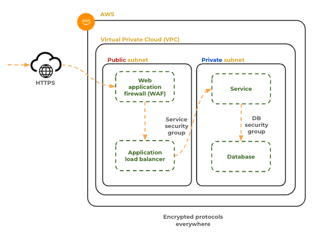

# Security

🔑 **Key points**

- Security is a foundational skill for every software engineer.
- Modern software development requires familiarity with many different aspects of security.

---

Now that you are preparing to deploy your application with a cloud service provider, it is vital to discuss security. Security should be a foundational piece of your application design, not an afterthought. An application that is not secure will eventually do more harm than good. It matters little if your application provides hours of entertainment, increases your customers' financial wealth, or promotes world peace if it eventually leads to compromised credentials, the loss of personal information, or monetary theft.

Consider that God has given you talents meant to do eternal good. This includes watching out for those who have been entrusted to your care. Providing for their security is an important part of that responsibility.

## Security-minded development


There are four major themes you should consider when building a secure application:

1. **Education**: Become familiar with common and current attacks. Learn industry best practices and help educate all members of your team.
1. **Prevention**: Instrument your code to reduce the attack surface area, secure credentials, encrypt data, authorize access, harden configurations, validate dependencies, and prevent injections.
1. **Detection**: Log usage, track metrics, and alert on anomalies.
1. **Remediation**: Deploy corrections quickly, notify impacted customers, report penetrations, and share attack vectors and vulnerabilities.

The goal is to constantly include these themes in your design discussions and implement them in your architectures. You will see these themes recurring throughout this course.

To make the concept of security more concrete, let's review some specific topics.

### Layers

No system is completely immune to a persistent, dedicated, and well-funded team of attackers. The best you can do is stay ahead of them in a constant game of cat and mouse. A proven technique for staying ahead of your opponent is to create **layers** of security (often called "Defense in Depth"). For example, consider the credentials stored in your database:

1. Passwords are hashed using properly configured, modern cryptographic algorithms, flavored with salt and pepper.
1. The database files themselves are encrypted at rest.
1. The database is immutably backed up hourly to an encrypted location accessible only for restoration.
1. Only the specific port required (e.g., 3306) is open to network requests.
1. The database server resides on a private network.
1. Only authorized devices can access the server over the network.
1. Authorized devices can only make requests using an encrypted protocol (TLS).
1. The authorized devices' credentials are rotated frequently.
1. The types of SQL queries a device can make are restricted to the minimum data required for its role.
1. All authentication and query requests are immutably logged, and anomalies trigger alerts.
1. Database metrics are immutably tracked, and anomalies trigger alerts.
1. A "honeypot" database exists on the network with similar protections to trigger an immediate alert upon any unexpected request.

Are all these layers enough to stop an attacker? Perhaps not, but they will slow them down enough for you to notice the intrusion and take direct action.


### Encryption

Public networks are insecure by definition; you should never send unencrypted data across them. Even internal private networks should be considered suspicious, as they can be penetrated. Sending unencrypted data across any network provides a rich source for attackers to grab passwords and other credentials.

The same applies to data stored on disk, known as **data at rest**. Once an attacker penetrates an operating system's security, unencrypted files on disk become a treasure trove of information. High-value targets include log files, password files, configuration files, and command histories. Ideally, each sensitive file should have its own encryption, and the entire storage device should be encrypted.

### Network security

Beyond encrypting data in transit, you should take advantage of protections provided by web application firewalls (WAFs), load balancers, private networks, firewalls (called **Security Groups** in AWS), and network access control lists (ACLs). These protections create perimeter barriers that help keep out or slow down an attack. The goal is to reduce the attack surface area to the smallest possible size.



### Protecting credentials

Credentials allow access to protected resources and data. You never want a credential to show up in a log entry or appear in your source code. Ideally, you should never persist long-term credentials locally. You can achieve this by taking advantage of AWS Roles, Secrets Manager, and Security Groups.

#### JWT Pizza logs

Several instances of passwords showing up in log files have occurred even at major companies like [X](https://www.digitalguardian.com/blog/twitter-urges-all-users-change-password-following-internal-bug) and [GitHub](https://www.bleepingcomputer.com/news/security/github-accidentally-recorded-some-plaintext-passwords-in-its-internal-logs/). While a password in a log file doesn't necessarily trigger a breach, it provides an opportunity for internal abuse and makes an attractive target for attackers.

The JWT Pizza Service attempts to keep passwords out of log files with code like the following. However, these simplistic attempts are not foolproof, and it is better to implement a more reliable, systemic solution.

```js
  sanitize(logData) {
    logData = JSON.stringify(logData);
    logData = logData.replace(/\\"password\\":\s*\\"[^"]*\\"/g, '\\"password\\": \\"*****\\"');
    logData = logData.replace(/\\"token\\":\s*\\"[^"]*\\"/g, '\\"token\\": \\"*****\\"');

    return logData;
  }
```

#### JWT Pizza database password

The JWT Pizza Service is currently configured to store the database password in a local configuration file. If that file is ever accidentally committed to GitHub or found on a compromised storage device, it gives an attacker an essential piece of your security puzzle. Instead of storing the password in cleartext, several other options could be used:

1. **Encryption**: Encrypt the password in the configuration file. Require a private key to decrypt it, which is only obtainable if the device is executing with a specific AWS role.
2. **Secrets Manager**: Retrieve the password from AWS Secrets Manager when the service starts. Only allow the key to be retrieved by a device with a specific role.
3. **IAM Authentication**: Configure RDS database access to not require a password at all if the request comes from a device with a specific AWS role.

### Hardening

Consider a device that allows the entire world to make an unauthenticated SSH connection on any port and grants root access. This is an obvious security violation. A slightly less egregious (but still dangerous) example is allowing anyone access to port 22 but requiring a simple password for the root user.

Ideally, you should only allow network access from a **whitelist** of approved IP addresses, where users are authenticated via named accounts using cryptographically secure private keys. Users should then be restricted to the specific storage, memory, and applications necessary for their jobs.

This process of moving from an open state to the most restrictive window necessary is called **hardening**. When developing a system, it is often necessary to be liberal with access until you determine exactly what is required. However, you must restrict that access once the system definition matures.

For example, while setting up your JWT Pizza Service on AWS, it is tempting to supply liberal permissions to your CI pipeline so it can deploy containers to the AWS Elastic Container Registry (ECR):

```json
{
  "Sid": "PushToECR",
  "Effect": "Allow",
  "Action": ["ecr:*"],
  "Resource": ["*"]
}
```

Once the deployment is working, you should harden this policy so it can only perform specific actions on specific resources:

```json
{
  "Sid": "PushToECR",
  "Effect": "Allow",
  "Action": ["ecr:PutImage"],
  "Resource": "arn:aws:ecr:region:account-id:repository/jwt-pizza"
}
```

Failing to harden your application leaves a large attack surface and makes it more likely that you will be breached or miss the signs of a penetration.

### Removing default settings

Oftentimes, devices or software packages come with default configurations that allow administrative access. Home network routers are notorious for this. Immediately after installing a device or package, you should remove any default configuration that might pose a threat. This includes default credentials, liberal port access, unnecessary administration utilities, or overly verbose logging.

### Third-party credentials

Cloud services often require credentials to use their APIs. Historically, these were long-lived API keys. This is problematic because if the third party is hacked, your credentials are exposed. This is exactly what happened to [CircleCI](https://circleci.com/blog/jan-4-2023-incident-report/).

Instead of storing long-lived credentials, it is much better to create a **trust relationship** between providers using standards like OAuth or OIDC to create temporary access. This is the process you will use to authorize GitHub Actions to execute commands on your AWS account.

Conversely, the JWT Pizza Factory issues an API Token for making pizzas. If your token is compromised, an attacker can make pizzas on your behalf, and you will be responsible for the cost.

### Roles

Identifying a user is called **Authentication**; defining what they can do is called **Authorization**. A **role** formally defines a user's authorization. Without a formal definition, authorization logic is often scattered across application code, making it easy for attackers to exploit subtle inconsistencies.

#### JWT Pizza Roles

The JWT Pizza Service defines roles in the database using a `subject/predicate/object` pattern, where a specific user is given a role for a specific object.

```sql
  `CREATE TABLE IF NOT EXISTS userRole (
    userId INT NOT NULL,
    role VARCHAR(255) NOT NULL,
    objectId INT NOT NULL
  )`,
```

Specific roles are defined in the codebase:

```js
const Role = {
  Diner: 'diner',
  Franchisee: 'franchisee',
  Admin: 'admin',
};
```

The application uses Express middleware (`setAuthUser` and `authenticateToken`) to validate that a user is authenticated:

```js
async function setAuthUser(req, res, next) {
  const token = readAuthToken(req);
  if (token) {
    if (await DB.isLoggedIn(token)) {
      req.user = jwt.verify(token, config.jwtSecret);
      req.user.isRole = (role) => !!req.user.roles.find((r) => r.role === role);
    }
  }
  next();
}

authRouter.authenticateToken = (req, res, next) => {
  if (!req.user) {
    return res.status(401).send({ message: 'unauthorized' });
  }
  next();
};
```

However, it is currently left to individual endpoints to check roles:

```js
if (!req.user.isRole(Role.Admin)) {
  // protected resource
}
```

While flexible, this "sprinkles" enforcement throughout the code. It would be better if endpoint declarations explicitly required a role. This makes it easier to audit endpoints and ensures a developer doesn't forget a single `if` statement.

> [!NOTE]
>
> It is important to note that the backend service enforces roles, not the frontend client. While the frontend should limit access to restricted views for a better user experience, the backend must be the final authority for data and functionality.

#### AWS roles

AWS Identity and Access Management (IAM) has a powerful authorization model. Roles are assumed by entities (users or services) to gain temporary permissions defined by policies. Policies consist of:

- **Effect**: "Allow" or "Deny".
- **Action**: Specific operations (e.g., `s3:PutObject`).
- **Resource**: Specific resources identified by Amazon Resource Names (ARNs).
- **Condition**: Optional constraints (e.g., requiring a specific IP address).

The key is to follow the **Principle of Least Privilege** (PoLP). The following policy is a blatant violation of PoLP:

```json
{
  "Effect": "Allow",
  "Action": "*",
  "Resource": "*"
}
```

A hardened policy would look like this:

```json
{
  "Effect": "Allow",
  "Action": "s3:PutObject",
  "Resource": "arn:aws:s3:::example-bucket/*",
  "Condition": {
    "IpAddress": {
      "aws:SourceIp": "203.0.113.0/24"
    }
  }
}
```

### Package security

It is tempting to assume that code from a popular repository is safe. However, popular packages are high-value targets for attackers. You must be careful about what you download. Security-minded companies often require external software to be vetted by a security team before being hosted in an internal package manager.

Sometimes it is better to avoid external dependencies entirely. For example, later in this course, you will upload logs to Grafana Cloud. The documentation suggests a third-party package with few stars and followers. 

```sh
npm i @miketako3/cloki
```

A security-minded engineer would examine the source code. In this case, the package's value boils down to a single function:

```js
async function sendToLoki(config: LokiConfig, lokiMessage: LokiMessage) {
  await fetch(`https://${config.lokiHost}/loki/api/v1/push`, {
    method: 'POST',
    headers: {
      'Content-Type': 'application/json',
      Authorization: `Basic ${btoa(`${config.lokiUser}:${config.lokiToken}`)}`,
    },
    body: JSON.stringify(lokiMessage),
  })
    .then((r) => {
      if (!r.ok) throw new Error(r.statusText);
    })
    .catch((e) => console.error('Error:', e));
}
```

In this situation, it is much safer to copy those ten lines of code into your project rather than taking on the security risk and maintenance of a third-party dependency.

### Logging and Metrics

Logs and metrics are foundational to security architecture. They alert you to anomalous behavior and provide the forensic evidence necessary to determine an attacker's target and strategy. To be useful, logs must be immutable, aggregated, accessible, and highly searchable.

## Common attacks

Familiarize yourself with these common exploits:

- **Phishing**: Acquiring sensitive information by masquerading as a trustworthy entity.
- **Malware**: Software designed to compromise systems (viruses, worms, Trojans, ransomware).
- **Ransomware**: Malware that encrypts files and demands payment for the decryption key.
- **DoS and DDoS**: Overwhelming a service with illegitimate requests to make it unavailable.
- **Man-in-the-Middle (MitM)**: Intercepting and potentially altering communication between two parties.
- **SQL Injection**: Injecting malicious SQL statements into entry fields to manipulate a database.
- **Cross-Site Scripting (XSS)**: Injecting malicious scripts into webpages viewed by other users.
- **Password Attacks**: Brute force, dictionary attacks, or credential stuffing to guess passwords.
- **Zero-Day Exploit**: Attacking a previously unknown vulnerability before a patch exists.
- **Insider Threats**: Attacks originating from within an organization (employees or contractors).
- **Social Engineering**: Manipulating individuals into divulging confidential information.
- **Advanced Persistent Threat (APT)**: A prolonged, targeted attack where an intruder remains undetected for a long period.
- **Drive-by Download**: Unintentional download of malicious software just by visiting a website.
- **Session Hijacking**: Taking over a user session by stealing or predicting a session ID.

## Non-software security concerns

Organizational security involves more than just code:

- **Social Engineering**: Human subversion of controls based on emotional appeal or deception.
- **Insider Threats**: Mitigated by hiring practices, periodic reviews, and the Principle of Least Privilege.
- **Physical Security**: Controls for sensitive infrastructure and workspaces.
- **Data Management**: Preventing unauthorized transport of confidential data.
- **Network Topology**: Ensuring unauthorized devices cannot connect to the internal network.

A hardened architecture is useless if a team member gives an administrative password to someone claiming to be from the "operations team" during a manufactured "critical emergency."

## Parting thoughts

Security is a massive topic that deserves your serious consideration. Gone are the days when a programmer could focus solely on an algorithm without considering how that code could be exploited. The more valuable your code, the more likely it is to attract attention from ill-intentioned individuals, gangs, terrorists, Gadianton robbers, and state-sponsored criminals. The more educated and engaged you are, the less likely it is that the trust your customers place in you will be violated.

💡 Hopefully these topics have piqued your curiosity. There are many subjects here that you can explore as part of your curiosity report.

## ☑ Exercise


```masteryls
{"id":"0967ba86-5617-4230-beae-7d19a239f956","title":"Identifying Evidence-Based Security","type":"multiple-choice"}
Security theater refers to measures that provide a false sense of safety without significantly reducing actual risk. Which approach is most effective for an organization looking to transition from security theater to evidence-based security?

- [ ] Implementing highly visible security protocols primarily to reassure stakeholders and employees, even if the underlying technical vulnerabilities remain unaddressed.

- [ ] Mandating complex password requirements and frequent periodic rotations to demonstrate a public commitment to rigorous access control.
- [ ] Deploying a wide array of specialized security tools to ensure that every category of the security software market is represented in the organization's tech stack.
- [x] Prioritizing security investments based on a formal threat model and validating the effectiveness of controls through objective testing and metrics.
```
