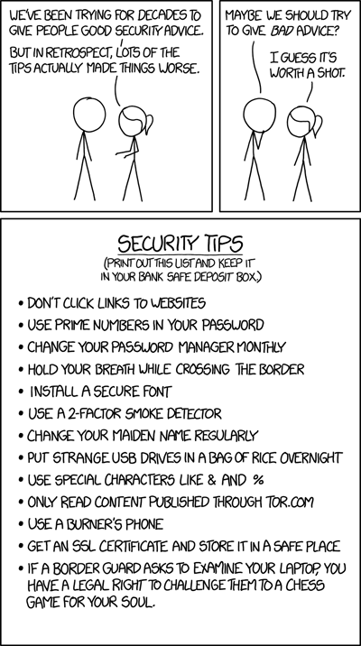

# Security Community

🔑 **Key points**

- Security is your responsibility.
- There is a large security community seeking to make a positive impact.
- CWEs and CVEs help track exploits and vulnerabilities.
- Knowing the top ten exploit vectors helps you prevent them.

---

📖 **Deeper dive reading**:

- [OWASP Top Ten](https://owasp.org/www-project-top-ten/)
- [MITRE CWE Top 25](https://cwe.mitre.org/top25/index.html)

---

Protecting the integrity of financial and information systems requires vigilant effort at every level of the technology stack. This includes academic, government, and corporate partnerships. As a software engineer you must consider security as your primary responsibility. This means that you design, implement, deploy, and monitor your software with a security first mindset. It also means that you devote significant time educating yourself on common security vulnerabilities and weaknesses. A great place to educate yourself is to study the information provided by organization such as MITRE, NIST, and OWASP.

## CWE (Common Weakness Enumeration)

- **Managed by**: [MITRE Corporation](https://www.mitre.org/), a U.S.-based, non-profit organization that oversees several key cybersecurity initiatives.
- **Description**: Common patterns of software weaknesses, such as buffer overflows or SQL injection flaws, that can lead to security vulnerabilities.
- **Example**: [CWE-22](http://cwe.mitre.org/data/definitions/22.html) Improper Limitation of a Pathname to a Restricted Directory ('Path Traversal')

## CVE (Common Vulnerabilities and Exposures)

- **Managed by**: National Institute of Standards and Technology ([NIST](https://www.nist.gov/)). NIST is part of the US Department of Commerce.
- **Description**: Catalog of known instances of security vulnerabilities.
- **Example**: [CVE-2024-28995](https://nvd.nist.gov/vuln/detail/CVE-2024-28995) SolarWinds Serv-U was susceptible to a directory transversal vulnerability that would allow access to read sensitive files on the host machine.

## The OWASP Top Ten

The Open Worldwide Application Security Project ([OWASP](https://owasp.org/)) compiles a list of the top ten security concerns for the software application industry. This list serves as an excellent educational tool to help software engineers understand and prevent the most common software development security failures. Here is a summary of the current list.

| Position | Name                                       | Description                                                              | Examples                                                                                                                                                                     |
| -------- | ------------------------------------------ | ------------------------------------------------------------------------ | ---------------------------------------------------------------------------------------------------------------------------------------------------------------------------- |
| 1        | Broken Access Control                      | Missing authentication or authorization enforcement.                     | Providing access to a security resource based entirely upon the knowledge of a URL. Allowing an authorized user to execute an administrative command. CORS misconfiguration. |
| 2        | Cryptographic Failures                     | Failure to protect data in transit or at rest.                           | Clear text transmission. Weak or old cryptographic algorithms.                                                                                                               |
| 3        | Injection                                  | User supplied data executed as code.                                     | Database query allows user supplied manipulation. Additional records returned, data deleted, or encrypted.                                                                   |
| 4        | Insecure Design                            | Application design decisions that enable loss of revenue or DOS attacks. | Question and answer security credential recovery. Unrestricted trial accounts. CI/CD workflows. Cloud architectures.                                                         |
| 5        | Security Misconfiguration                  | Exposure of well known or unnecessary system configuration.              | Default account credentials. Default configuration. Unnecessary port, services, or privileges. Unclear configuration ownership.                                              |
| 6        | Vulnerable and Outdated Components         | Deploying insecure internal or 3rd party software components.            | Deploying components with known security vulnerabilities. Not knowing what components the system deploys.                                                                    |
| 7        | Identification and Authentication Failures | Allowing credential attacks.                                             | Brute force. Weak passwords. Missing or ineffective MFA. Improper session management.                                                                                        |
| 8        | Software and Data Integrity Failures       | Exposure to 3rd party services for components or data management.        | CDN or CI/CD provider failures. Third party packages and binaries. Third party data and credential processors.                                                               |
| 9        | Software Logging and Monitoring Failures   | Mutable, non-persistent, or inaccessible observability.                  | Log can be altered or deleted. Log data is not centrally aggregated. Metric data only available for a limited time.                                                          |
| 10       | Server side request forgery                | User supplied data controls execution of requests on the server.         | User can supply a console command to execute on the server. User can supply the URL that the service uses to acquire data with the service's security context.               |

Notice that most of the top ten concerns fall directly in the sphere of DevOps. That is because DevOps focuses on automation, and automation requires configured systems and scripting. Any sort of parametrized configuration or programming language provides an increased attack surface. Additionally, production endpoints, deployment processes, and management consoles often have some level of public accessibility.

If you are not security minded in the design and deployment of your deployment and monitoring systems, it is likely that your code will be the focus of successful attacks. Take some time to carefully review and be familiar with each the top 10. Consider the following in the context of the JWT Pizza application and its deployment infrastructure.

1. Could any of the OWASP top ten be used to exploit the application?
1. How can I evaluate the application's exposure to the exploit?
1. What would be the impact of the exploit?
1. Can I reproduce the exploit?
1. What can be done to mitigate the exploit?

## A bit of fun

> _source: [XKCD](https://xkcd.com/1820/)_
