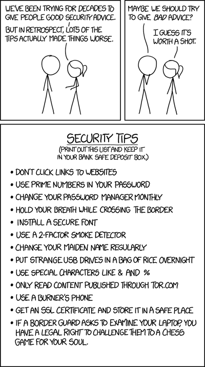

# Security Community

🔑 **Key points**

- Security is your responsibility.
- A large, global security community works to make a positive impact.
- CWEs and CVEs help track weaknesses and specific vulnerabilities.
- Understanding the top exploit vectors helps you prevent them.

---

📖 **Deeper dive reading**:

- [OWASP Top Ten](https://owasp.org/www-project-top-ten/)
- [MITRE CWE Top 25](https://cwe.mitre.org/top25/index.html)

---

Protecting the integrity of financial and information systems requires vigilant effort at every level of the technology stack. This involves academic, government, and corporate partnerships. As a software engineer, you must consider security a primary responsibility. This means designing, implementing, deploying, and monitoring your software with a security-first mindset. It also requires devoting significant time to educating yourself on common security vulnerabilities and weaknesses. Excellent resources for this education include information provided by organizations such as MITRE, NIST, and OWASP.

## CWE (Common Weakness Enumeration)

- **Managed by**: The [MITRE Corporation](https://www.mitre.org/), a U.S.-based, non-profit organization that oversees several key cybersecurity initiatives.
- **Description**: A community-developed list of common patterns for software weaknesses, such as buffer overflows or SQL injection flaws, which can lead to security vulnerabilities.
- **Example**: [CWE-22](http://cwe.mitre.org/data/definitions/22.html) Improper Limitation of a Pathname to a Restricted Directory ('Path Traversal').

## CVE (Common Vulnerabilities and Exposures)

- **Managed by**: The CVE Program is overseen by [MITRE](https://www.mitre.org/), while the National Vulnerability Database (NVD) is managed by the National Institute of Standards and Technology ([NIST](https://www.nist.gov/)).
- **Description**: A catalog of specific, known instances of security vulnerabilities in released software packages.
- **Example**: [CVE-2024-28995](https://nvd.nist.gov/vuln/detail/CVE-2024-28995) SolarWinds Serv-U was susceptible to a directory traversal vulnerability that allowed unauthorized access to sensitive files on the host machine.

## The OWASP Top Ten

The Open Worldwide Application Security Project ([OWASP](https://owasp.org/)) compiles a list of the top ten security concerns for the software application industry. This list serves as an essential educational tool to help software engineers understand and prevent the most common security failures.

| Position | Name                                       | Description                                                              | Examples                                                                                                                                                                     |
| -------- | ------------------------------------------ | ------------------------------------------------------------------------ | ---------------------------------------------------------------------------------------------------------------------------------------------------------------------------- |
| 1        | Broken Access Control                      | Missing or weak enforcement of authentication or authorization.          | Accessing a protected resource simply by knowing its URL; allowing an unauthorized user to execute administrative commands; CORS misconfiguration.                         |
| 2        | Security Misconfiguration                  | Exposure of well-known or unnecessary system configurations.             | Using default account credentials; keeping unnecessary ports, services, or privileges active; unclear configuration ownership.                                               |
| 3        | Software Supply Chain                      | Integrating or deploying insecure third-party software components.       | Using components with known security vulnerabilities; lack of visibility into the system's software bill of materials (SBOM).                                                |
| 4        | Cryptographic Failures                     | Failure to protect sensitive data in transit or at rest.                 | Cleartext data transmission; using weak or obsolete cryptographic algorithms.                                                                                                |
| 5        | Injection                                  | User-supplied data executed as code by an interpreter.                   | Database queries manipulated by user input to return unauthorized records, delete data, or bypass encryption.                                                                |
| 6        | Insecure Design                            | Fundamental design flaws that enable financial loss or DoS attacks.      | Weak security credential recovery (e.g., security questions); unrestricted trial accounts; insecure CI/CD workflows or cloud architectures.                                  |
| 7        | Identification and Authentication Failures | Weaknesses that allow credentials to be compromised.                     | Susceptibility to brute force attacks; weak password requirements; missing or ineffective MFA; improper session management.                                                  |
| 8        | Software and Data Integrity Failures       | Risks from third-party services used for code or data management.        | CDN or CI/CD provider compromises; malicious third-party packages or binaries; compromised third-party data processors.                                                      |
| 9        | Software Logging and Monitoring Failures   | Logs that are mutable, non-persistent, or inaccessible.                  | Logs that can be altered or deleted by attackers; lack of centralized log aggregation; metric data available only for a very limited time.                                   |
| 10       | Mishandled Exceptions                      | Errors that leak sensitive information or fail to reset system state.    | Error messages revealing stack traces or database structures; failing to clean up temporary files or roll back database transactions after a crash.                          |

Notice that most of the top ten concerns fall directly within the sphere of DevOps. This is because DevOps focuses on automation, which relies heavily on configured systems and scripting. Any parameterized configuration or programming language increases the attack surface. Additionally, production endpoints, deployment processes, and management consoles often have some level of public accessibility.

If you are not security-minded in the design and deployment of your systems, your infrastructure will likely become a target for successful attacks. Take time to carefully review and familiarize yourself with each of the Top 10. Consider the following in the context of the JWT Pizza application and its deployment infrastructure:

1. Could any of the OWASP Top Ten be used to exploit the application?
2. How can I evaluate the application's exposure to these exploits?
3. What would be the impact of a successful exploit?
4. Can I reproduce the exploit in a safe environment?
5. What specific steps can be taken to mitigate the exploit?

## ☑ Exercise


```masteryls
{"id":"ea642aff-079f-4706-a7af-1da545607613","title":"CWE vs. CVE: Understanding the Difference","type":"multiple-choice"}
In the context of the security community and vulnerability management, which of the following best describes the fundamental difference between Common Weakness Enumeration (CWE) and Common Vulnerabilities and Exposures (CVE)?

- [ ] CWE is a scoring system used to calculate the severity and impact of a security breach, while CVE is the database used to store the names of the researchers who discovered the breach.
- [ ] CVE identifies the root cause types of software flaws (such as "Buffer Overflow"), while CWE tracks the specific patches and version numbers released to fix those flaws.
- [x] CWE identifies types or classes of software security flaws (the "what"), while CVE identifies specific, documented instances of vulnerabilities in particular products or systems (the "where").
- [ ] CWE is a private list maintained by software vendors for internal bug tracking, while CVE is a public list managed by government agencies for national infrastructure defense.
```


## A bit of fun



> _source: [XKCD](https://xkcd.com/1820/)_