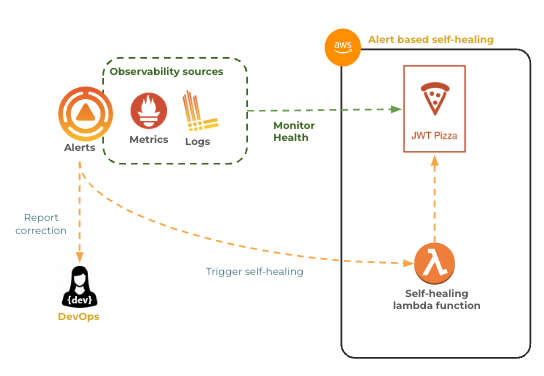
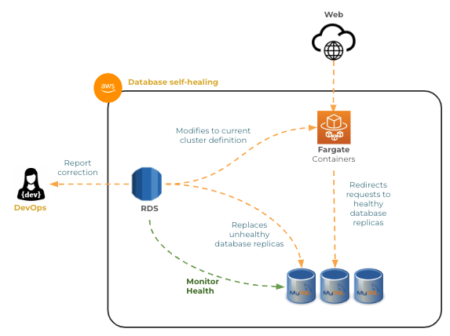
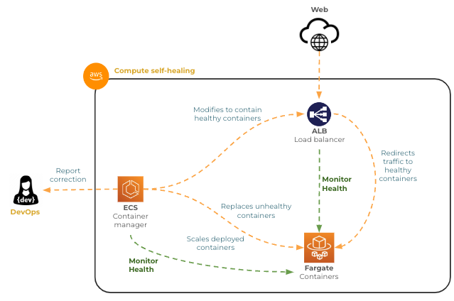

# Self-healing

🔑 **Key points**

- Self-healing systems are a primary goal of DevOps automation.
- These systems automatically detect, correct, and log infrastructure issues without human intervention.
- Automation can be custom-built (e.g., using Lambda) or provided natively by cloud vendors (e.g., AWS).

---

The ultimate goal of many DevOps engineers is to "automate themselves out of a job." The capstone of that automation is a self-healing system: an environment that automatically detects a problem, deploys a correction, and records the modification in an audit log.

Consider a system where you have configured Grafana observability alerts to trigger an AWS Lambda function. When a specific issue is detected, the function automatically corrects the problem and notifies the DevOps team that the correction has taken place.



This approach is highly effective for tasks like auto-scaling. When infrastructure CPU usage reaches a saturation threshold, a Lambda function or scaling policy can increase available resources. Conversely, the system can scale down resources when utilization falls below a certain threshold to save costs.

## Self healing strategies


Self-healing strategies represent a proactive approach to system resilience, enabling software architectures to autonomously detect and rectify failures. At the core of these strategies is a continuous feedback loop consisting of monitoring, analysis, and remediation. Key implementations include **health checks** to monitor component status, **automated restarts** to recover from transient errors, and **auto-scaling** to handle resource exhaustion. Furthermore, patterns like **circuit breakers** prevent cascading failures by isolating faulty services, while **state reconciliation** ensures that the actual system state aligns with the desired configuration. By integrating these automated recovery mechanisms, systems can maintain high availability and reduce the operational burden of manual troubleshooting.


### Control Theory and PID Loops
Software self-healing is fundamentally an application of **Control Theory**. A self-healing system functions as a closed-loop feedback system consisting of three primary components:
*   **The Sensor:** Monitors the current state (e.g., latency, error rates).
*   **The Controller:** Compares the current state against the desired state (the setpoint) and calculates the necessary adjustment.
*   **The Actuator:** Executes the change (e.g., spinning up a new container or throttling traffic).

Advanced systems implement **PID (Proportional-Integral-Derivative) controllers** to prevent "oscillations." For example, if a system scales up too aggressively in response to a temporary spike (proportional), it might immediately scale down when the spike ends, leading to instability. A PID-based healing logic accounts for the duration of the error (integral) and the rate of change (derivative) to ensure smooth, stable remediation.

### Semantic Observability vs. Syntactic Health
Most basic self-healing relies on **syntactic health** (e.g., "Is the process running?" or "Does the HTTP endpoint return 200 OK?"). Advanced self-healing requires **semantic observability**, which monitors the internal state and correctness of data.
*   **Concept:** A service might be "running" but stuck in a logical deadlock or returning empty datasets due to a corrupted cache.
*   **Healing Mechanism:** Semantic probes validate business logic. If the probe detects that the output is logically impossible (e.g., a "GetProduct" call returning zero results for a flagship item), the self-healing system triggers a cache flush or a stateful reset rather than just a process restart.

### The "Roll-Forward" Immutable Healing
Traditional healing often involves "patching" a running system. Modern self-healing leans toward **Immutable Infrastructure** principles.
*   **The Concept:** Instead of trying to fix a degraded node (which leads to "configuration drift"), the system treats the node as disposable.
*   **Mechanism:** When a fault is detected, the orchestrator marks the node as "tainted," stops routing traffic to it, and simultaneously provisions a brand-new instance from a verified golden image. This ensures the "healed" state is identical to the "known good" state, eliminating residual corruption in local storage or memory.

### Byzantine Fault Tolerance (BFT) in Healing
In distributed systems, self-healing must account for **Byzantine failures**, where a component does not just stop working, but continues to operate while providing incorrect or misleading data.
*   **The Concept:** A self-healing system using BFT logic does not trust a single health check.
*   **Mechanism:** It uses a consensus-based approach. If five monitoring nodes check a service and three report it as "unhealthy" while two report it as "healthy," the system trusts the majority and initiates remediation. This prevents a "liar" node from destabilizing the cluster.

### Predictive Remediation (AIOps)
Predictive healing moves the trigger point from **Reactive** (after a failure) to **Proactive** (before a failure).
*   **Pattern Matching:** Machine learning models analyze historical telemetry to identify "fingerprints" of impending failure, such as a specific slope in memory consumption indicating a slow memory leak.
*   **Pre-emptive Action:** The system may trigger a graceful restart of a service during a period of low traffic *before* the memory limit is reached, avoiding a hard crash and data loss during peak hours.

## AWS self-healing

Many AWS services include automated self-healing features by default. For example, Amazon Relational Database Service (RDS) monitors database health and can automatically redirect traffic away from unhealthy replicas or perform a failover to a standby instance.



Similarly, Amazon ECS manages the health of containerized applications. If an Application Load Balancer (ALB) detects that a container is unhealthy, it stops routing traffic to that specific instance. ECS then detects the failure, terminates the unhealthy container, and replaces it with a new one, automatically updating the ALB configuration in the process.

ECS also monitors container load and can automatically scale the number of running tasks up or down based on demand.



All of these operations occur without human involvement, ensuring high availability and performance.

## The reality and future

In practice, achieving 100% self-healing for every possible edge case is difficult. However, automating the recovery of common, predictable problems—or even just delaying their impact—allows DevOps teams to focus on high-level architecture rather than manual firefighting.

The integration of AI and Machine Learning (ML) is further expanding these capabilities. AI excels at detecting subtle anomalies and executing complex playbook actions based on large volumes of historical training data. As these systems evolve, the scope of issues that can be resolved without human intervention will continue to grow.

## ☑ Exercise


```masteryls
{"id":"bc2eb95e-0cd1-4764-a59b-eb9b2f8ecb62","title":"The Roll-Forward Mechanism","type":"multiple-choice"}

In an infrastructure environment utilizing **Roll-Forward Immutable Healing**, what is the standard procedure when a specific service instance is detected as unhealthy or failing?

- [ ] The system triggers an automated configuration management agent to identify and repair the specific corrupted files on the existing live instance.
- [x] The failing instance is terminated and a brand-new instance is provisioned from the current, validated "golden" image or container specification.
- [ ] The system performs a global version reversal, reverting all healthy and unhealthy nodes to the previous stable software release.
- [ ] The unhealthy instance is placed into a "frozen" state while an automated debugger attempts to restart the specific failed process within the original environment.
```
