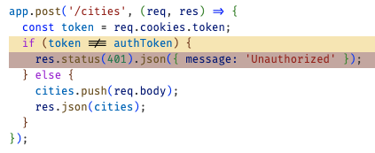
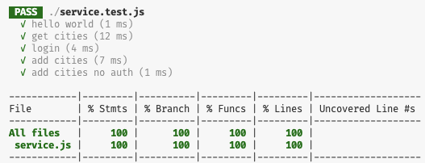

# Service testing

We can now apply what we have learned about unit testing by creating a simple HTTP service and driving our testing of the service with [Jest](https://jestjs.io/) and a service testing helper package called [SuperTest](https://www.testim.io/blog/supertest-how-to-test-apis-like-a-pro/).

The example HTTP service is a simple Express based service called `City`, that provides the following endpoints.

- **Login**: Sets an authorization cookie
- **List cities**: Returns a list of city names and their populations
- **Add city**: Authenticates the cookie and inserts a new city with its population

The following are the steps needed to take to create the City service and set it up for testing.

### Installing the necessary packages

First create an NPM based project and install the packages need to create an HTTP service with cookie support.

```sh
npm init -y
npm install express cookie-parser
```

### Configuring the project

Then modify `package.js` so that it serves up the endpoints over HTTP by adding a `start` script, and runs Jest for testing by adding a `test` script.

```json
"scripts": {
  "start": "node index.js",
  "test": "jest"
},
```

Create a `.gitignore` file so that we don't accidentally commit the `node_modules`, `cookies.txt`, or `coverage` files that will be generated as we use the project.

```txt
cookies.txt
node_modules
coverage
```

### Providing the service endpoints

Next, create a file named `service.js` that initializes Express and defines all of the endpoints. Note that it does not start the service listening on an HTTP port. It only exports the service from the module. We will put the service, represented by the `app` variable, to work in the next step.

**service.js**

```js
const express = require('express');
const cookieParser = require('cookie-parser');

const app = express();
app.use(express.json());
app.use(cookieParser());

const cities = [{ name: 'Provo', population: 116618 }];
const authToken = 'eyJhbGciOiJIUzI1NiIsInR5cCI6Ikp9';

app.post('/login', (req, res) => {
  res.cookie('token', authToken, { secure: true, httpOnly: true, sameSite: 'strict' });
  res.json({ message: 'Success' });
});

app.get('/cities', (req, res) => {
  res.json(cities);
});

app.post('/cities', (req, res) => {
  const token = req.cookies.token;
  if (token !== authToken) {
    res.status(401).json({ message: 'Unauthorized' });
  } else {
    cities.push(req.body);
    res.json(cities);
  }
});

module.exports = app;
```

### Calling the service endpoints

We will call the service endpoints from both HTTP requests and from our automated tests.


The hosting of our endpoints over HTTP is accomplished by listing on a network port with the function `app.listen(port)` as defined in a file that we created named `index.js`.

**index.js**

```js
const app = require('./service.js');

const port = process.argv[2] || 3000;
app.listen(port, () => {
  console.log(`Service started on port ${port}`);
});
```

The driving of the endpoints from our tests is accomplished by making endpoint requests through SuperTest by calling the function `request(app)` as defined in a file named `service.test.js` that we will create later.

### Smoke test

We want to make sure our service is working as expected, and so we do a quick manual smoke test to demonstrate that the service works from the command console. First start up the service.

```sh
➜ node index.js

Service started on port 3000
```

Then execute each of the endpoints using Curl.

```sh
➜  curl -c cookies.txt -X POST localhost:3000/login
{"message":"Success"}

➜  curl localhost:3000/cities
[{"name":"Provo","population":116618}]

curl -b cookies.txt -X POST localhost:3000/cities -H 'Content-Type: application/json' -d '{ "name":"Lehi", "population": 33435}'
[{"name":"Provo","population":116618},{"name":"Lehi","population":33435}]
```

## Add Jest and Supertest

We are now ready to setup Jest and create some automated tests. Get started by installing both Jest and SuperTest. SuperTest provides the ability to easily make endpoint requests without having to actually making HTTP network requests.

```sh
npm install -D jest supertest
```

The `-D` flag tells NPM to install these packages as a development dependency that will not be included in a production release. Here are the changes the occur in `package.json`.

```json
  "devDependencies": {
    "jest": "^29.7.0",
    "supertest": "^7.0.0"
  }
```

## Setup service for testing

Now we can create our first test by creating a file named `service.test.js`. The name of the file is significant because Jest will look for files with `.test.` in the name.

**service.test.js**

```js
const request = require('supertest');
const app = require('./service');

test('hello world', () => {
  expect(true).toBe(true);
});
```

This contains a single test that just demonstrates that all the parts for creating real tests are in place.

## Configuring for coverage

We want to see how much of our service code is covered by our test. We do this by added the Jest config `jest.config.json` file and setting `collectCoverage` to true.

```json
{
  "collectCoverage": true
}
```

## Run the tests

We can now finally run our initial test and see what the coverage is. Open up a command console and execute `npm test`

```sh
➜  npm test

 PASS  ./service.test.js
  ✓ hello world (1 ms)

------------|---------|----------|---------|---------|-------------------
File        | % Stmts | % Branch | % Funcs | % Lines | Uncovered Line #s
------------|---------|----------|---------|---------|-------------------
All files   |   57.89 |        0 |       0 |   57.89 |
 service.js |   57.89 |        0 |       0 |   57.89 | 12-13,17,21-26
------------|---------|----------|---------|---------|-------------------
Test Suites: 1 passed, 1 total
Tests:       1 passed, 1 total
```

This shows that our `hello world` test passed and we even have **57.89%** coverage without even writing a meaningful test. This happened because we imported `service.js` in our test file. That caused all of the initialization code to execute even though no endpoints were called.

## Testing the endpoints

Let's delete the `hello world` test and write some tests that actually hit the endpoints.

### Get cities

First we will test the `[GET] /cities` endpoint.

```js
test('get cities', async () => {
  const getCitiesRes = await request(app).get('/cities');
  expect(getCitiesRes.status).toBe(200);
  expect(getCitiesRes.headers['content-type']).toMatch('application/json; charset=utf-8');
  expect(getCitiesRes.body).toMatchObject([{ name: 'Provo', population: 116618 }]);
});
```

This calls the `[GET] /cities` endpoint using the SuperTest `request(app)` function. The result of the asynchronous call is an object that has all of the information about the response. This includes the status, headers, and body. We can then use the Jest expectation object and matchers to validate the response.

When we run the test, everything is green, and we jump to **63%** coverage.

```sh
➜  npm test

 PASS  ./service.test.js
  ✓ get cities (14 ms)

------------|---------|----------|---------|---------|-------------------
File        | % Stmts | % Branch | % Funcs | % Lines | Uncovered Line #s
------------|---------|----------|---------|---------|-------------------
All files   |   63.15 |        0 |   33.33 |   63.15 |
 service.js |   63.15 |        0 |   33.33 |   63.15 | 12-13,21-26
------------|---------|----------|---------|---------|-------------------
Test Suites: 1 passed, 1 total
Tests:       1 passed, 1 total
```

### Login

Next on our list is to test the `[POST] /login` endpoint. We need to do this first because it is necessary to login before we can call our last endpoint.

This test is a little more complex because we have to deal with cookies. However, other than the cookie header and the change from a `get` request to a `post` request it is pretty similar to the previous test.

```js
test('login', async () => {
  const loginRes = await request(app).post('/login');
  expect(loginRes.status).toBe(200);
  expect(loginRes.headers['content-type']).toMatch('application/json; charset=utf-8');
  expect(loginRes.body).toMatchObject({ message: 'Success' });
  expect(loginRes.headers['set-cookie'][0]).toMatch(/token=.+; Path=\/; HttpOnly; Secure; SameSite=Strict/);
});
```

The authorization cookie is returned in the `set-cookie` header. Even though our simple service code always returns the same authorization token we want to make our test more general than that and so we use a regular express match to validate that the cookie is set along with all of the cookie security options.

When we run the tests again we see that we are up to **73.68%**. So close that I can taste it. Just one more endpoint to test.

### Add city

The `[POST] /cities` endpoint requires that we have previously logged in and so we need to combine this test with the action of logging in. We don't want to repeat the code for logging in for every endpoint that requires authorization and so we are going to decompose the problem and reuse login functionality in order to create our last test.

Here is what the resulting tests look like.

```js
test('get cities', async () => {
  const getCitiesRes = await request(app).get('/cities');
  expect(getCitiesRes.status).toBe(200);
  expect(getCitiesRes.headers['content-type']).toMatch('application/json; charset=utf-8');
  expect(getCitiesRes.body).toMatchObject([{ name: 'Provo', population: 116618 }]);
});

test('login', login);
async function login() {
  const loginRes = await request(app).post('/login');

  expect(loginRes.status).toBe(200);
  expect(loginRes.headers['content-type']).toMatch('application/json; charset=utf-8');
  expect(loginRes.body).toMatchObject({ message: 'Success' });

  const cookies = loginRes.headers['set-cookie'];
  expect(cookies[0]).toMatch(/token=.+; Path=\/; HttpOnly; Secure; SameSite=Strict/);
  return cookies;
}

test('add cities', async () => {
  const cookies = await login();

  const city = { name: 'Orem', population: 89932 };
  const addCitiesRes = await request(app).post('/cities').set('Cookie', cookies).send(city);

  expect(addCitiesRes.status).toBe(200);
  expect(addCitiesRes.headers['content-type']).toMatch('application/json; charset=utf-8');
  expect(addCitiesRes.body).toMatchObject([
    { name: 'Provo', population: 116618 },
    { name: 'Orem', population: 89932 },
  ]);
});
```

The `add cities` test gets the cookies from the login request and passes them into the post request to add a new city. The rest is just assertions that we got back a list containing both the old and new cities.

## Diagnosing missing coverage

With the above tests implemented we are now up to **94.73%** coverage. Where is the remaining 5.27%? If we turn on coverage display using the VS Code Jest extension we can visually see that the remaining code is the failure case where an invalid or missing token is provided when calling to get the cities.



We can fix that by writing a test that doesn't provide the cookie and expects to get back a 401 HTTP status code.

```js
test('add cities no auth', async () => {
  const city = { name: 'Orem', population: 89932 };
  const addCitiesRes = await request(app).post('/cities').send(city);
  expect(addCitiesRes.status).toBe(401);
});
```

Now we have **100%** coverage with 46 lines of testing code used to assure the quality of 30 lines of service code. That is a _1:.65_ ratio. Not a horrible amount of work, and we will sleep better tonight knowing that we can extend or refactor this code with confidence that we didn't break anything.



Time to go and celebrate. 🍦
