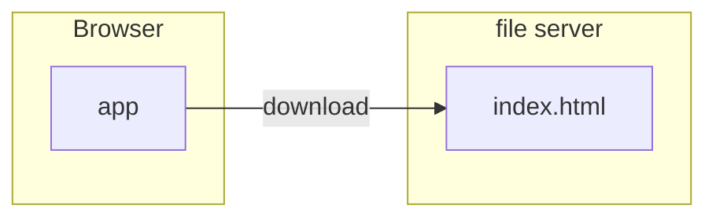
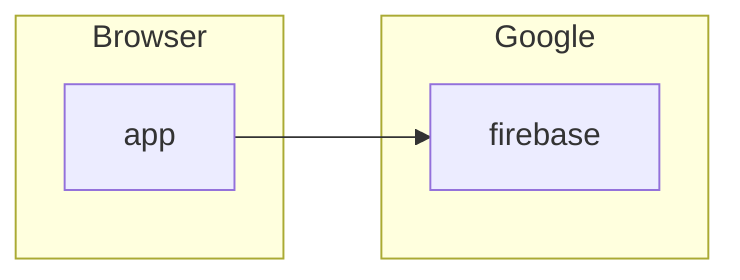
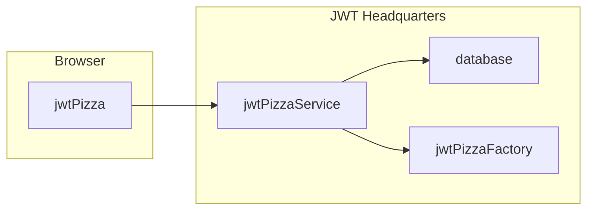

# Static deployment

🔑 **Key points**

- An application that doesn't require you to provide backend support is called a static deployment.

---

Sometimes your application consists of files that can be loaded and executed on a user's device. This simplifies things because you do not need to deploy backend computing resources to handle things like functional endpoints or storing customer data.

A common example of static deployment is this: A website that only consists of a set of HTML pages can be hosted as files on an HTTP server and then executed on the user's computer when they load the files in the browser. Taking this to the extreme, we can provide a sample application that simply prints out _Hello World_.

```html
<!DOCTYPE html>
<html>
  <body>
    <h1>Hello World!</h1>
  </body>
</html>
```

You can then host the file on a server that simply delivers the file to the customer's browser where it is interpreted and rendered. This is a completely static deployment because no execution of code happens on the backend.



Static deployments are desirable because they are simple, inexpensive, and easily scalable.

## Calling non-static services

You can only get so far building applications that only execute on a customer's device. For example, if your application requires authentication, you need to store those credentials somewhere. However, that doesn't mean that you need to provide the dynamic part of the application.

An application can still be considered a static deployment even if it calls backend computational services, as long as **you** are not providing those services. The idea here is that your part of the application is static, while some other party is supporting the dynamic part of the application.

Consider a case where you build a React application that uses [Google Firebase](https://firebase.google.com/) to handle authentication, notifications, and simple data storage. In this case you are still only deploying a static application, and Google is handling all the harder issues related to scalability, reliability, and resilience.



## JWT Pizza

You can deploy the JWT Pizza application by placing the frontend code on a publicly available HTTP server, and then using the JWT Pizza service and database provided by JWT Headquarters.



This greatly simplifies your life because you don't have to worry about deploying and managing code running on backend servers. That is left to the DevOps engineers working at JWT Headquarters. You just need to put the JWT Pizza frontend code in a location from where a browser can load the frontend code.

In later instruction you will learn how to deploy your own JWT Pizza Service and database. Then you will only rely on the Pizza Factory provided by JWT Headquarters. Deploying your own backend service and database makes things significantly more complicated, but it gives you control over the full stack, and that is where all the fun is.
