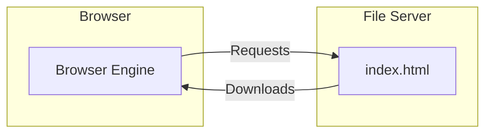
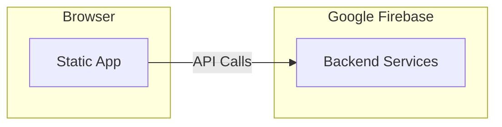
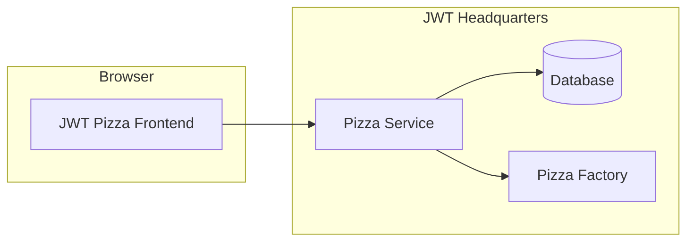

# Static deployment

🔑 **Key points**

- A static deployment is an application consisting of pre-built files served directly to a user's browser without requiring server-side code execution.
- Static deployments are highly scalable, cost-effective, and simple to maintain.
- A static application can still interact with dynamic backend services via APIs provided by third parties.

---

Sometimes an application consists entirely of files that can be loaded and executed directly on a user's device. This simplifies the deployment process because you do not need to manage backend computing resources to handle API endpoints or store customer data on your own servers.

A common example of a static deployment is a website consisting of a set of HTML, CSS, and JavaScript files. These files are hosted on a web server and delivered to the user's browser, where they are interpreted and rendered. To illustrate this, consider a simple application that prints "Hello World."

```html
<!DOCTYPE html>
<html>
  <body>
    <h1>Hello World!</h1>
  </body>
</html>
```

Here is a more complicated example of an audio mixer that you can interact with and alter. Everything is loaded from a single HTML file and executed right here in the browser.


```masteryls
{"id":"39ecfa23-3913-44a1-93bc-db33d61fe1fa", "title":"Web page", "type":"web-page", "height":500, "file":"audioMixer.html"}
```


You can host static deployment on a server, or content delivery network (CDN), that simply delivers it to the customer's browser. This is a completely static deployment because no code execution happens on the backend when the application is used.


```mermaid
graph LR;
    subgraph Browser
    app[Browser Engine]
    end
    subgraph File Server
    app-->|Requests|index.html
    index.html-->|Downloads|app
    end
```

Static deployments are desirable because they are simple to set up, inexpensive to host, and easily scalable through Content Delivery Networks (CDNs).

## Calling non-static services

There is a limit to what you can build using only client-side code. For example, if your application requires user authentication, you must store and verify credentials in a secure environment. However, needing dynamic functionality does not necessarily mean you must move away from a static deployment model for your frontend.

An application is still considered a static deployment even if it calls backend computational services, as long as **you** are not the one providing and maintaining those server-side services. In this model, your part of the application remains static, while a third party supports the dynamic functionality.

Consider a React application that uses [Google Firebase](https://firebase.google.com/) to handle authentication, notifications, and data storage. In this scenario, you are still deploying a static application (the React build files), while Google handles the complexities of scalability, reliability, and server-side logic.


```mermaid
graph LR;
    subgraph Browser
    app[Static App]
    end
    subgraph Google Firebase
    app-->|API Calls|firebase[Backend Services]
    end
```

## JWT Pizza

You can deploy the JWT Pizza application by placing the frontend code on a publicly available web server and then connecting it to the JWT Pizza service and database provided by JWT Headquarters.


```mermaid
graph LR;
    subgraph Browser
    jwtPizza[JWT Pizza Frontend]
    end
    subgraph JWT Headquarters
    jwtPizza-->jwtPizzaService[Pizza Service]
    jwtPizzaService-->database[(Database)]
    jwtPizzaService-->jwtPizzaFactory[Pizza Factory]
    end
```

This approach simplifies development because you do not have to worry about deploying or managing code on backend servers. Those responsibilities are handled by the DevOps engineers at JWT Headquarters. You only need to host the JWT Pizza frontend code in a location where a browser can load it.

In later lessons, you will learn how to deploy your own JWT Pizza Service and database. While deploying your own backend makes the architecture significantly more complex, it gives you full control over the entire stack.

## Exercises

```masteryls
{"id":"c42e5169-4462-4001-b8a0-dda9046a5245","title":"Static vs. Dynamic Deployment","type":"multiple-choice"}
What is the primary technical characteristic that distinguishes a static deployment from a dynamic server-side deployment?

- [x] Static deployments serve pre-built files directly to the user without requiring a server to execute code or query a database during the request-response cycle.
- [ ] Static deployments are restricted to HTML and CSS only and cannot execute client-side JavaScript or interact with external APIs.
- [ ] Static deployments require a server-side runtime environment like Node.js or Python to generate the page content every time a user visits the URL.
- [ ] Static deployments must be hosted on a local physical server and are incompatible with modern edge computing or Content Delivery Networks (CDNs).
```