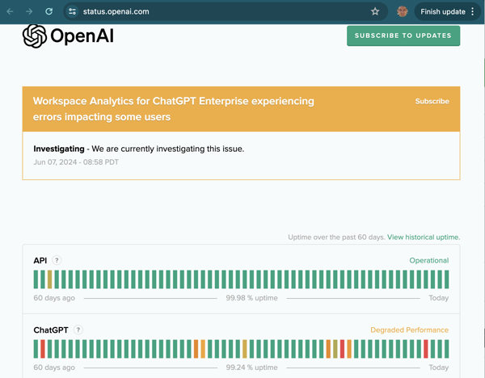
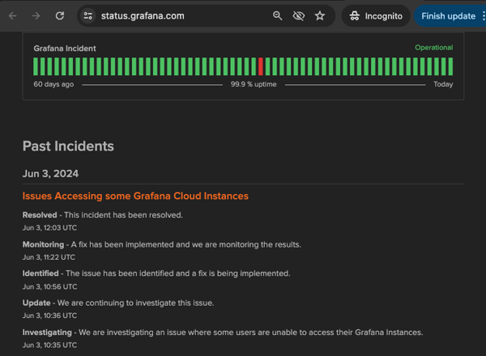
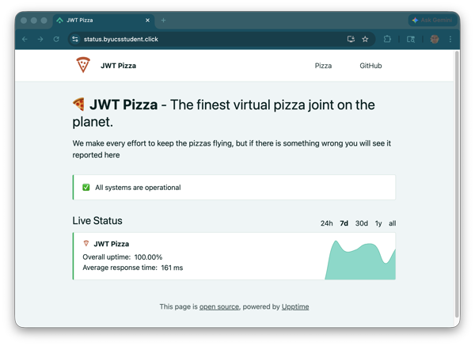

# Status reporting

🔑 **Key points**

- Status pages are a standard industry practice for modern applications.
- Reviewing status page examples helps you become familiar with the information they provide and how they manage customer expectations.

---

If customers perceive your application as unstable or feel your company is indifferent to reliability, they will quickly seek alternatives among your competitors. As a software engineer committed to quality, you can take several approaches to maintain customer trust:

1.  **Reduce the likelihood of bugs**: Focus on solid software design principles. Isolate or remove problematic functionality and keep the system as simple as possible.
2.  **Handle failure gracefully**: Implement circuit breakers that fall back to dependable functionality and provide system redundancy.
3.  **Ensure quality**: Invest significantly in both automated and manual testing.
4.  **Respond quickly**: Detect and resolve failures as rapidly as possible.
5.  **Communicate**: Inform your customers about ongoing issues and demonstrate that you have the situation under control.

No product is ever completely free of defects. While you should do everything within reason to minimize impacts on the customer, there is a point where the investment in prevention yields diminishing returns. This is where **communication** becomes vital. The worst-case scenario is having your customers discover an outage, data loss, or security breach weeks later via the news or social media. Ideally, you should identify and react to a problem before your customers report it, providing clear messaging that conveys confidence in your ability to address the issue.

## status.mydomain.com

A common way to communicate with customers is to host a [status](https://github.com/ivbeg/awesome-status-pages?tab=readme-ov-file#public-status-pages) subdomain that serves as a centralized information hub during incidents.

#### status.openai.com

The [OpenAI status](https://status.openai.com) page is a prime example.



Notice how they specify when the problem was discovered, the nature of the issue, and the current state of the resolution. Users can even subscribe to receive real-time updates via email or SMS.

#### status.grafana.com

Grafana takes communication a step further. If they detect a serious problem with functionality you are currently using, they display a notification banner directly within the application.


This banner includes a link to their status page, where the incident is described in detail.



## Creating your status page

There are several ways to create a status page for your application. Generally, you should not host the status page as part of your primary application; if your application goes down, your status page will likely go down with it, which is self-defeating. Instead, build the status page on a completely separate stack, preferably hosted in a different environment or cloud region.

Rather than building a custom solution from scratch, you can use one of many available cloud services. There are also numerous [open-source projects](https://github.com/ivbeg/awesome-status-pages) that make it easy to deploy a dedicated status page.

### Upptime

[Upptime](https://github.com/upptime/upptime) is a free, easy-to-configure option that leverages GitHub's infrastructure. It uses a scheduled GitHub Actions workflow to monitor your website and updates GitHub Pages to display the current status. GitHub Issues are used to track incidents, and the results are automatically integrated into the [status page](https://demo.upptime.js.org/).



💡 If you are looking for a practical "curiosity project," setting up an Upptime page is an excellent way to learn about automated monitoring.


## ☑ Exercise


```masteryls
{"id":"73a6e15f-1e5a-40cd-a2de-6f1cae8d6534","title":"The Value of Status Pages","type":"multiple-choice"}
Why is maintaining a public-facing status page considered an essential practice for modern software-as-a-service (SaaS) providers?

- [ ] It acts as an automated load balancer that redirects user traffic away from degraded components during a failure.
- [ ] It provides the engineering team with the specific logs and metrics needed to debug the underlying code during an incident.
- [x] It fosters transparency and reduces support ticket volume by providing a single, reliable source of truth for system health.
- [ ] It ensures that competitors cannot track service reliability or historical uptime performance.
```
