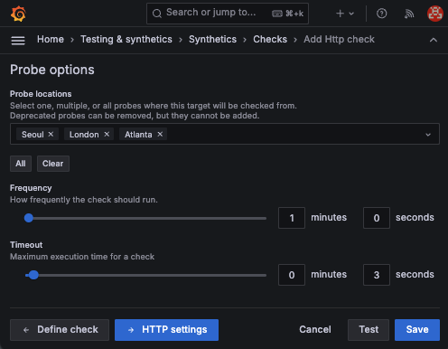
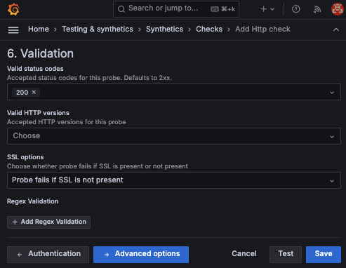

# Synthetic testing

🔑 **Key points**

- Grafana supports synthetic testing from multiple global locations.
- Create a synthetic test for JWT Pizza.

---

Synthetic testing, sometimes called _end user testing_, exercises the application from the user's perspective. It serves as a valuable smoke test that helps you discover problems before your customers notice and report them. This is important because anytime a customer discovers a problem, it erodes their confidence and encourages them to look elsewhere for a more stable solution.

In one sense, synthetic testing is the most authentic testing because it uses the actual environment that your customers are using. If your synthetic tests fail, then it probably means that your users are currently experiencing problems.

A good synthetic testing system seeks to recreate real world usage. This means it needs to simulate requests on different devices and from different places in the world. This exercises things that are usually out of the control of the application developer, such as hardware, bandwidth and network connectivity, but that are just as vital to the usefulness of the application as functional correctness and database resilience.

## Grafana synthetic testing

Grafana Cloud provides significant synthetic testing functionality with the following capabilities.

1. Global request origin locations from every populated continent.
1. Multiple types of request protocols including ICMP (ping), HTTP, DNS, Traceroute, and TCP.
1. The ability to execute a series of HTTP requests simulating actual user interactions.
1. Control over frequency of requests.
1. Advanced validation of responses by HTTP status codes and regular expressions against headers and bodies.
1. Automated alerts for when the tests fail.

Grafana's synthetic testing dashboard looks like the following.

This includes graphs that show the latency of requests, locations that requests are probed from, and general statistics for uptime, reachability, and web certificate currency.

## Creating a synthetic test

To create a Grafana synthetic test do the following:

1. Open the Grafana Cloud Dashboard.
1. Open the home menu and click on `Synthetics`.
1. Click on `Add new check`.
1. Select the check type. These represent the network request times that you can make. Select `HTTP` in order to make a single request that assures that your application resource is available.
1. Define the check.

   1. Provide `jwt-pizza` as the **Job name**.
   1. Provide the URL of your JWT Pizza application as the **Request target**.

      ⚠️ **Note**: This will require that your application is currently running. If it is not, then go and deploy it now.

   1. Check `Enabled` so that metrics for the tests will be stored in you Grafana data source (i.e. `grafanacloud-*-prom`) under metrics that begin with `probe_`. This is useful if you want to create your own visualizations.

   

1. Click the `→ Probes` button to define the frequency and location where request originate.

   1. Choose the `Probe locations` as **London**, **Seoul**, and **Atlanta**.
   1. Set the `Frequency` to one minute.
   1. Set the `Timeout` to 3 seconds.

   

1. Click `→ HTTP settings` and review the options. This allows you to make any type of HTTP request. We will not set any of these at this time.
1. Click `→ TLS config` and review the options. This allows you to specify the expected web certificate information. We will not set any of these at this time.
1. Click `→ Authentication` and review the options. This allows you to provide authentication tokens that the application requires. We will not set any of these at this time.
1. Click `→ Validation` and review the options. This allows you to define what response is expected from the HTTP request.

   1. Choose **200** as the `Valid status code`.
   1. Choose **Probe fails if SSL is not present** as the `SSL options`.

   

1. Press the `Test` button. After a few seconds this should return a successful response.

   

1. Press the `Save` button.

## Viewing the results

It will take a few seconds for the results of your test to start recording. Once they do, you will see the summary displayed.

Click on the `View dashboard` link to see the details of the test.

## Configuring alerts

Running tests is only as valuable as your ability to react to the results. In the case of synthetic testing, you need to define an alert that will contact the responsible parties when results need attention.

In a later section you will learn how to define the rules for triggering alerts and the methods for contacting the responsible parties. You can then write a rule that triggers an alert when an anomaly is detected.

## Reducing cost

Grafana Cloud provides you with a limited number of free synthetic testing checks. Once you have experimented with this functionality, you want to reduce the number of checks that you make so that it falls within their free tier.

To reduce the number of checks, edit the check that you just created and navigate to the `Probe options` view. Change the frequency to 60 minutes and press `Save`.

## ☑ Assignment

1. Follow the instruction given above to create a synthetic test of your JWT Pizza deployment.
1. Observe the metrics over a reasonable period of time.
1. Decrease the frequency of the tests to once an hour.

Once you are done, submit a screenshot of your check dashboard to the Canvas assignment.
