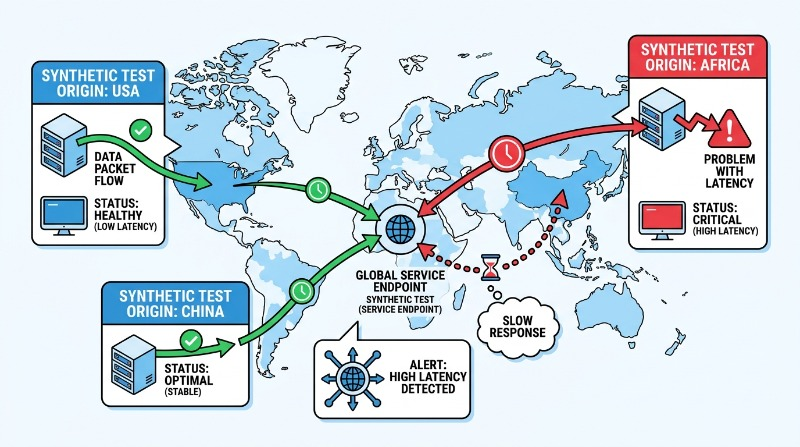
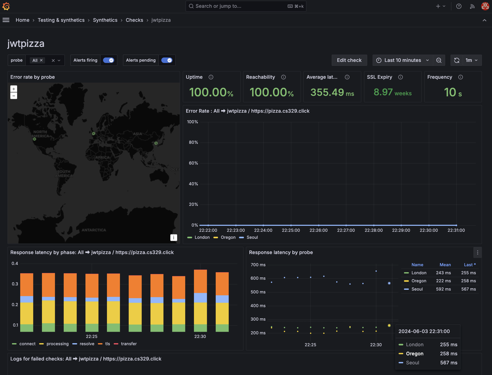
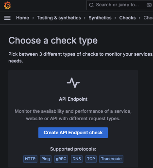
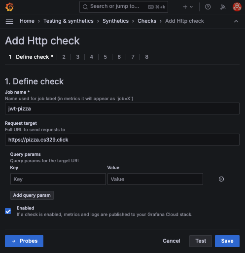
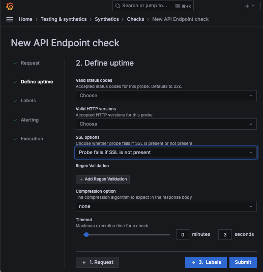
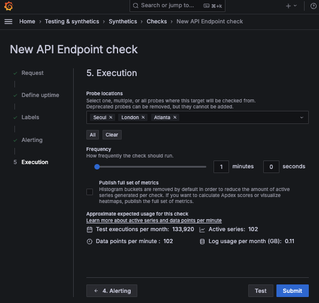
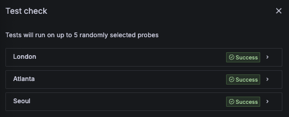
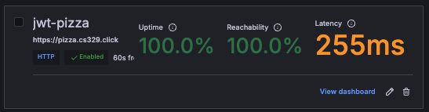
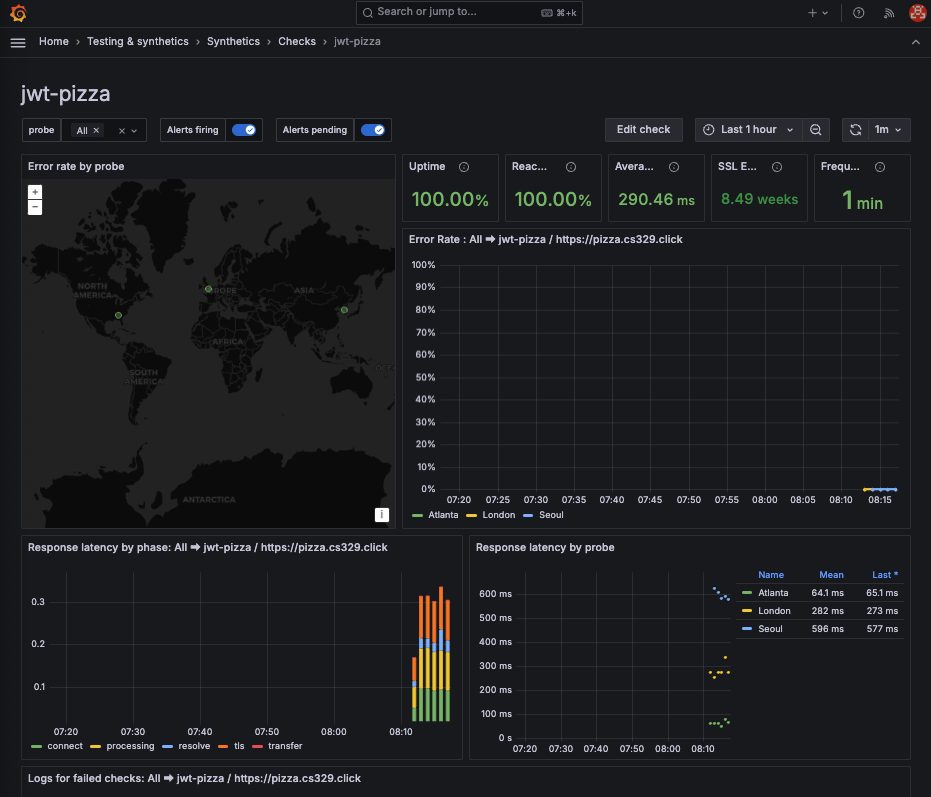

# Synthetic testing

🔑 **Key points**

- Grafana supports synthetic testing from multiple global locations.
- Create a synthetic test for the JWT Pizza application.

---

Synthetic testing, often referred to as _active monitoring_, is a method of monitoring software applications by simulating user behavior through automated scripts. Unlike Real User Monitoring (RUM), which captures data from actual visitors, synthetic testing uses "probes" or "bots" to traverse critical paths at regular intervals (e.g., every 1 or 5 minutes) from various geographic locations. This approach allows teams to identify outages, performance regressions, and broken workflows before a single real user is impacted. This is critical because every time a customer discovers an issue, it erodes their confidence and encourages them to look elsewhere for a more stable solution.



In one sense, synthetic testing is the most authentic form of testing because it uses the actual production environment that your customers use. If your synthetic tests fail, it almost certainly means that your users are currently experiencing problems.

A robust synthetic testing system seeks to recreate real-world usage. This means it must simulate requests from different devices and various geographical locations. This exercises factors that are usually outside the control of the application developer—such as hardware, bandwidth, and network connectivity—but are just as vital to the application's utility as functional correctness and database resilience.

### When Synthetic Testing is Appropriate

Synthetic testing is most effective for verifying the "golden paths" of an application. It is the preferred choice for:

- **Availability Monitoring:** Ensuring your site is "up" and reachable from different global regions (e.g., checking latency from Tokyo vs. New York).
- **SLA Verification:** Providing objective data to prove that a service provider is meeting uptime and performance requirements.
- **Critical Path Validation:** Testing essential business functions like "Add to Cart," "User Login," or "Password Reset" around the clock.
- **Pre-deployment Smoke Testing:** Running the same synthetic scripts against a staging environment to catch breaking changes before they reach production.

### When to Avoid Synthetic Testing

While powerful, synthetic testing is not a silver bullet. It should not be used in the following scenarios:

- **Measuring Real User Experience:** It cannot account for the "long tail" of real-world performance issues caused by diverse hardware, low-end mobile devices, or spotty cellular networks.
- **Highly Complex Exploratory Testing:** Scripts are rigid. They will not find bugs in features they aren't specifically programmed to touch.
- **High-Volume Load Testing:** While you can run many synthetic tests, their primary goal is functional health and baseline latency, not stressing the system to its breaking point.
- **Data-Sensitive Environments:** If a workflow requires unique, one-time-use production data that cannot be easily cleaned or mocked, synthetic scripts may cause data corruption or security risks.

### Example: A Basic Synthetic Script

Modern synthetic testing often uses tools like Playwright or Puppeteer. Below is a conceptual example of a synthetic check written in Playwright that verifies a login flow:

```javascript
const { test, expect } = require('@playwright/test');

test('Synthetic Login Check', async ({ page }) => {
  // 1. Navigate to the site
  await page.goto('https://example.com/login');

  // 2. Perform actions
  await page.fill('#username', 'synthetic_monitor_user');
  await page.fill('#password', process.env.MONITOR_PASSWORD);
  await page.click('#login-button');

  // 3. Verify the outcome
  const dashboardHeader = page.locator('h1');
  await expect(dashboardHeader).toContainText('Welcome Back');

  // If any step fails or times out, the monitor triggers an alert.
});
```

```masteryls
{"id":"6fe6f6c4-a049-4194-aae9-e5970ac89488","title":"Identifying Synthetic Testing Use Cases","type":"multiple-choice"}
In which of the following scenarios is synthetic testing the most appropriate tool to use?

- [ ] Debugging a performance issue reported by a specific user on an old Android device
- [ ] Analyzing the click-through rate of a new marketing banner
- [ ] Stress-testing the database by simulating 50,000 concurrent user sessions
- [x] Verifying that the "Checkout" flow is functional every 5 minutes from multiple global regions
```

## Grafana synthetic testing

Grafana Cloud provides significant synthetic testing functionality with the following capabilities:

1. **Global request origins:** Test from every populated continent.
2. **Multiple protocols:** Support for ICMP (ping), HTTP, DNS, Traceroute, and TCP.
3. **Multi-step interactions:** Execute a series of HTTP requests simulating actual user workflows.
4. **Frequency control:** Define how often tests run.
5. **Advanced validation:** Validate responses using HTTP status codes and regular expressions against headers and bodies.
6. **Automated alerts:** Notify the team immediately when tests fail.

The Grafana synthetic testing dashboard provides a high-level overview of application health.



This dashboard includes graphs showing request latency, the locations from which requests are probed, and general statistics for uptime, reachability, and SSL certificate validity.

## Creating a synthetic test

> [!NOTE]
>
> This requires your application to be currently running. If it is not, please deploy it before proceeding.

To create a Grafana synthetic test, follow these steps:

1. Open your Grafana Cloud Dashboard.
1. Open the home menu and navigate to **Testing & synthetics** > **Synthetics** > **Checks**.
1. Click on **New check**.
1. Select the check type. These represent the types of network requests you can perform. Select **Create API Endpoint check** to create a single request that ensures your application resource is available.

   

1. Define the check:
   1. Enter `jwt-pizza` as the **Job name**.
   2. Enter the URL of your JWT Pizza application as the **Request target**.

   

1. Click **→ Define uptime** from the left side menu. This allows you to define the expected response.
   1. Choose **200** as the **Valid status code**.
   2. Select **Probe fails if SSL is not present** under **SSL options**.

   

1. Click **→ Execution** from the left side menu to define the frequency and origin of the requests.
   1. Choose three different locations from the **Probe locations** (e.g., **London**, **Seoul**, and **Ohio**).
   2. Set the **Frequency** to **2 minutes**.

   

1. Click the **Test** button. After a few seconds, this should return a successful response.

   

1. Click the **Save** button.

## Viewing the results

It will take a few minutes for the results of your test to begin recording. Once they do, you will see a summary displayed on the Checks page.



Click on the **View dashboard** link to see the detailed metrics of the test.



## Configuring alerts

Running tests is only valuable if you can react to the results. For synthetic testing, you should define an alert that contacts the responsible parties when results require attention.

In a later section, you will learn how to define rules for triggering alerts and the methods for contacting the responsible team members. You can then write a rule that triggers an alert as soon as an anomaly is detected by your synthetic checks.

## Reducing cost

Grafana Cloud provides a limited number of free synthetic testing checks. Once you have finished experimenting with this functionality, you should reduce the frequency of your checks to ensure you stay within the free tier.

To reduce the number of checks:

1. Edit the check you just created.
2. Navigate to the **Execution** view.
3. Change the **Frequency** to **60 minutes**.
4. Click **Save**.

## ☑ Exercise

1. Follow the instructions above to create a synthetic test for your JWT Pizza deployment.
1. Observe the metrics over a short period of time to ensure they are recording correctly.
1. Decrease the frequency of the tests to once per hour to conserve your Grafana Cloud credits.

```masteryls
{"id":"cb2d8e87-a446-45bd-a3a4-4e724cc0e9db", "title":"Synthetic testing", "type":"file-submission", "gradingCriteria":"Successful display of Grafana Synthetic testing for jwt pizza"  }
Submit a screenshot of your synthetic test running in Grafana.
```
