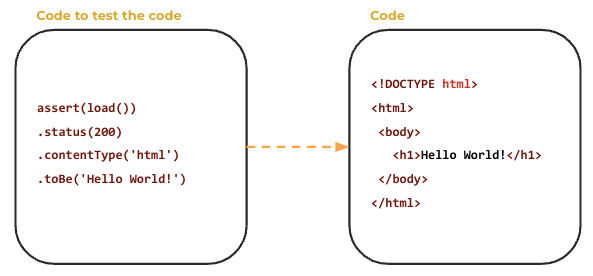
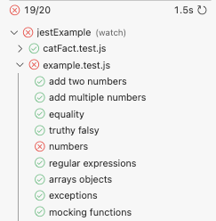

# Testing

🔑 **Key points**

- Testing leads to better developer and customer experiences.
- Understand the right and wrong way to do testing.
- Find the right balance when testing your code.

---

Software and system development should not be separated from the concept of testing any more than it can in other domains such as construction, writing, or the food industry. There always needs to be some sort of review to ensure the quality of the product. Without a testing cycle you have no assurance that the system meets the design characteristic or is satisfactory to the customer.

In reality, you cannot have a product without testing. If you don't test the product internally, you are just pushing the role of testing onto your customer, and that type of attitude will not work very well for long. It is much better for everyone if quality is baked into what you deliver.

Testing in general gives a different mindset to creating a project. It forces the producer of the product to focus on the product from a consumer's perspective. Generally this creates a cleaner design that is more likely to satisfy the customer.

What is different with testing software products is that we can test one software system by creating another software system to automatically do the testing.



This gives us some unexpected benefits.

- Actually decreases the development time because the develop/test cycle shortens dramatically
- Encourages consistent quality because testing is always happening
- Prevents breakage of existing functionality because it is cheap to test everything that was done before
- The tests provide a working example of the product that documents how the product works

Combined, these benefits result in a better design, in a shorter amount of time, with a reduced number of defects. This all leads to greater customer and developer satisfaction.

## More than just testing

It is tempting to think that testing is just about validating code. However, as mentioned above, software testing does significantly more than that. Kent Beck, the author of [Test Driven Development](https://www.amazon.com/Test-Driven-Development-Kent-Beck/dp/0321146530), put it this way:

> “The act of writing a unit test is more an act of design than of verification. It is also more an act of documentation than of verification. The act of writing a unit test closes a remarkable number of feedback loops, the least of which is the one pertaining to verification of function.”

This is most clearly seen in the impact that automated testing has on the design and documentation of the product.

### Better design

First, testing forces you to consider the design of the code from the consumer's perspective before you write the first line of code. It encourages questions such as:

- How is this going to work with other code?
- Will its interface be obvious and intuitive?
- Does it meet the consumer's needs?
- Is it concise and sufficiently uncoupled for unnecessary dependencies?
- Can it be decomposed into smaller pieces that will be easier to reuse, and by extension, test?
- Is it exposing details that need to be abstracted away?
- Can dependency inversion be used to increase flexibility?
- Is it exposing security vulnerabilities?

### Better documentation

Second, there is no better documentation than the code itself. Unfortunately, code can take a long time to read. However, an example of how to use the code is often the exact concise documentation that we are looking for. Well written, clearly named, tests can provide just that.

Consider the following test for a `Catalog` object. We can see from the test that we can `add` items and then get them all back with the `history`. Items can be of different type. It is also obvious that both the add and history methods are asynchronous. No long-winded narratives are necessary; I can experiment with this example, and I can use it to start my code.

```js
test('catalog history', async () => {
  const expectedItems = ['item', 2, {id:9}];

  const catalog = new Catalog();
  expectedItems.forEach(item => await catalog.add(item));

  const history = await catalog.history();
  expect(history).toEqual(expectedItems);
});
```

## Characteristics of good tests

- Test only one thing
- Don't repeat tests that are already covered elsewhere
- Naturally supported by the application code
- Tests are readable
- Test can run in any order
- Test can run concurrently

## Testing latency

The faster your tests run the more likely they will be ran. If you have a test suite that takes minutes or hours to complete then those test cannot reasonably be part of an engineers normal workflow and they will only be used with by a long running CI pipeline. While that does provide some utility, you want to encourage the following realtime development pattern:

1. Make a change
1. Run a full test suite to give you confidence that you didn't brake anything
1. Repeat until a reasonable milestone is achieved
1. Commit and let more exhaustive tests execute

This works best if the tests the engineer is running as part of their development workflow can execute in just a few seconds, or a minute at most. That means you have an average target test latency of around 20 ms. That way you can run 500 tests and only have to wait 10 seconds for them to complete.

## Gamification of testing

> “The run of the green bar can become addictive.”

_Source_: Robert C. Martin - Clean Code

Modern testing automation naturally creates a game-like environment. It can take the drudgery out of programming and give you an immediate dopamine hit.

### Ohhh, look, tests! I wanna play!

> 

- Can I get them all to turn green?
- Can I keep them green as I start adding new stuff?
- Can I decrease the amount of time it takes for the tests to run?
- Am I missing some tests? Can I improve my score by adding more?
- What is your high score? Am I on top of the scoreboard?
- I'm not going to be able to sleep tonight until that last test is green!

This is part of an actual phenomenon called [Green Bar Addiction](https://wiki.c2.com/?GreenBarAddiction).

## When testing goes wrong 😱

When testing is done correctly it gives major payback. Conversely, if unit testing is done incorrectly it can destroy your product. The following are common mistakes that developers make when they first start using automated testing.

### Duplication

There is a temptation to duplicate portions of the production code in the testing code, possibly multiple times. This is often done so that you can test isolated portions of the code, or because the code is too tightly coupled that it is impossible to create a test. Duplicating production code requires you to change things in multiple places whenever you need to make a change.

Consider the case where you have a suite of tests that validate the endpoints for working with pizza franchises. You write a test to create a franchise, and then you duplicate that same franchise creation and testing code when you create a franchise store, purchase a pizza from the franchise, add an admin to the franchise, delete a store, and so forth.

```js
test('create franchise', async () => {
  const franchiseReq = { name: TestHelper.randomName(), admins: [{ email: user.email }] };
  const getFranchiseRes = await request(app).post(`/api/franchise`).set('Authorization', `Bearer ${authToken}`).send(franchiseReq);
  expect(getFranchiseRes.status).toBe(200);
  expect(getFranchiseRes.headers['content-type']).toMatch('application/json; charset=utf-8');
  expect(getFranchiseRes.admins[0].id).toBe(adminUser.id);
  testFranchise = getFranchiseRes.body;
});

test('create store', async () => {
  const franchiseReq = { name: TestHelper.randomName(), admins: [{ email: user.email }] };
  const getFranchiseRes = await request(app).post(`/api/franchise`).set('Authorization', `Bearer ${authToken}`).send(franchiseReq);
  expect(getFranchiseRes.status).toBe(200);
  expect(getFranchiseRes.headers['content-type']).toMatch('application/json; charset=utf-8');
  expect(getFranchiseRes.admins[0].id).toBe(adminUser.id);
  testFranchise = getFranchiseRes.body;

  // code to create a store using the franchise
});
```

A more impactful example would be if you rewrote a subsystem, say like MySQL, so that you could test that your data access layer was working correctly.

### Mocking lies

It is common to fake, or mock, inputs and outputs for a testing subject. When the mocked data is not actually consistent with reality, you are no longer validating the production code, you are instead validating the testing code.

In the following example everything is mocked out so that the testing framework is only comparing two hard coded objects.

```js
test('get joke', () => {
  // Request mock
  const request = () => {
    return {
      get: () => {
        return { joke: 'Chuck Norris can divide by zero.' };
      },
    };
  };

  const jokeRes = request(app).get('/api/joke');
  expect(jokeRes).toEqual({ joke: 'Chuck Norris can divide by zero.' });
});
```

### Testing creep

Sometimes we alter the production code to better support testing. This is fine if it actually improves the production code so that it actually creates a better consumer interface, increases abstraction, and decreases coupling. However, when it actually leaks abstraction (I'm talking about you _C++ friends_), or adds a bunch of "test only" branches to the production code, you have probably gone too far.

In the following example you have an HTTP service that has a hardcoded joke that is returned when the service is in testing mode.

```js
const express = require('express');

const app = express();
const port = 3000;

app.get('/api/joke', (req, res) => {
  if (app.mode === 'test') {
    return res.json({ joke: 'Chuck Norris can divide by zero.' });
  }
  res.json(jokeServer.getJoke());
});

app.listen(port, () => {
  console.log(`Server is running on http://localhost:${port}`);
});
```

### Infallible green

Tests should increase confidence, but just like any other code, you should never assume they are correct until they have reached a certain level of battle worn hardening. It is very common to write a test, see that it is green on the first run, and immediately move on, only to find out later that the test was actually not testing what you assumed and when corrected is no longer green. Consider the following test. It only checks to see that it returns a response. Never mind that the status code is 500.

```js
test('get menu', async () => {
  const getMenuRes = await request(app).get('/api/order/menu');
  expect(getMenuRes).toBeDefined();
});
```

### Increased maintenance

You are writing a program to test your program. Make no mistakes, this is more code that you will need to maintain as you move forward. If you write useless tests, tests that are duplicates of each other, tests that exercise paths a consumer will never use, or that only test trivial paths, then the value of the tests will not justify the investment in the tests.

### Incomprehensible

It is common to take time to properly design production software without giving the same thought to the design of tests. Watch out for these red flags in test code:

- Run on for hundreds of lines
- Use overly terse constructs
- Have duplicated/complex setup code
- Are hard to find
- Not clear what they are testing
- Test multiple things
- Poorly named

### Coverage fixation

If you become focused on testing coverage you can sometimes create tests that hit every line, but don't actually verify anything that is happening on those lines. For example, the following test code makes an endpoint request, but never looks at the result. The request may have completely failed, but the test coverage will 💯!

```js
test('get orders', async () => {
  await request(app).get('/api/order/').set('Authorization', `Bearer ${authToken}`);
});
```
