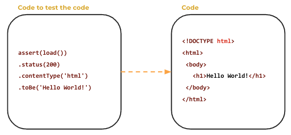
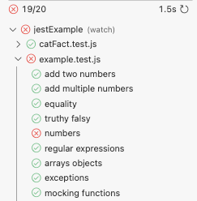

# Testing

🔑 **Key points**

- Testing leads to better developer and customer experiences.
- Understand the right and wrong ways to perform testing.
- Find the right balance when testing your code.

---

Software and system development should not be separated from the concept of testing any more than it is in other domains such as construction, writing, or the food industry. There always needs to be a review process to ensure the quality of the product. Without a testing cycle, you have no assurance that the system meets the design characteristics or is satisfactory to the customer.

In reality, you cannot have a product without testing. If you don't test the product internally, you are pushing the role of testing onto your customer, an attitude that will not work for long. It is much better for everyone if quality is baked into what you deliver.

Testing gives a different mindset to the creation of a project. It forces the producer of the product to focus on the product from a consumer's perspective. Generally, this creates a cleaner design that is more likely to satisfy the customer.

What is unique about software products is that we can test one software system by creating another software system to automatically perform the testing.



This provides several significant benefits:

- **Decreases development time** because the develop/test cycle shortens dramatically.
- **Encourages consistent quality** because testing is always happening.
- **Prevents breakage of existing functionality** because it is inexpensive to test everything that was built previously.
- **Provides documentation** through working examples that demonstrate how the product works.

Combined, these benefits result in a better design in a shorter amount of time with a reduced number of defects. This leads to greater customer and developer satisfaction.

## More than just testing

It is tempting to think that testing is just about validating code. However, software testing does significantly more than that. Kent Beck, the author of [Test Driven Development](https://www.amazon.com/Test-Driven-Development-Kent-Beck/dp/0321146530), put it this way:

> "The act of writing a unit test is more an act of design than of verification. It is also more an act of documentation than of verification. The act of writing a unit test closes a remarkable number of feedback loops, the least of which is the one pertaining to verification of function."

This is most clearly seen in the impact that automated testing has on the design and documentation of the product.

### Better design

First, testing forces you to consider the design of the code from the consumer's perspective before you write the first line of code. It encourages questions such as:

- How is this going to work with other code?
- Will its interface be obvious and intuitive?
- Does it meet the consumer's needs?
- Is it concise and sufficiently decoupled from unnecessary dependencies?
- Can it be decomposed into smaller pieces that are easier to reuse and test?
- Is it exposing details that should be abstracted away?
- Can dependency inversion be used to increase flexibility?
- Is it exposing security vulnerabilities?

### Better documentation

Second, there is no better documentation than the code itself. Unfortunately, code can take a long time to read. However, an example of how to use the code is often the exact, concise documentation we are looking for. Well-written, clearly named tests provide just that.

Consider the following test for a `Catalog` object. We can see from the test that we can `add` items and then retrieve them all with `history`. Items can be of different types. It is also obvious that both the `add` and `history` methods are asynchronous. No long-winded narratives are necessary; an engineer can experiment with this example and use it to start their own code.

```js
test('catalog history', async () => {
  const expectedItems = ['item', 2, { id: 9 }];

  const catalog = new Catalog();
  for (const item of expectedItems) {
    await catalog.add(item);
  }

  const history = await catalog.history();
  expect(history).toEqual(expectedItems);
});
```

## Characteristics of good tests

- Test only one thing.
- Do not repeat tests that are already covered elsewhere.
- Naturally supported by the application code.
- Tests are readable.
- Tests can run in any order.
- Tests can run concurrently.

## Structuring Tests with Arrange-Act-Assert

The **Arrange-Act-Assert (AAA)** pattern is the gold standard for structuring unit tests. It provides a clear, consistent framework that improves the readability and maintainability of your test suite. By separating the setup of the test from the execution and the verification, developers can quickly understand the intent of a test case and diagnose failures when they occur.

The pattern breaks a test down into three distinct functional phases:

1.  **Arrange**: Initialize objects, set up mocks, and prepare the data required for the specific test scenario.
2.  **Act**: Invoke the specific method or action that you are testing. The more granular the action the better.
3.  **Assert**: Verify that the outcome of the action matches your expectations. This involves checking return values, object states, or interactions with dependencies.

### Implementation Example

Consider a simple `ShoppingCart` class. When testing the functionality of adding an item, the AAA pattern ensures that the test code remains clean and focused.

```javascript
// Example using a JavaScript testing framework like Jest
test('should update total price when an item is added', () => {
  // Arrange
  const cart = new ShoppingCart();
  const item = { name: 'Widget', price: 10.0 };
  const expectedTotal = 10.0;

  // Act
  cart.addItem(item);

  // Assert
  expect(cart.total).toBe(expectedTotal);
  expect(cart.items.length).toBe(1);
});
```

### Key Benefits of AAA

Using this pattern consistently offers several advantages to a development team:

- **Improved Readability**: Because every test follows the same structure, developers don't have to "hunt" for what is actually being tested.
- **Separation of Concerns**: It prevents "interleaving" where you might assert something, then act again, then assert more. Interleaved tests are difficult to debug and often indicate that a test is trying to do too much.
- **Easier Maintenance**: If the setup logic for a class changes, you know exactly which section (Arrange) needs to be updated.
- **Clearer Test Intent**: It enforces the "Single Responsibility Principle" for tests. If your **Act** section contains multiple lines or complex logic, it is a signal that the test should likely be split into multiple smaller tests.

## Testing latency

The faster your tests run, the more likely they are to be run. If a test suite takes minutes or hours to complete, those tests cannot reasonably be part of an engineer's normal workflow; they will only be used by a long-running CI pipeline. While that provides some utility, you want to encourage the following real-time development pattern:

1. Make a change.
2. Run a full test suite to gain confidence that nothing broke.
3. Repeat until a reasonable milestone is achieved.
4. Commit and let more exhaustive tests execute.

This works best if the tests an engineer runs during development execute in just a few seconds, or a minute at most. This means you should target an average test latency of around 20 ms. At that speed, you can run 500 tests and only wait 10 seconds for them to complete.

## Gamification of testing

> "The run of the green bar can become addictive."
> — _Robert C. Martin, Clean Code_

Modern testing automation naturally creates a game-like environment. It can take the drudgery out of programming and provide an immediate dopamine hit.

### Ohhh, look, tests! I wanna play!

> 

- Can I get them all to turn green?
- Can I keep them green as I add new features?
- Can I decrease the amount of time it takes for the tests to run?
- Am I missing some tests? Can I improve my score by adding more?
- What is the high score? Am I on top of the scoreboard?
- I am not going to be able to sleep tonight until that last test is green!

This is part of an actual phenomenon called [Green Bar Addiction](https://wiki.c2.com/?GreenBarAddiction).

## When testing goes wrong 😱

When testing is done correctly, it gives a major payback. Conversely, if unit testing is done incorrectly, it can destroy your product. The following are common mistakes developers make when they first start using automated testing.

### Duplication

There is a temptation to duplicate portions of the production code in the testing code. This is often done to test isolated portions of code or because the code is so tightly coupled that it is difficult to create a test. Duplicating production logic requires you to change things in multiple places whenever you make a change.

Consider a suite of tests that validate endpoints for pizza franchises. You might write a test to create a franchise, and then duplicate that same creation code when you test creating a store, purchasing a pizza, adding an admin, and so forth.

```js
test('create franchise', async () => {
  const franchiseReq = { name: TestHelper.randomName(), admins: [{ email: user.email }] };
  const getFranchiseRes = await request(app).post(`/api/franchise`).set('Authorization', `Bearer ${authToken}`).send(franchiseReq);
  expect(getFranchiseRes.status).toBe(200);
  expect(getFranchiseRes.headers['content-type']).toMatch('application/json; charset=utf-8');
  expect(getFranchiseRes.body.admins[0].id).toBe(adminUser.id);
  testFranchise = getFranchiseRes.body;
});

test('create store', async () => {
  // Duplicated franchise creation logic
  const franchiseReq = { name: TestHelper.randomName(), admins: [{ email: user.email }] };
  const getFranchiseRes = await request(app).post(`/api/franchise`).set('Authorization', `Bearer ${authToken}`).send(franchiseReq);
  expect(getFranchiseRes.status).toBe(200);
  testFranchise = getFranchiseRes.body;

  // Actual code to test creating a store using the franchise
});
```

### Mocking lies

It is common to fake, or "mock," inputs and outputs for a testing subject. When the mocked data is not consistent with reality, you are no longer validating the production code; you are merely validating the testing code.

In the following example, everything is mocked so that the testing framework is only comparing two hard-coded objects.

```js
test('get joke', () => {
  // Mocking the request behavior entirely
  const mockRequest = {
    get: () => ({ joke: 'Chuck Norris can divide by zero.' }),
  };

  const jokeRes = mockRequest.get('/api/joke');
  expect(jokeRes).toEqual({ joke: 'Chuck Norris can divide by zero.' });
});
```

### Testing creep

Sometimes we alter production code to better support testing. This is acceptable if it improves the production code by creating a better consumer interface, increasing abstraction, or decreasing coupling. However, when it leaks abstractions (such as C++ `friend` classes) or adds "test only" branches to the production code, you have gone too far.

In the following example, an HTTP service has a hard-coded joke returned only when the service is in testing mode.

```js
const express = require('express');
const app = express();

app.get('/api/joke', (req, res) => {
  // Production code branching for tests
  if (app.get('env') === 'test') {
    return res.json({ joke: 'Chuck Norris can divide by zero.' });
  }
  res.json(jokeServer.getJoke());
});
```

### Infallible green

Tests should increase confidence, but like any other code, you should never assume they are correct until they are battle-worn. It is common to write a test, see it turn green on the first run, and move on, only to find out later that the test was not actually checking what you intended.

Consider the following test. It only checks that a response exists, ignoring the fact that the status code might be a 500 error.

```js
test('get menu', async () => {
  const getMenuRes = await request(app).get('/api/order/menu');
  // This passes even if the response is an error message
  expect(getMenuRes).toBeDefined();
});
```

### Increased maintenance

You are writing a program to test your program. This is more code that you will need to maintain. If you write useless tests, duplicate tests, or tests that exercise paths a consumer will never use, the value of the tests will not justify the investment.

### Incomprehensible tests

It is common to properly design production software while neglecting the design of the tests. Watch out for these red flags in test code:

- Tests that run for hundreds of lines.
- Overly terse or cryptic constructs.
- Duplicated or complex setup code.
- Tests that are hard to find.
- Unclear testing objectives.
- Testing multiple things in one block.
- Poorly named tests.

### Coverage fixation

If you focus solely on test coverage metrics, you may create tests that hit every line but do not actually verify the results. For example, the following test makes an endpoint request but never inspects the response. The request may have failed completely, but the code coverage will still show 100%.

```js
test('get orders', async () => {
  // Hits the line, but verifies nothing
  await request(app).get('/api/order/').set('Authorization', `Bearer ${authToken}`);
});
```

## ☑ Exercise

```masteryls
{"id":"7d6ec40a-e0f0-4841-82a6-61411fc573db","title":"Primary Benefits of Testing","type":"multiple-select"}
What is the primary benefit of incorporating a robust testing strategy early in the software development lifecycle?

- [ ] It provides a formal guarantee that the software is entirely free of bugs and security vulnerabilities.
- [x] It complements documentation and architectural planning.
- [x] It identifies defects early, significantly reducing the cost and complexity of remediation compared to finding them in production.
- [ ] It allows developers to skip code quality checks since all errors will be caught during the final test phase.
```

```masteryls
{"id":"41af55fd-ccbc-4dfb-bef1-9e4ec3547aa6","title":"Avoiding Brittle Tests","type":"multiple-choice"}
When beginners start writing unit tests, they often create "brittle" tests that break frequently during refactoring. Which of the following actions is a primary cause of this problem?

- [ ] Organizing tests using the **Arrange-Act-Assert** pattern, which creates too much overhead for simple logic
- [ ] Mocking a database connection to ensure that the unit tests can run quickly and in isolation from the infrastructure
- [x] Asserting against the internal implementation details of a class rather than its public API and observable behavior
- [ ] Writing tests that only verify the final return value of a function instead of inspecting every local variable change
```
