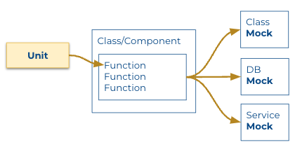
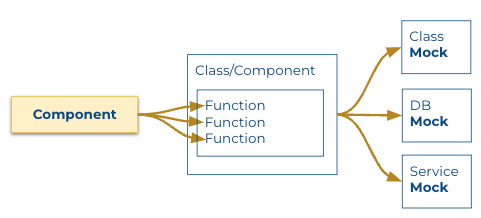
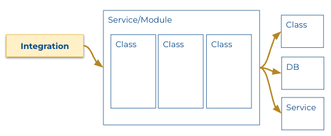
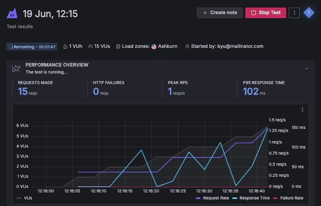
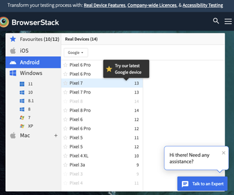
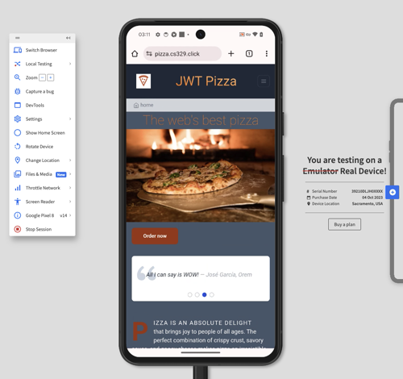
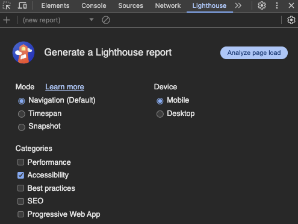
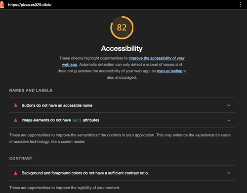
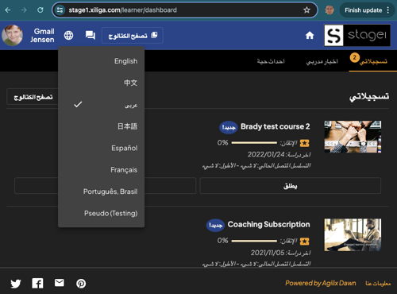
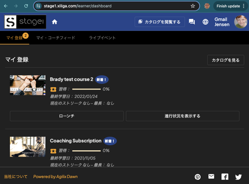

# Testing categories

🔑 **Key points**

- Understand the different categories of testing.
- Know which testing strategy to use for every situation.

---

While the general idea of testing is to simply verify that code is doing what it is supposed to do, it is often helpful to classify testing into different categories. Each category has different tools, limits, and expectations. It also gets a bit fuzzy where the boundaries of each type cross; in general, there is a lot of overlap. The thing to keep in mind is the focus of the category and the value it brings. It is not so important how much you are blurring the lines between categories as long as you are not overly duplicating your tests.


## Categories

### Unit

Unit testing demonstrates the correctness of a very small piece of code such as a function or class. This differs from other testing models that focus on how code integrates into a larger system, is used by a customer, or handles load. With unit testing you actively try to abstract out the context of the target. Usually this is done by creating mocks of, or faking, the input to the target and the outputs of dependencies.

Consider a unit test for a service endpoint.

```js
test('login', async () => {
  const loginRes = await request(app).put('/api/auth').send(testUser);
  expect(loginRes.status).toBe(200);
  expect(loginRes.body.token).toMatch(/^[a-zA-Z0-9\-_]*\.[a-zA-Z0-9\-_]*\.[a-zA-Z0-9\-_]*$/);

  const { password, ...user } = { ...testUser, roles: [{ role: 'diner' }] };
  expect(loginRes.body.user).toMatchObject(user);
});
```

With a unit test, you would only validate that the endpoint could read its input and properly return the expected output. If the endpoint called other components, services, or devices such as a database, those would all be mocked out.



A unit test tries to only cover the vital parts of the test without being tied down to specifics that might cause maintenance issues as the underlying code evolves. Basically you want the test to fail if the **unit** no longer provides its core responsibility, but you don't want it to fail based on timing, locality, or data transitions that are not core to the unit.

### Component

Component testing takes unit testing to the next level. With component testing you want to remove some mocks and make sure that the component works as a whole. With our endpoint example, you would want to make sure that everything in the class/component works well together. This usually involves calling multiple endpoints on a component or class and making sure that any state shared by the component is properly updated. For example, a unit test would make sure that the login endpoint works correctly. A component test would make sure that everything dealing with authorization (login, register, logout, and delete user) works correctly.



External entities are still mocked out, but the entire component is extensively exercised as part of the test.

### Integration

Integration testing takes component testing to the next level. You now test a service or module as a whole, making sure that everything within the module remains consistent. For example, instead of just testing the authorization portion of a service like we did in component testing, you would test the entire service. Can I register a user, make a purchase, logout, come back and login again, check my order status, and then contact the support team concerning my order?



At this point you probably want to also drop a significant portion of your mocks. Knowing that the database actually persists data is an important part of integration testing. Likewise, if a dependent service changes its endpoints you definitely want your integration test to fail.

### Regression

Before the software industry learned to automate our testing, it was common practice to write or modify some code, manually test it, and then execute a frenzy of manual spot checking to make sure you didn't break anything that depended on the code you changed. When you break existing code it is called a regression bug because you are regressing to an earlier state of instability. For a quality assurance team, regression testing was the major focus of what they did. This created a very inefficient cycle of developers making changes to a specific part of the code and QA rejecting those changes because it broke different parts of the system.

Automated regression testing is actually fairly easy to achieve. You just need to write appropriate component and integration tests and then run those tests whenever any related code changes. Knowing that you have a full suite of regression tests to protect you will increase your confidence that you didn't inadvertently break anything. You might even find that you no longer need to have an independent QA team to help debug your code.

### End-to-end

End-to-end testing exercises every part of the application from the highest level. This includes how services interact with each other as well as any dependent third party services and all devices such as databases, caches, and search systems.

Once you get to this level of testing you are approaching what a real user does and the tests become more authentic with very few pieces being mocked out. The difficulty with end-to-end testing is that is hard to use with test driven development, since it is at a much higher level than you are usually working on when implementing a specific feature. It also reproduces many of the tests that happen at the integration, component, or unit levels. That creates significant maintenance overhead.

However, without end-to-end testing you really can't be confident that the application is actually working in any realistic way.

### Synthetic

Synthetic testing is similar to end-to-end testing, but it only tries to simulate what a normal user would do. This is useful for driving load testing where realistic use is important. Often times synthetic testing is done as part of a larger testing strategy such as load or smoke testing.

When you are conducting synthetic testing, it is important to cover all the common paths of the application. That requires your testing tool to be able to impersonate a user during authentication and then do things like make purchases, change roles, acquire reputation points, or whatever your application provides. If you are not synthetically simulating real customer behavior then you are going to be reliant on your customers reporting when their behavior does not receive the expected response.

One way to generate good synthetic tests is to review your application logs and then play back the requests that real users make in the sequence that they originally made them.

### Load

Load testing leverages synthetic tests as it creates a load on the application that represents dozens, hundreds, or even thousands of customers. The idea with load testing is not to assert that the code does what it is supposed to do, but that the entire system doesn't fall over under load, or that it elastically scales according to the load.



Later in the course you will experience an entire module on this topic.

### Penetration

Penetration testing is the exact opposite of synthetic testing. With synthetic testing, you try to emulate a normal customer; with penetration testing, you try abuse the application in ways that a normal customer never would. The whole idea is to get the application to behave in a way that exploits authentication, authorization, commerce, or private data for nefarious purposes. Penetration testing can also try to disable the application so that it no longer functions properly. This could be by deleting or encrypting the database, or by overwhelming the network or computing capacity.

The whole idea with penetration testing is to discover and correct vulnerabilities in your application before an attacker does. Failure to properly protect your users can result in the complete collapse of any company.

Later in the course you will experience an entire module on this topic.

### Smoke

A smoke test is a quick synthetic test that gives you reasonable confidence that the application is working at a nominal level. Usually, you run a smoke test after deploying a production release. Once the smoke clears, you can tear down resources that were allocated for the deployment since you are pretty sure that you won't need to roll back.

### User acceptance

User acceptance testing is usually manual testing that is done by an actual user. The customer is given the application and asked to see if it matches their expectations. This helps to validate new features in the current version and generates data that helps to direct the design of future functionality. Acceptance testing can be done by providing specific users access to private releases, or by exposing customers that match a specific demographic with an A/B release.

### Compatibility

Compatibility testing helps to ensure that different versions of the application are compatible with every version that could be running concurrently. Of special interest to compatibility testing are bugs that could destroy customer data due to schema changes or endpoint incompatibilities. The amount of compatibility testing that is required depends upon the complexity of the application. If the application needs to be compatible with every possible past release, it must be tested with every schema that has ever existed. That can be a daunting prospect for a mature application.

Compatibility testing also needs to be concerned with every device and operating system compatibility. For an application that can run on consumer devices such as televisions or gaming consoles you must actually test the application on each of those devices. That can run into thousands of permutations that must be tested before you can have confidence in a release. Even for simple websites, compatibility testing can be daunting since the permutations of browsers, operating systems, and hardware can quickly run into the dozens or hundreds.

To help with the complexities of compatibility testing, software companies often rent access to device farms where an application can be installed and tested on thousands of devices simultaneously. Once such company that has captured a broad share of the native device testing market is [BrowserStack](https://www.browserstack.com/). The following image shows many of the operating systems and hardware devices that you can test your application with.



The following image shows JWT Pizza running on a Google Pixel 8. BrowserStack allows you to execute automated tests on any of their supported devices.



💡 Fully exploring the state of the art for compatibility testing would be an interesting curiosity project.

### Accessibility

Accessibility testing ensures that your application can service a diverse population of customers. Not only does this help some of the most disadvantaged members of our committee, it can also be a violation of local or federal law to not adhere to the most basic levels of accessibility support. This includes high contrast themes, support for screen readers, and proper keyboard navigation.

The most popular accessibility guideline in North America is the Web Content Accessibility Guidelines (WCAG). Not only does this guideline provide 12 comprehensive guidelines organized under the categories of Perceivable, Operable, Understandable, and Robust, it also provides a full test suite that you can apply to your application.

You can also test your accessibility using Google Chrome's Lighthouse utility. Open up JWT Pizza in Chrome and access the `Lighthouse` tab in the developer tools. Make sure you have **Accessibility** checked and press the `Analyze page load` button.



After a brief moment it will report a score for your home page. It looks like JWT Pizza is doing alright with a score of 82, but there are a couple of simple things that can be done to easily bump it up to a perfect 100.



💡 Accessibility testing in an emerging and interesting area to invest your time in. Perhaps you should consider researching this for your curiosity project.

### Localization

We live in a global world where applications can be accessed from anywhere on the planet. Making sure that your application conforms to local expectations as well as providing current datetime and language support, needs to be part of your testing plan. Here is an example of a website that supports right to left languages such as Arabic.



You can see from the language menu that multiple languages are supported by this application. Here is the same website in Chinese.



Supporting localization requires significant testing resources, not just to ensure that the application is translated correctly, but to validate that it is culturally sensitive and will idiomatically appeal to the target audience. This usually requires a team of quality assurance engineers that are intimately familiar with the countries that you want to support. It also means that you need to invest heavily in automated UI testing tools so that you can quickly test a release in multiple languages concurrently.

### Beta

Beta testing is when you give a select audience of customers access to your application before the public. The idea is that the beta testers will put up with partially completed functionality in order to get early access to a desirable product.

In order for beta testing to be valuable, you must collect logs and metrics that properly represent the experience of the customer. Additionally, you can survey your beta testers to get first person feedback concerning their experience.

There is also **alpha** testing where you give your customers access to an application that contains only the barest functionality, or that is barely usable. The popularity of alpha testing has greatly decreased as development teams have embraced the concept of creating minimal viable products that actually provide significant stability and value even at the earliest stages of development.

### Black and white box

Black box testing refers to the quality assurance team only having access to the publicly available documentation and interfaces of the application. White box testing refers to when the team can peer into the box and access all the source code and internal services of the application.

Usually white box testing allows for the discovery of bugs that normally wouldn't have been considered without reviewing the source code. However, it is also more expensive since it requires a greater investment of time and abilities.

## Testing JWT Pizza

For this course you will employ the following testing strategies.

1. Unit and integration testing for the `jwt-pizza-service` and the database. This will make actual calls from the service to the MySQL database.
1. Unit and UI testing for `jwt-pizza`. This will mock out all calls to the `jwt-pizza-service` and other external services.
1. Synthetic, load, chaos, and penetration testing on the production application.
