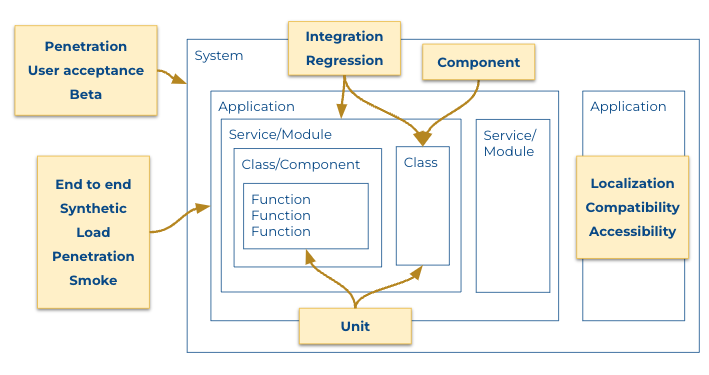
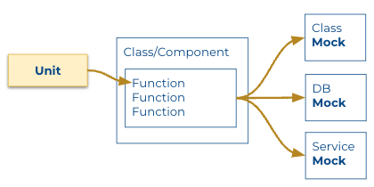
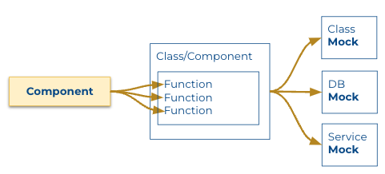
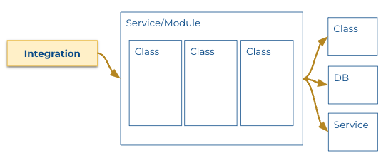
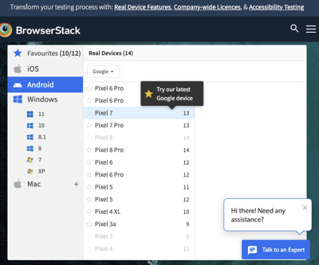
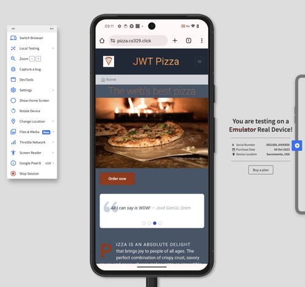
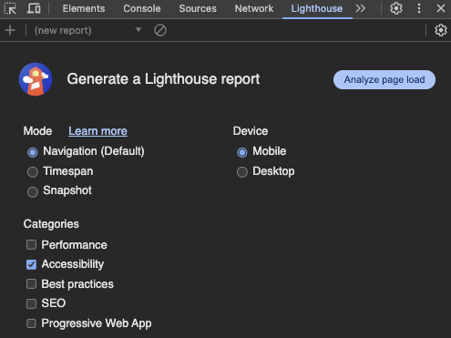
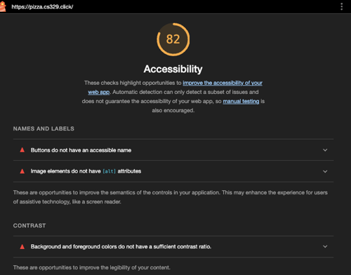
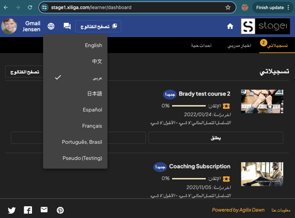
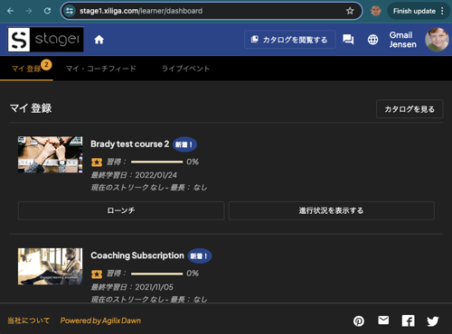

# Testing categories

🔑 **Key points**

- Understand the different categories of testing.
- Identify the appropriate testing strategy for any given scenario.

---

While the general goal of testing is to verify that code functions as intended, it is helpful to classify testing into specific categories. Each category utilizes different tools, has distinct limitations, and carries specific expectations. While the boundaries between these types can overlap, you should focus on the specific intent and value each category provides. The goal is to ensure comprehensive coverage without excessive duplication.



## Categories

### Unit

Unit testing verifies the correctness of an isolated, small piece of code, such as a single function or class. Unlike other models that focus on system integration or user experience, unit testing abstracts the target from its environment. This is typically achieved by using "mocks" or "fakes" to simulate inputs and the outputs of external dependencies.

Consider this unit test for a service endpoint:

```js
test('login', async () => {
  const loginRes = await request(app).put('/api/auth').send(testUser);
  expect(loginRes.status).toBe(200);
  expect(loginRes.body.token).toMatch(/^[a-zA-Z0-9\-_]*\.[a-zA-Z0-9\-_]*\.[a-zA-Z0-9\-_]*$/);

  const { password, ...user } = { ...testUser, roles: [{ role: 'diner' }] };
  expect(loginRes.body.user).toMatchObject(user);
});
```

In a unit test, you only validate that the endpoint correctly processes its input and returns the expected output. If the endpoint interacts with other components, services, or databases, those external dependencies are mocked.



A unit test focuses on the core logic of the code without being tied to external factors that might cause "flaky" tests or maintenance issues. Ideally, a test should fail only if the **unit** no longer fulfills its primary responsibility—not because of network timing, database state, or external data changes.

### Component

Component testing expands the scope of unit testing by verifying that a group of units works together as a cohesive whole. Using the endpoint example, a component test would ensure that everything within a specific class or module functions correctly. This often involves calling multiple related endpoints to ensure that shared state is updated properly. 

For instance, while a unit test verifies that the login endpoint works in isolation, a component test ensures that the entire authorization flow (login, register, logout, and delete user) works correctly together.



External entities are still mocked, but the entire component is extensively exercised.

### Integration

Integration testing shifts the focus to how different services or modules interact. It ensures that the system remains consistent across boundaries. For example, instead of testing just the authorization component, you might test a complete workflow: Can a user register, make a purchase, log out, log back in, check their order status, and contact support?



At this level, you typically remove many of the mocks used in unit or component testing. Verifying that a database actually persists data or that a dependent service responds to a real request is a vital part of integration testing.

### Regression

Before automated testing became standard, developers often modified code and then performed manual "spot checks" to ensure they hadn't broken existing features. When a change inadvertently breaks existing functionality, it is called a **regression**. 

Automated regression testing is achieved by maintaining a suite of component and integration tests that run whenever code changes. This suite provides a safety net, giving developers the confidence to refactor or add features without fear of breaking the system. A robust regression suite can significantly reduce the need for manual quality assurance (QA) cycles.

### End-to-end (E2E)

End-to-end testing exercises the entire application stack from the user's perspective. This includes front-end interfaces, back-end services, third-party integrations, and infrastructure like databases and caches.

E2E tests are highly authentic because they use very few mocks. However, they can be difficult to use with Test-Driven Development (TDD) because they operate at a much higher level than the specific feature being implemented. They also tend to be slower and require more maintenance than unit or integration tests. Despite these challenges, E2E testing is the only way to be fully confident that the application works for a real user.

### Synthetic

Synthetic testing is similar to E2E testing but focuses on simulating specific user behaviors. This is often used for load testing or smoke testing.

Effective synthetic testing covers common user paths, such as authenticating, making purchases, or updating profiles. If you do not simulate real customer behavior, you become reliant on customers to report when the application fails to meet their needs. One effective way to generate synthetic tests is to analyze application logs and "play back" sequences of real user requests.

### Load

Load testing leverages synthetic tests to create a high volume of traffic, representing hundreds or thousands of concurrent users. The goal is not necessarily to assert functional correctness, but to ensure the system remains stable under stress and scales elastically as demand increases.


You will explore this topic in detail later in the course.

### Penetration

Penetration testing is the opposite of synthetic testing. While synthetic testing emulates a normal user, penetration testing attempts to abuse the application in ways a normal user never would. The goal is to discover vulnerabilities—such as unauthorized data access, commerce exploits, or service disruptions—before an attacker can exploit them.

Failure to protect user data can lead to catastrophic consequences for a company. You will explore security and penetration testing in a dedicated module later in the course.

### Smoke

A smoke test is a brief, high-level synthetic test used to verify that an application is functioning at a basic level. These are typically run immediately after a production deployment. If the "smoke clears" (the test passes), the deployment is considered successful, and the team can proceed without rolling back.

### User acceptance (UAT)

User acceptance testing involves manual testing by actual users or stakeholders to ensure the software meets their requirements and expectations. This can be done through private beta releases or A/B testing, where different versions of a feature are exposed to different demographics to gather data on usability and effectiveness.

### Compatibility

Compatibility testing ensures that the application works across different versions, operating systems, and devices. This is particularly important for preventing data corruption during database schema changes or ensuring that mobile users have the same experience as desktop users.

For applications running on diverse hardware (like smart TVs or gaming consoles), compatibility testing can involve thousands of permutations. To manage this, companies often use "device farms" like [BrowserStack](https://www.browserstack.com/), which allow developers to run automated tests on thousands of real devices simultaneously.



The image below shows JWT Pizza running on a Google Pixel 8 via BrowserStack emulation.



💡 **Curiosity Project:** Fully exploring the current state of the art for automated compatibility testing would make an excellent project.

### Accessibility

Accessibility testing ensures that an application is usable by everyone, including people with visual, auditory, or motor impairments. In many jurisdictions, adhering to accessibility standards is a legal requirement. This includes supporting high-contrast themes, screen readers, and keyboard-only navigation.

The most common standard is the **Web Content Accessibility Guidelines (WCAG)**, which organizes requirements into four categories: Perceivable, Operable, Understandable, and Robust.

You can test accessibility using Google Chrome’s **Lighthouse** utility:
1. Open the `Lighthouse` tab in Chrome DevTools.
2. Select **Accessibility**.
3. Click `Analyze page load`.



Lighthouse provides a score and actionable suggestions for improvement.



💡 **Curiosity Project:** Accessibility testing is an emerging and vital field. Researching advanced accessibility automation could be a great focus for your project.

### Localization

In a global market, applications must conform to local expectations, including language, date/time formats, and cultural nuances. For example, some languages (like Arabic) require right-to-left (RTL) layouts.



Supporting localization requires significant testing to ensure translations are accurate and the UI remains functional across different languages (like Chinese, shown below).



This often requires a mix of automated UI testing and manual QA by native speakers to ensure the application is culturally and idiomatically appropriate.

### Beta and Alpha

**Beta testing** involves giving a select group of external users early access to the application. In exchange for early access, beta testers provide feedback and help identify bugs that weren't caught in internal testing. For beta testing to be effective, developers must collect detailed logs and metrics.

**Alpha testing** occurs even earlier in the lifecycle, often using an application that is only partially functional. Alpha testing has become less common as teams move toward **Minimum Viable Products (MVPs)**, which aim to provide a stable, valuable experience even in the earliest releases.

### Black box and White box

- **Black box testing:** The tester has no knowledge of the internal code or architecture. They interact only with the public interfaces and documentation, much like an end user.
- **White box testing:** The tester has full access to the source code and internal systems. This allows for more thorough testing of internal logic and edge cases, though it requires more technical expertise and time.

## Testing JWT Pizza

In this course, you will apply these strategies to the JWT Pizza project:

1.  **Unit and Integration testing:** For the `jwt-pizza-service` and the MySQL database.
2.  **Unit and UI testing:** For the `jwt-pizza` frontend, mocking calls to the backend service.
3.  **Synthetic, Load, Chaos, and Penetration testing:** Performed on the production application to ensure resilience and security.

## Exercises


```masteryls
{"id":"c022b6e5-09b9-4fc6-a05a-e036d4e7c14d", "title":"Testing categories", "type":"essay" }
Compare and contrast **Unit** and **Integration** testing.
```
