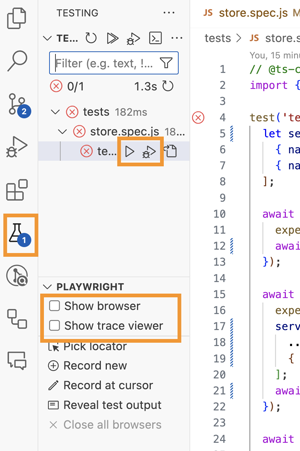

# UI Testing

https://playwright.dev/

[Best Practices](https://playwright.dev/docs/best-practices)

To get Playwright to run I followed the instructions in [cs260](https://learn.cs260.click/page/webServices/uiTesting/uiTesting_md). I did have to change the created file so use ES modules instead of Common modules. This was a simple change from the `required` syntax to the `import` syntax.

```js
const { defineConfig, devices } = require('@playwright/test');
import { defineConfig, devices } from '@playwright/test';
```

I also modified the config file to drop out the extra browsers and to specify the webServer to work with Vite on startup.

```js
  projects: [
    {
      name: 'chromium',
      use: { ...devices['Desktop Chrome'] },
    },
  ],

  /* Run your local dev server before starting the tests */
  webServer: {
    command: 'npm run dev',
    port: 5173,
    reuseExistingServer: true,
  },
```

## Install Playwright extension

> Playwright Test for VSCode
> v1.0.22
> Microsoft

This creates a little beaker icon in the tools



### Show browser and Trace viewer

These tools are great. They allow you to interactively see what the tests are doing.

## Writing tests

https://playwright.dev/docs/writing-tests

## Modify the tests

I then deleted the examples and modified the simple `example.spec.js` to be `store.spec.js` and to contain the following.

```js
// @ts-check
import { test, expect } from '@playwright/test';

test('testAddStoreButton', async ({ page }) => {
  let serverStoreJson = [
    { name: 'nyc', date: '2028-01-01' },
    { name: 'san diego', date: '2032-10-31' },
  ];

  // Mock out the server
  await page.route('*/**/api/store', async (route) => {
    expect(route.request().method()).toBe('GET');
    await route.fulfill({ json: { store: serverStoreJson } });
  });

  await page.route('*/**/api/store/provo', async (route) => {
    expect(route.request().method()).toBe('POST');
    serverStoreJson = [
      ...serverStoreJson,
      { name: 'provo', date: '2021-10-31' },
    ];
    await route.fulfill({ json: { store: serverStoreJson } });
  });

  await page.goto('http://localhost:5173/');
  await expect(page).toHaveTitle('DevOps Demo');

  // add a new store
  await page.locator('css=input').fill('provo');
  const addStoreBtn = page.getByRole('button', { name: 'Add' });
  await addStoreBtn.click();
  const storeTable = page.getByRole('cell', { name: 'provo' });
  await expect(storeTable).toHaveText('provo');
});
```

## Install Browser

Because I didn't install any browsers on startup I had to do that before the tests would run.

Press `Shift+Command+P` to open the Command Palette in VSCode, type 'Playwright' and select 'Install Playwright Browsers'.

I only selected Chromium.

I then went to the VS Code test extension and ran the tests.

## Debugging Playwright

https://playwright.dev/docs/debug

## Other UI testing libraries

https://www.accelq.com/blog/ui-testing-tools/

### React Testing Library

Alternatives to Playwright include using Jest with the [react testing library](https://medium.com/expedia-group-tech/ui-testing-with-react-testing-library-and-jest-f3bd9d4ec2ea).
