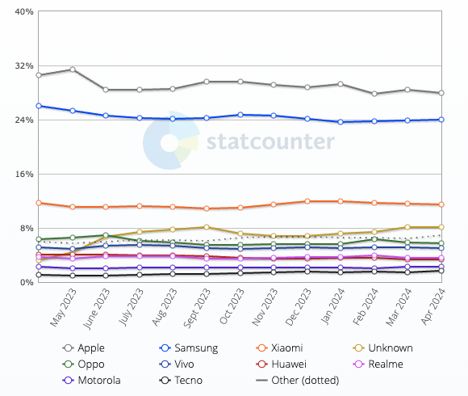
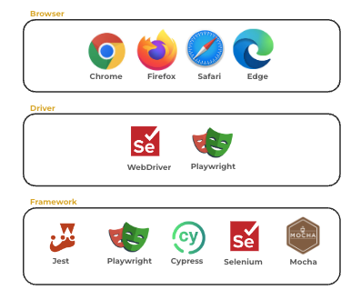

# UI Testing

🔑 **Key points**

- UI testing is a critical component of a modern application testing strategy.
- The diversity of devices, operating systems (OS), and browsers creates a complex testing matrix.
- The testing stack is composed of browsers, drivers, and frameworks.
- Flakiness is a significant challenge in UI automation.

---

UI testing involves emulating user interactions with an application and asserting that it responds correctly. This includes authenticating users, guiding them through various workflows, and verifying that they can achieve their desired results.

UI tests are among the most valuable tests in a suite because the UI is the top layer of the application stack and the primary interface for users. However, for UI testing to provide full value, it must integrate with the underlying architecture during execution to represent realistic usage. It is not enough to simply verify that a home page loads; tests must validate that vital navigation elements are functional and that user data renders correctly.

## The difficulties of UI testing

No one understands the difficulty of browser-based testing better than the companies that build the browsers themselves. They must test every possible combination of HTML, CSS, and JavaScript. Because manual testing cannot scale to this level of complexity, browser vendors implemented "hooks" that allow browsers to be controlled by automated external processes. 

[Selenium](https://www.selenium.dev/) was introduced in 2004 as the first popular tool for browser automation. However, Selenium is often associated with being "flaky" and slow. **Flakiness** refers to a test that fails in unpredictable, non-reproducible ways. When a pipeline requires thousands of tests to pass before a feature can be deployed, even a small percentage of flakiness becomes a major bottleneck. If those tests also take hours to run, development velocity decreases significantly.

Testing UI code in a web browser is significantly harder than testing backend code. Backend code typically runs in a predictable server environment with little execution variance. In contrast, browser-based code must be executed within a specific rendering engine while simulating complex human interactions like mouse movements, touch gestures, and keyboard input.

#### Device, browser, and OS explosion

UI testing is further complicated by the vast array of browsers and devices. According to StatCounter, global mobile vendor usage for 2023–2024 shows Android and Apple splitting the majority of the market nearly evenly.



> _Source: [StatCounter](https://gs.statcounter.com/vendor-market-share/mobile/worldwide)_

In addition to hardware diversity, testers must account for different browsers. Each browser has unique behaviors and rendering characteristics influenced by the host operating system. As of February 2024, browser usage statistics are as follows:

| Browser | Percentage |
| ------- | ---------- |
| Chrome  | 65%        |
| Safari  | 18%        |
| Edge    | 5%         |
| Firefox | 3%         |

> _Source: [SimilarWeb](https://www.similarweb.com/browsers/)_

## Browser drivers

Browser drivers act as the bridge between your test scripts and the web browser environment. These tools simulate user interactions—such as clicking buttons, filling out forms, and navigating pages—acting as the "invisible hands" that execute tests within a real browser.



Currently, the most common browser drivers are based on the W3C [WebDriver](https://www.w3.org/TR/webdriver2/) specification. This standard was derived from the original Selenium project. Many modern testing frameworks use the Selenium WebDriver as their foundation. Other drivers follow the WebDriver specification for specific browsers, including SafariDriver, OperaDriver, and FirefoxDriver.

Alternatively, the Playwright framework interacts directly with browser-level APIs for all major engines, including WebKit (Safari), Chromium (Chrome/Edge), and Firefox. This approach is designed to execute tests faster and with higher reliability.

### Running headless

Drivers typically allow you to execute tests in either **visual** (headed) or **headless** mode. In headless mode, the application does not render a visible UI, allowing tests to run significantly faster and consume fewer resources. However, when developing or debugging tests, visual mode is useful for observing the execution in real-time.

## Testing frameworks

There are many UI testing frameworks available, each with different strengths.

| Tool       | Pros                                                                                                                                           | Cons                                                                               | Driver                                        |
| ---------- | ---------------------------------------------------------------------------------------------------------------------------------------------- | ---------------------------------------------------------------------------------- | --------------------------------------------- |
| Jest       | Popular for JavaScript projects; integrates with React Testing Library; supports snapshot testing for visual regressions.                       | Primarily designed for JavaScript-based component testing.                         | Selenium WebDriver (via integrations)         |
| Cypress    | Easy to learn with a visual test runner; offers "time travel" debugging to inspect state at any step.                                          | Focused on end-to-end testing; can be difficult to use for complex unit scenarios. | Chrome DevTools Protocol                      |
| Playwright | Built for modern web apps; natively supports multiple browsers; includes a code recorder for rapid test creation.                             | Requires proficiency in JavaScript, Python, Java, or .NET.                         | Native calls to Chromium, WebKit, and Firefox |

## Writing tests

Testing frameworks provide various methods for authoring tests, including custom scripting languages, visual interaction recorders, or standard programming languages like JavaScript and C#. The choice of language and framework significantly impacts the performance, maintainability, and capabilities of the test suite.

The following example demonstrates a test written in JavaScript using the Playwright framework:

```js
import { test, expect } from '@playwright/test';

test('addStore', async ({ page }) => {
  // Mock out the service endpoints
  let mockServiceData = [
    { name: 'nyc', date: '2028-01-01' },
    { name: 'san diego', date: '2032-10-31' },
  ];

  await page.route('*/**/api/store', async (route) => {
    expect(route.request().method()).toBe('GET');
    await route.fulfill({ json: { store: mockServiceData } });
  });

  await page.route('*/**/api/store/provo', async (route) => {
    expect(route.request().method()).toBe('POST');
    mockServiceData = [...mockServiceData, { name: 'provo', date: '2021-10-31' }];
    await route.fulfill({ json: { store: mockServiceData } });
  });

  // Initiate page loading
  await page.goto('http://localhost:5173/');
  await expect(page).toHaveTitle('DevOps Demo');

  // Add a new store by interacting with the UI
  await page.locator('css=input').fill('provo');
  const addStoreBtn = page.getByRole('button', { name: 'Add' });
  await addStoreBtn.click();

  // Verify the new store appears in the table
  const storeTable = page.getByRole('cell', { name: 'provo' });
  await expect(storeTable).toHaveText('provo');
});
```

## Flakiness

Browser-driven testing is inherently susceptible to flakiness due to the complexity of simulating human behavior across diverse environments. Flaky tests intermittently pass or fail without code changes, which slows down development and erodes trust in the CI/CD pipeline. 

To combat flakiness:

- **Eliminate synchronization issues:** Ensure tests explicitly wait for elements to be visible or actionable before interacting with them.
- **Use robust selectors:** Avoid fragile CSS paths; use data attributes or accessible roles that are less likely to change during UI refactors.
- **Minimize external dependencies:** Use mocking or stubbing to prevent tests from failing due to network instability or third-party service outages.

## ☑ Exercise


```masteryls
{"id":"8de29cc1-603b-4f49-bc02-481a9939d02b","title":"Purpose of Browser-Driven UI Testing","type":"multiple-choice"}
What is the primary reason for performing UI testing that directly drives a web browser rather than relying solely on unit or integration tests?

- [ ] It significantly reduces the overall execution time of the test suite because browsers can process JavaScript faster than isolated runtime environments.
- [ ] It is the most efficient method for achieving 100% code coverage across the backend's internal business logic and database schemas.
- [x] It validates the entire application stack from the user's perspective, ensuring that the frontend, backend, and environment integrate correctly.
- [ ] It allows developers to bypass the user interface to test private server-side methods that are not exposed to the network.
```
