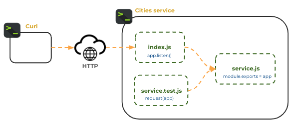

# Unit testing: JWT Pizza Service

🔑 **Key points**

- Write tests against the JWT Pizza service.
- Compute your coverage.
- Run linting analysis.

---

Now that you have the JWT Pizza Service in your hands you can start to assure its quality by writing unit tests. As part of your testing you will generate a coverage report. Later you will add coverage thresholds, so that if the coverage requirements of your tests do not meet the required thresholds, then an error is generated.

If you haven't already done so, make sure you fork the [jwt-pizza-service](../jwtPizzaService/jwtPizzaService.md) repository and clone it to your development environment.

Within your fork of the jwt-pizza-service repository, follow the previous instruction and install the [Jest](../jest/jest.md) testing framework.

```sh
npm install -D jest supertest
```

```json
  "devDependencies": {
    "jest": "^29.7.0",
    "supertest": "^6.3.4"
  }
```

In order to test service endpoints you need to decompose the creation of the Express app from the use of it for serving HTTP requests or running tests.



This is already done in `jwt-pizza-service` and so you don't need to worry about it, but you should clearly understand the implications of the pattern. The `service.js` file creates the Express app and exports it. The `index.js` file then uses the app to listen for HTTP requests. The `service.test.js` file uses the app to run tests.

## Coverage

Add the Jest config file, `jest.config.json`, so coverage is turned on.

```json
{
  "collectCoverage": true,
  "coverageReporters": ["json-summary", "text"]
}
```

This requests the generation of different coverage reports. The `text` report generates a summary that is output to the console window. The `json-summary` report is created in the `coverage` directory and contains a JSON representation of the coverage information.

Note that the `.gitignore` file ignores the `coverage` directory so that the resulting coverage reports don't get added to GitHub.

## NPM test script

Add the `test` script to `package.json` so that it knows to use Jest for testing.

```json
  "scripts": {
    "run": "node index.js",
    "test": "jest"
  },
```

## Creating a simple test

Now that you have set up jwt-pizza-service to be tested with Jest, you can make sure it is all working right by writing a simple test. Create a file named `authRouter.test.js` in the `src/routes` directory and place the following `hello world` test in file.

```sh
test('hello world', () => {
  expect('hello' + ' world').toBe('hello world');
});
```

Now execute the test by either using the VS Code Jest extension or by opening up a command console and running `npm test`. If you run it from the command console you should see the following result.

```sh
➜  npm test

 PASS  src/routes/authRouter.test.js
  ✓ hello world (1 ms)

----------|---------|----------|---------|---------|-------------------
File      | % Stmts | % Branch | % Funcs | % Lines | Uncovered Line #s
----------|---------|----------|---------|---------|-------------------
All files |       0 |        0 |       0 |       0 |
----------|---------|----------|---------|---------|-------------------
Test Suites: 1 passed, 1 total
Tests:       1 passed, 1 total
```

This is not very interesting from a coverage perspective, but it does demonstrate that you are configured correctly.

Make sure you commit and push your code at this important milestone.

## Mocking dependencies

Before we can write a test that actually uses the functionality of the JWT Pizza Service we need to think about the service's dependencies. In this case it is the MySQL database. We have a choice here:

1. **Unit test**: Mock out the the database dependency such that the service doesn't actually call the database.
1. **Component test**: Let the service call the MySQL database so that we can actually test that our SQL syntax is correct.

The downside of component testing is that it complicates the test setup and potentially increases the time the test takes to execute. The downside of a pure unit test is that it doesn't actually test a core part of what the code is doing. You don't actually have any assurance that service can persist data correctly.

For the JWT Pizza Service you will setup a MySQL database that your service code calls and use component testing to validate the interaction between the service and the database.

## Write a real test

Now you get to start writing all the tests necessary to get at least 80% coverage of the `jwt-pizza-service` code. You should review everything you learned in the following instruction topics before proceeding.

- [Jest](../jest/jest.md)
- [Service Testing](../serviceTesting/serviceTesting.md)

Let's write the first test together. Replace the `hello world` test found in `src/authRouter.test.js` with the following.

```js
const request = require('supertest');
const app = require('../service');

const testUser = { name: 'pizza diner', email: 'reg@test.com', password: 'a' };
let testUserAuthToken;

beforeAll(async () => {
  testUser.email = Math.random().toString(36).substring(2, 12) + '@test.com';
  const registerRes = await request(app).post('/api/auth').send(testUser);
  testUserAuthToken = registerRes.body.token;
});

test('login', async () => {
  const loginRes = await request(app).put('/api/auth').send(testUser);
  expect(loginRes.status).toBe(200);
  expect(loginRes.body.token).toMatch(/^[a-zA-Z0-9\-_]*\.[a-zA-Z0-9\-_]*\.[a-zA-Z0-9\-_]*$/);

  const { password, ...user } = { ...testUser, roles: [{ role: 'diner' }] };
  expect(loginRes.body.user).toMatchObject(user);
});
```

In this code the `beforeAll` function registers a random user every time the tests run. You can use the user and its associated authorization token for tests that require an existing registered user.

The `login` test logs the test user in and verifies that it gets back an authorization token along with the expected user information.

This one test should bump your line coverage up to **40%**. Only 40% more to go. You can verify this by running the test.

```sh
➜  npm test

 PASS  src/routes/authRouter.test.js
  ✓ login (70 ms)

---------------------|---------|----------|---------|---------|------------------------------------------------------
File                 | % Stmts | % Branch | % Funcs | % Lines | Uncovered Line #s
---------------------|---------|----------|---------|---------|------------------------------------------------------
All files            |   42.69 |    25.64 |    32.2 |   43.14 |
 src                 |   81.08 |       50 |    37.5 |   80.55 |
  config.js          |     100 |      100 |     100 |     100 |
  endpointHelper.js  |   66.66 |      100 |   66.66 |      60 | 3-4
  service.js         |   83.33 |       50 |      20 |   83.33 | 26,34,41,48-49
 src/database        |   32.62 |    36.36 |   39.28 |   32.79 |
  database.js        |   31.89 |    36.36 |   39.28 |   32.06 | 13-28,42-44,64,79-95,110-276,284,293-297,335-336,342
  dbModel.js         |     100 |      100 |     100 |     100 |
 src/model           |     100 |      100 |     100 |     100 |
  model.js           |     100 |      100 |     100 |     100 |
 src/routes          |   45.52 |    14.63 |   21.73 |   47.05 |
  authRouter.js      |   56.36 |    31.57 |   45.45 |   58.49 | 45-52,60-63,72,96-97,106-114,125-127,134
  franchiseRouter.js |   30.95 |        0 |       0 |    32.5 | 62,71-77,86-91,99-105,114-120,129-137
  orderRouter.js     |   46.15 |        0 |       0 |   46.15 | 47,56-62,71,80-91
---------------------|---------|----------|---------|---------|------------------------------------------------------
Test Suites: 1 passed, 1 total
Tests:       1 passed, 1 total
```

Now it is your turn. Keep writing tests until you have at least 80% coverage.

## Hints for writing service tests

### Creating unique objects

You will create a lot of test objects (e.g. users, menu items, franchises) as part of your tests. It is convenient to have a function that will create a unique random name for these objects.

```js
function randomName() {
  return Math.random().toString(36).substring(2, 12);
}
```

### Creating an admin user

At some point in your testing you will need to have an administrator user in order to do things like create a franchise. You don't want to hardcode a user that you have created in your database because you shouldn't assume any preexisting data when creating a unit test. However, the JWT Pizza Service doesn't have an obvious way to bootstrap an admin user. You can overcome this by calling directly into the DB.addUser function. The DB.addUser function has no constraints and will let you create any user that you would like, including a user with a role of Admin.

```js
const { DB } = require('./database/database.js');

async function createAdminUser() {
  let user = { password: 'toomanysecrets', roles: [{ role: Role.Admin }] };
  user.name = randomName();
  user.email = user.name + '@admin.com';

  await DB.addUser(user);
  return user;
}
```

### Increasing the VS Code Jest debugging timeout

The default timeout for a Jest test is just a few seconds. That means it will timeout on you as you are debugging through the tests with VS Code. You can increase the timeout by setting a high value with the `jest.setTimeout` function. You can also wrap the timer increase in a check that only triggers if you are debugging with VS Code.

```js
if (process.env.VSCODE_INSPECTOR_OPTIONS) {
  jest.setTimeout(60 * 1000 * 5); // 5 minutes
}
```

## Linting

In addition to assuring the quality of the code with automated tests we also want to make sure that there isn't any lint in there. So let's install `eslint` and see what it reports.

We start by installing eslint as a development dependency. Review or follow the [lint instructions](../lint/lint.md) if you are unclear how to do this. Once this is done, you can run eslint from your command console.

```sh
npm run lint

/Users/lee/Desktop/demo/student-jwt-pizza-service/src/routes/authRouter.test.js
   6:1  error  'beforeAll' is not defined  no-undef
  11:1  error  'test' is not defined       no-undef
  13:3  error  'expect' is not defined     no-undef
...
```

This will spew out a bunch of errors. Most of them should be because we are using Jest, and we haven't told `eslint` about the types that Jest defines. You can correct this by modifying the `eslint.confg.mjs` file to include the Jest definitions.

```js
  { languageOptions: { globals: globals.jest } },
```

The config file should look something like this when you are done.

```js
import globals from 'globals';
import pluginJs from '@eslint/js';

export default [
  { files: ['**/*.js'], languageOptions: { sourceType: 'commonjs' } },
  { languageOptions: { globals: globals.node } },
  { languageOptions: { globals: globals.jest } },
  pluginJs.configs.recommended,
];
```

Now when you run `npm run lint` you should only see errors that are due to problems in your code or the `jwt-pizza-service` code. Go fix the problems you created until there are no linting errors.

## Reporting problems with JWT Pizza Service

If during the testing or linting process you discover problems with `jwt-pizza-service`, then you can open an issue or pull request on the repository to report them. This will help future students and also give you experience with this vital development process.
