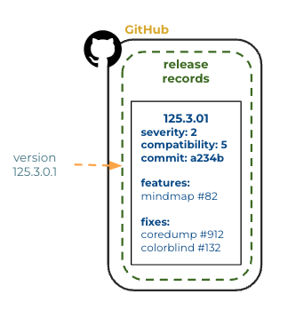
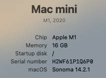
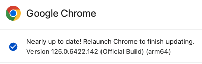
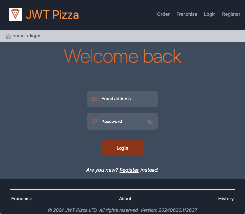
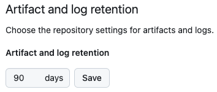

# Versioning

🔑 **Key points**

- Version identification is a critical component of any deployment architecture.
- Various schemes exist for representing versions, each serving different needs.

---

When building production software, it is vital to use version identifiers that uniquely represent each component used by a customer. A version ID allows you to identify exactly which code was in use when features were introduced, bugs were discovered, or failures occurred. Without a version ID, it is difficult to reproduce problems or confirm with certainty that a specific issue has been resolved.

The most critical requirement for a version ID is that it can uniquely reference an immutable copy of the deliverable package, the source code used to build it, or preferably both. Access to source code is necessary for debugging, especially in cases where it is impossible to reproduce the original deliverable package—such as when the CI workflow or build tools used at the time no longer exist.

If you cannot reliably correlate a customer's experience with the specific code changes that caused that behavior, the version ID loses much of its value.

A high-quality version ID is consistent in its representation and provides the following:

- Unique identification of the source codebase.
- Unique identification of the deliverable package.
- An indication of when the version was created.
- A description of the magnitude of the change.
- A link to a detailed description of the changes.
- Comparability to other version IDs.

## Supplemental information

Including every detail in a single version ID is impossible. Instead, a version ID should contain a reasonable amount of information while remaining concise. You then use that ID to reference more detailed supplemental information, such as:

- The storage location of the production package.
- The source code repository ID (e.g., a Git commit hash).
- Deployment documentation describing what changed and the impact on the customer.
- The accessibility of the version (e.g., public, internal, or restricted to specific parties).
- Metrics and logs associated with the testing of that version.



## Version schemes

There are many ways to represent the history and contents of a software deliverable within a concise ID. The following sections describe some of the most common methods.

### Incremental versioning

A simple scheme for version IDs is to increment a number sequentially each time a candidate production package is built. This ID conveys only the order of releases. While this approach is easy to understand and represent in almost any context, it provides little inherent meaning. You must correlate the number to an external table or database to understand the scope or content of the changes.

### Semantic versioning

A widely used scheme is Semantic Versioning (SemVer), which follows a `major.minor.patch` syntax. Each segment is a number that increments based on the type of change:

- **Major**: Incremented for incompatible API or feature changes.
- **Minor**: Incremented for backward-compatible feature additions.
- **Patch**: Incremented for backward-compatible bug fixes.

For example, `3.4.0` represents the fourth feature improvement of the third major release. A subsequent version of `3.4.1` would indicate a bug fix that maintains backward compatibility. This scheme focuses on release order and the potential disruptiveness of the update.

### Date versioning

Date-based versioning focuses on when the production package was created. A common syntax is `YYYY.MMDD.HHmmSS`. For example:

```txt
2052.0212.121011
```

This clearly conveys the age of the package and is easily comparable to other deployments to determine which is newer. However, it does not describe the magnitude of the changes or the purpose of the release.

### Referential versioning

This scheme uses an identifier from another system, such as a Git SHA or a Jira ticket ID. This makes it easy to correlate the version with a system that holds significant metadata. For instance, a Git SHA points to the exact source code, associated pull requests, CI pipeline results, and the contributors involved.

The downside of referential versioning is that the ID itself lacks human-readable information. Without looking it up in the external system, you cannot determine the release order or the scope of the changes.

## Examples

#### Apple macOS

Apple uses a semantic versioning structure for its operating system versions, following the `major.minor.patch` format.



#### Google Chrome

[Chrome](https://www.chromium.org/developers/version-numbers/) uses a four-part versioning scheme. In addition to the standard major, minor, and patch segments, it includes a sequential build number. In Chrome's case, the patch number represents a release candidate rather than a simple bug fix. For example, a version might indicate the 6,422nd build of Chrome with 142 candidate releases.

Note that while the version number is concise, the "About" screen includes supplemental information such as the build type (e.g., "Official Build") and the system architecture.



#### Agilix Dawn

This software display represents three related version identifiers. First is a date version representing the build time, followed by two component versions that reference specific repository commit IDs. This allows developers to quickly see how recent a release is while maintaining a direct link to the exact code in the server and client repositories.

```json
{
  "version": {
    "app": "2024.0620.001306",
    "client": "f9a9165864c306e06626aaa43a72201b6b734248",
    "server": "fc28cca97d54e80bebcc0b270d0b9e361c5815a1"
  }
}
```

## JWT Pizza versions

JWT Pizza uses a date-based versioning scheme with the date in the first segment and the time in the second, using UTC. This version is stored in a `version.json` file in the root of the source code and is displayed in the footer of the application.

```sh
➜  curl -s https://pizza.cs329.click/version.json | jq '.'
{
  "version": "20240620.112637"
}
```



While a date does not inherently point to a Git commit, it makes it easy to find the specific CI execution that occurred at that time, which in turn provides the Git SHA for that version.

### Package archive

By configuring a GitHub Actions pipeline, you can create artifacts that represent the specific binaries deployed for a version.

For example, adding a step to upload an artifact allows you to retrieve the exact files that were deployed:

```yml
- name: Update pages artifact
  uses: actions/upload-artifact@v4
  with:
    name: package
    path: dist/
```

Note that GitHub stores these artifacts according to your repository's retention policy (90 days by default). This setting is located in `Settings > Actions > General`.




```masteryls
{"id":"44106e2a-8351-4227-b6db-2e572380e89b", "title":"Versioning", "type":"essay" }
Describe a software versioning method along with the pros and cons.
```
