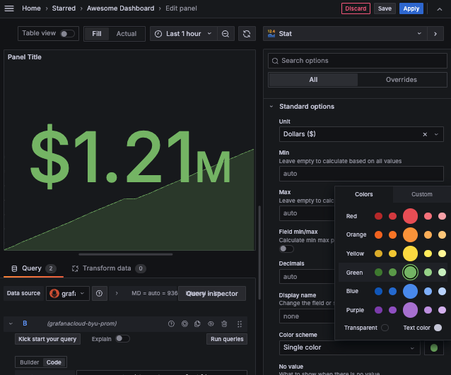
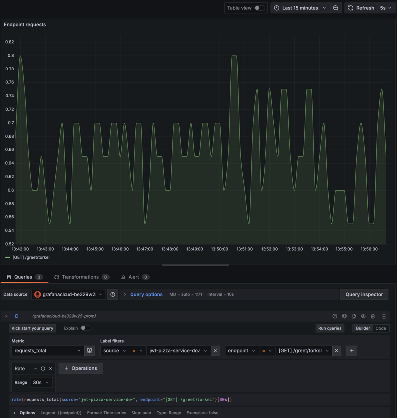
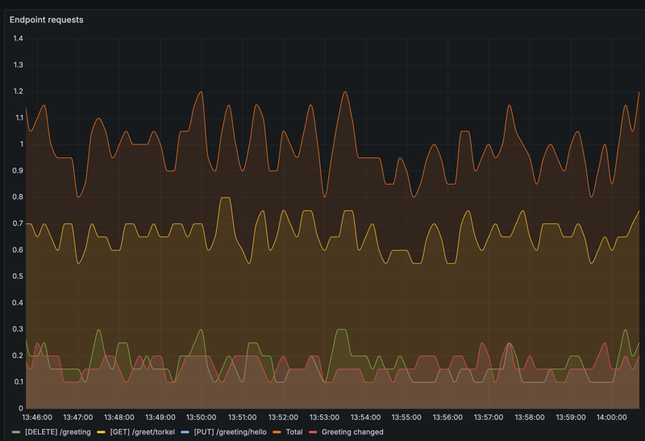
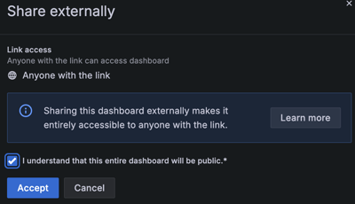
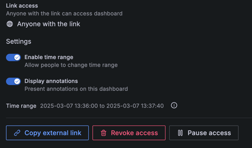
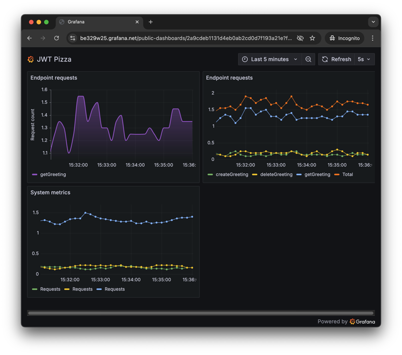

# Visualizing metrics

🔑 **Key points**

- Experiment with creating visualizations based on generated data.

---

Inserting and visualizing metrics can take some time to get comfortable with. You should spend time both inserting data and experimenting with the visualization options that have made Grafana so popular.



For this course we mainly focus on visualizing service metric and so let's carefully walk through the basic concepts you are going to need in order to build your JWT Pizza dashboard.

## A simple web service

Let's start by creating a simple web service that has a single endpoint.

1. Open your command console.
1. Execute the commends:

   ```sh
   mkdir metricsExample && cd metricsExample
   npm init -y
   npm install express
   ```

1. Modify the `package.json` file to include a start script.

   ```json
     "scripts": {
       "start": "node index.js"
     },
   ```

1. Create a `config.js` file to include your Grafana credentials just like you did in the [Grafana Metrics](../grafanaMetrics/grafanaMetrics.md#generating-data-with-javascript) instruction.
1. Create a `metrics.js` file that uses a similar `sendMetricToGrafana` that we created earlier. The difference is that it has some extra parameters that allow us to track each HTTP method type.

   ```js
   const config = require('./config');

   const requests = {};

   function track(endpoint) {
     return (req, res, next) => {
       requests[endpoint] = (requests[endpoint] || 0) + 1;
       next();
     };
   }

   // This will periodically send metrics to Grafana
   const timer = setInterval(() => {
     Object.keys(requests).forEach((endpoint) => {
       sendMetricToGrafana('requests', requests[endpoint], { endpoint });
     });
   }, 10000);

   function sendMetricToGrafana(metricName, metricValue, attributes) {
     attributes = { ...attributes, source: config.source };

     const metric = {
       resourceMetrics: [
         {
           scopeMetrics: [
             {
               metrics: [
                 {
                   name: metricName,
                   unit: '1',
                   sum: {
                     dataPoints: [
                       {
                         asInt: metricValue,
                         timeUnixNano: Date.now() * 1000000,
                         attributes: [],
                       },
                     ],
                     aggregationTemporality: 'AGGREGATION_TEMPORALITY_CUMULATIVE',
                     isMonotonic: true,
                   },
                 },
               ],
             },
           ],
         },
       ],
     };

     Object.keys(attributes).forEach((key) => {
       metric.resourceMetrics[0].scopeMetrics[0].metrics[0].sum.dataPoints[0].attributes.push({
         key: key,
         value: { stringValue: attributes[key] },
       });
     });

     fetch(`${config.url}`, {
       method: 'POST',
       body: JSON.stringify(metric),
       headers: { Authorization: `Bearer ${config.apiKey}`, 'Content-Type': 'application/json' },
     })
       .then((response) => {
         if (!response.ok) {
           console.error('Failed to push metrics data to Grafana');
         } else {
           console.log(`Pushed ${metricName}`);
         }
       })
       .catch((error) => {
         console.error('Error pushing metrics:', error);
       });
   }

   module.exports = { track };
   ```

1. Create an `index.js` that contains your simple demonstration service. Every time an HTTP request is made to the service it will increment the total request count.

   ```js
   const express = require('express');
   const app = express();

   const metrics = require('./metrics');
   let greeting = 'hello';

   app.use(express.json());

   app.get('/hello/:name', metrics.track('getGreeting'), (req, res) => {
     res.send({ [greeting]: req.params.name });
   });

   app.listen(3000, function () {
     console.log(`Listening on port 3000`);
   });
   ```

## Generate data

With the service created you can now start it running.

```sh
npm run start
```

And use a Curl command to repeatedly hits the **getGreeting** endpoint.

```sh
while true; do curl localhost:3000/hello/Torkel; sleep 1; done;
```

## Create the visualization

Now that you are generating data for your web service you can create a visualization to display the endpoint request count.

1. Go to your dashboard.
1. Create a new visualization.
1. Set the `Query options` to display on a **Min interval** of 10s.
1. Select the `requests_total` metric with a label filter of `endpoint` equal to `getGreeting`.
1. Add an operation with a `Rate` **Range function** with a **Range** of 30s.
1. Change the legend options to be custom with a value of {{endpoint}}.
1. Experiment with the visualization options to make the graph more appealing.



## ☑ Exercise

At this point you should have a pretty good idea of how to create a Grafana dashboard that displays a simple request count metric as generated from JavaScript. Now it is time to take it to the next level. Do the following:

1. Modify the service code to:
   1. Provide a POST endpoint that sets the greeting.
      ```sh
      [POST] /greeting/:greeting
      ```
   1. Provide a DELETE endpoint that resets the greeting back to the default.
      ```sh
      [DELETE] /greeting
      ```
1. Use the [generateMetricTraffic.sh](exampleCode/generateMetricTraffic.sh) shell script to make requests to all the endpoints.
1. Change the visualization so that it shows a series for **each endpoint** as well as a **total** request count.

When you are done, you should have a dashboard that looks something like this:



## Make your dashboard public

In order to complete the assignment you need to make your dashboard public so that all of your adoring fans (i.e. the TAs) can admire it.

1. Navigate to your Grafana dashboard. If it says `Exit edit` in the top right corner then make sure you exit edit mode.
1. Click on the `Share` button and select **Share externally**.

   

1. Acknowledge the warning.

   

1. Enable the settings to allow people to change the time range and display annotations. **You must enable** this ability so that the TAs can grade your work.

   

1. Copy the external link.
1. Test the link by opening an incognito window and view the link.



> [!IMPORTANT]
>
> You will provide this URL for the Metrics and Logging deliverable. So make sure you keep track of how you get the URL and test that it works in an incognito window.
