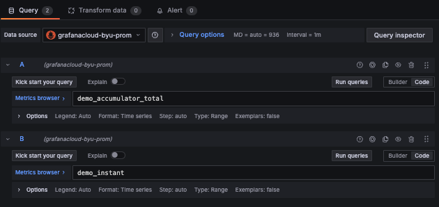
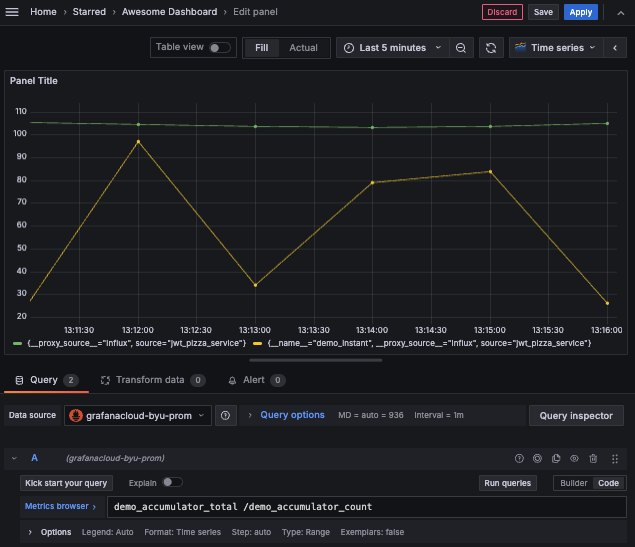
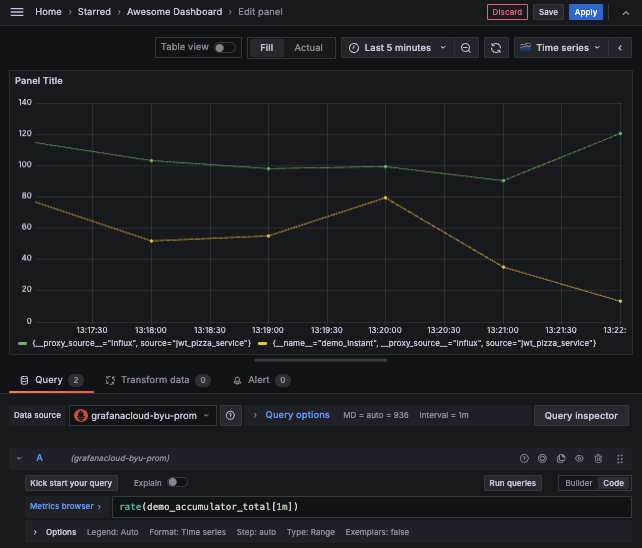
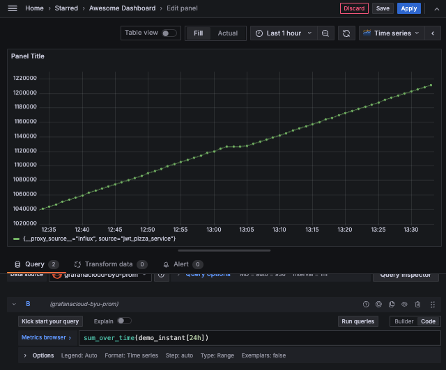
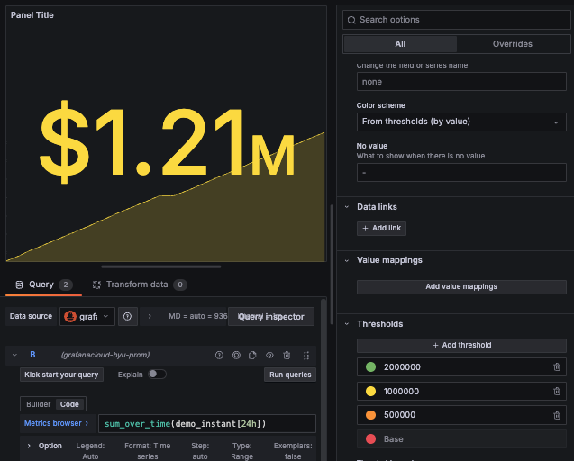

# Visualizing metrics

🔑 **Key points**

- Experiment with creating visualizations based on generated data.

---

Inserting and visualizing metrics can take some time to get comfortable with, so let's carefully walk through a demonstration in order to understand the basic concepts you are going to need in order to build your JWT Pizza dashboard.

## Demo data

We start by simplifying our generation of data to be three values.

| Name                   | Description                                                        |
| ---------------------- | ------------------------------------------------------------------ |
| demo_instant           | Random number between 1-100                                        |
| demo_accumulator_total | Accumulation total that increases by a random number between 1-200 |
| demo_accumulator_count | Number of times we have increased the accumulator total            |

### Generating data

We generate our data by creating a metric generation program ([metricsGenerator.js](visualizingMetricsExample/metricsGenerator.js)) that is similar to what was presented in the previous topic. Reuse the `config.json` settings that you created for your exploration with [Grafana Metrics](https://github.com/devops329/devops/blob/main/instruction/grafanaMetrics/grafanaMetrics.md#sending-metrics-from-code). This should looks something like:

```json
{
  "source": "jwt-pizza-service",
  "userId": 2222222,
  "url": "https://influx-prod-13-prod-us-east-0.grafana.net/api/v1/push/influx/write",
  "apiKey": "glc_111111111111111111111111111111111111111111="
}
```

This code sets a timer that triggers every second and supplies our metric values to Grafana Cloud.

```js
const config = require('./config.json');

accumulator = 0;
count = 0;

setInterval(() => {
  const instantValue = Math.floor(Math.random() * 100) + 1;
  sendMetricToGrafana('demo', 'instant', instantValue);

  count++;
  accumulator += Math.floor(Math.random() * 200) + 1;
  sendMetricToGrafana('demo', 'accumulator_total', accumulator);
  sendMetricToGrafana('demo', 'accumulator_count', count);
}, 1000);

function nowString() {
  return (Math.floor(Date.now()) * 1000000).toString();
}

function sendMetricToGrafana(metricPrefix, metricName, metricValue) {
  const metric = `${metricPrefix},source=${config.source} ${metricName}=${metricValue} ${nowString()}`;
  console.log(metric);

  fetch(`${config.url}`, {
    method: 'post',
    body: metric,
    headers: { Authorization: `Bearer ${config.userId}:${config.apiKey}` },
  }).catch((error) => {
    console.error('Error pushing metrics:', error);
  });
}
```

When you run the code you will see it dumping out the metrics that it is sending to Grafana.

```sh
demo,source=jwt-pizza-service instant=22
demo,source=jwt-pizza-service accumulator_total=73
demo,source=jwt-pizza-service accumulator_count=1
demo,source=jwt-pizza-service instant=32
demo,source=jwt-pizza-service accumulator_total=182
demo,source=jwt-pizza-service accumulator_count=2
demo,source=jwt-pizza-service instant=65
demo,source=jwt-pizza-service accumulator_total=191
demo,source=jwt-pizza-service accumulator_count=3
demo,source=jwt-pizza-service instant=3
demo,source=jwt-pizza-service accumulator_total=278
demo,source=jwt-pizza-service accumulator_count=4
demo,source=jwt-pizza-service instant=70
demo,source=jwt-pizza-service accumulator_total=368
demo,source=jwt-pizza-service accumulator_count=5
```

Go grab an apple 🍏 while you let this run for 15 minutes or so. This will give you some meaningful data to play with.

## Visualizing data in Grafana

Now you can open up your Grafana Cloud dashboard and create a new visualization. Make sure the `Data source` is set to your **grafanacloud-\*-prom** data source. Set the time window to be the **Last 5 minutes**.

Create two queries, with `demo_accumulator_total` for the first query, and `demo_instant` for the second query. Switch the input mode from `Builder` to `Code` so that we can just supply PromQL queries. However, if you prefer the `Builder` input mode better, you can stick with that and adapt the following instruction. You can also input PromQL queries before switching to `Builder` to view a breakdown of how they are constructed.



Press `Run queries`. This should display the data with the default **Time series** visualization.


Depending on how long it has been since you started generating data you should see the **instant** value hovering around 0 and the **count** value in the tens of thousands.

### Computing average metrics from totals

The `demo_accumulator_total` metric is going to keep on growing, which is fine if you want it to represent something like the total number of pizzas sold. However, if you want to represent the number of pizzas sold per some interval, then you need to divide it by the number of times the metric has been increased. That is where the `demo_accumulator_count` metric comes into play. We can use that to figure out the average value of the accumulator at each interval represented in the visualization. You can do this by changing the query for the accumulator to be `demo_accumulator_total / demo_accumulator_count`. Now the visualization displays with the current value of the instant metric and the average at each interval for the accumulator metric.



However, this isn't quite what we want. The average that is computed at each interval is the total average since the accumulator started. This will smooth out spikes in the accumulator that occur at a specific interval, and the longer the accumulator gathers data, the less any specific interval change will be represented.

What we really want is to compute the average change within an interval itself. This works because the accumulator increases monotonically, so you can pick any range of values, calculate the difference, and then divide by the number of data points in the range. This is basically what we were doing manually with the **accumulator_count** metric, but by using the PromQL `rate` function we no longer need to track the count ourselves and we can compute it for any range.

| function                     | description                                                                                                                                                                                                                                                                                                                                                           | example                          |
| ---------------------------- | --------------------------------------------------------------------------------------------------------------------------------------------------------------------------------------------------------------------------------------------------------------------------------------------------------------------------------------------------------------------- | -------------------------------- |
| `rate(<expr>[<time range>])` | Calculates the per-second average rate of increase of the time series in the range vector. Breaks in monotonicity (such as counter resets due to target restarts) are automatically adjusted for. Also, the calculation extrapolates to the ends of the time range, allowing for missed scrapes or imperfect alignment of scrape cycles with the range's time period. | rate(demo_accumulator_total[1m]) |

Go ahead and change your query to use the rate function.

```sh
rate(demo_accumulator_total[1m])
```



### Computing totals from instant metrics

You can also reverse the process of averaging metrics from a total, and compute a total from a metric that is reported as instant values. Currently, the **instant** metric is reporting something like CPU % at this moment, current active users, or revenue for the past data collection. So assuming that **instant** represents revenue for the past data collection, you can figure out the total revenue for the past day by using the`sum_over_time` function.

```sh
sum_over_time(demo_instant[24h])
```

Make sure you hide the **accumulator** metric by pressing the 👁️ icon above the accumulator query.



This will show a steady inflow of cash. Things are looking good. However, since you just want to know how much you have made today, what you really want is a big green number. To do this you need to change the visualization found in the top right corner of the visualization from `Time series` to `Stat`. This will display the `Stat` options. Change the `Unit` to **Currency** and **Dollars ($)**. Change the `Color scheme` to **Single color** and select green.


You can also experiment with the threshold options found at the bottom of the list. Change the `Color scheme` back to **From thresholds (by value)** and then define thresholds for your desired daily revenue.



## Experiment

Grafana and Prometheus are very powerful, but it takes time to understand what they can do, how to properly provide metric data, and create impactful visualizations. Take some time to play around. Generate different data and experiment with both PromQL and the different visualizations.
