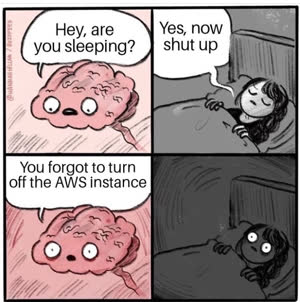

# Wrap up

We hope that you have enjoyed learning how to assure the quality of an application, deploy it to a production environment, and monitor its state. The concepts you have mastered from this instruction are the same ones that professional software engineers use on a daily basis.

Always remember to continually invest in your capabilities, collaboration, curiosity, creativity, and Christlike skills as you make the world a better place.

## Outcomes


```masteryls
{"id":"431d3154-c324-48e7-b2a4-da857e3281b1", "title":"Course Outcomes", "type":"likert", "showResults":"editor", "required":"true"}
Please take a moment and evaluate where you are currently with the course outcomes.

Scale: Beginner|Intermediate|Proficient|Advanced|Expert

| id | statement |
|----|-----------|
|Automation|**Automation**: Design and implement automated testing and delivery workflows, valuing disciplined practices that foster trust, quality, and continuous improvement.|
|Observability|**Observability**: Analyze software systems using evidence and metrics, cultivating intellectual humility and informed judgment.|
|Collaboration|**Collaboration**: Collaborate effectively with peers to improve software quality and delivery, developing habits of respect, accountability, and Christlike service.|
|Leadership|**Leadership**: Evaluate the practical and ethical implications of QA and DevOps decisions, strengthening integrity and responsible stewardship of technology and its impact on others.|
|Learning|**Learning**: Assess emerging tools and practices in quality assurance and DevOps, fostering lifelong learning, curiosity, and creativity while magnifying the ability to serve and bless others.|
```

## Clean up AWS

After everything has been graded, you should consider cleaning up your resources on AWS.



_Meme credit: [Reddit](https://www.reddit.com/r/ProgrammerHumor/comments/qbx03g/better_turn_off_aws_before_you_get_a_huge_bill/)_

- Delete your S3 buckets
- Terminate your CloudFront distribution
- Terminate your RDS instance
- Terminate your ECS cluster
- Delete your ECR registry
- Delete your CloudFormation stack
- Make sure you do not have auto-renew set for your domain name
- Delete the Route 53 hosted zone for your domain name
- Clean up your security group and key pair
- Check your bill to make sure you haven't missed anything

## ⭐ Assignment - Optional

Please take the time to provide us with honest feedback by responding to the university student ratings survey.

If you complete the student ratings survey you will receive bonus a 1% bonus towards your final grade. In order to receive the bonus, you must release your name as part of the survey so that I can see that you completed the survey. Note that releasing your name does not allow me to associate your response with your name. It only informs me that you completed the survey. Thanks in advance for helping to make the course better.
