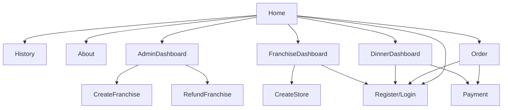

## Dates

- Stephen gone may 1-18
- Lee gone apr 29 - may 3, July 11-20

| Date   | Owner   | Action                                                                                 |
| ------ | ------- | -------------------------------------------------------------------------------------- |
| Apr 18 |         | Start work                                                                             |
| May 2  | Stephen | Grafana Research complete                                                              |
| May 17 | Lee     | Research complete                                                                      |
| May 22 | Lee     | Assignment definition complete                                                         |
| May 24 | Lee     | Pizza Shop code complete                                                               |
| May 24 | Stephen | Autograder design                                                                      |
| May x  | x       | Course repo definition complete                                                        |
| May x  | Lee     | Student example Phase 1 - UI Testing, Deploy to GitHub pages, with and without actions |
| May x  | Lee     | Student example Phase 2 - Cloudfront deploy with version increment                     |
| May x  | Lee     | Student example Phase 3 - Backend testing                                              |
| May x  | Lee     | Student example Phase 4 - Container lambda deployment, aurora setup                    |
| May x  | Lee     | Student example Phase 5 - Deployment strategies                                        |
| May 29 | Stephen | Student example Phase 6 - Logging, metrics, and load repo complete                     |
| May 31 | Stephen | Student example Phase 7 - load repo complete                                           |
| May x  | Lee     | Student example Phase 8 - Chaos injection                                              |
| May x  | Lee     | Student example Phase 9 - Pen testing                                                  |
| May x  | x       | Canvas creation complete                                                               |
| May x  | x       | Course repo complete                                                                   |
| Aug 28 | Lee     | Instruction written                                                                    |
| Sept 4 | Lee     | Slides written                                                                         |
| Sept 4 | Lee     | Videos created                                                                         |
| Aug 28 | Stephen | Autograder complete                                                                    |
| Sept 4 | All     | Go Live                                                                                |

## Stephen's Core Responsibilities

- [ ] K6, Grafana for logging and metrics
- [ ] Autograder
- [ ] Student solutions for all assignments
- [ ] Fix all of Professor Jensen's logic, grammar, and spelling errors

## Lee's Core Responsibilities

- [x] Pizza Shop code
- [x] Set up course version of backend server (ClassBE)
- [x] Set up JWT generation service (ClassJWT)
- [ ] Set up Chaos injection
- [ ] Instruction
- [ ] Videos
- [ ] Canvas
- [ ] Course repos
- [ ] Setup discord server

## PizzaShop

### Frontend sitemap

This should be enough complexity to demonstrate testing, coverage, and security.

### System architecture

- **PizzaShopUI**: The client app. Course provides all the code. The student deploys, writes tests, adds metric instrumentation, and logging.
- **StudentDB**: Student deploys a DB backend.
- **StudentBE**: Course provides all the code. The student deploys, writes tests, adds metric instrumentation, and logging.
- **ClassJWT**: Course provided JWT demonstrates what backend is asking for pizza JWT. This also allows for chaos injection.
  - Slow down how quickly it responds
  - Send a response that the Backend driver code uses to delete the database, or delete the DB data.
  - Return a failure saying that they need to request a new V2 Client token.
- **ClassBE**: Course provided Backend until the student deploys their own.
- **ClassDB**: Course provided DB until the student deploys their own.

## Autograder

- Hook into CAS
- Has DB for storing student info
- connection to canvas to adjust grades
- Simple UI to trigger grading
- Admin triggers for chaos injection
- TA Github account that the students must let be admin on their repo
- Late day calculation

## Phases

### Phase 1 - UI Testing and Simple Deployment

- [ ] TDD fibonacci
- [ ] Fork jwt-pizza
- [ ] Deploy to github pages by committing to the branch
  - **AG** check for ability to git classJWT pizza
- [ ] Deploy to github pages using a gitHub action
  - **AG** look at their actions history.
- [ ] Create UI Playwright tests
- [ ] Create coverage
- [ ] Add linting
- [ ] Build, test, and deploy using gitHub actions
  - **AG** look at their actions history to see if tests run and what coverage is

### Phase 2 - Cloud Deployment

- [ ] S3/ CloudFront. Manual deployment
- [ ] GitHub Actions deployment (CI with cloud)
  - **AG** - look at actions history. Checks cloud-front endpoint

### Phase 3

- [ ] Fork jwt-pizza-service
- [ ] Create service Jest tests
- [ ] Create coverage
- [ ] Add linting
- [ ] Build and test using gitHub actions
  - **AG** look at their actions history to see if tests run and what coverage is

### Phase 4

- Deploy Pizza shop backend
- Container
- **Assignment** - student autograder trigger run. Hit the Compute the JWT should have a different signature than the class backend
- Lambda
- **Assignment** - student autograder trigger run. Hit the Compute the JWT should have a different signature than the class backend

### Phase 5

- Deployment strategies - versioning (CI with keeping the system running)
- **Assignment** - student autograder run. Autograder trigger multiple deployments. Check that service is not disrupted. Version increasing. For A/B on param I get different versions. Canary - 5% given version A.

### Phase 6

- Metrics (Grafana)
- Logging
- **Assignment** - student autograder trigger run. Make automated requests and make sure logs and metrics show up.

### Phase 7

- E2E, end user testing, load testing (K6)
- **Assignment** - student autograder trigger run. Run their K6 tests from the autograder and make sure logs and metrics show up.

### Phase 8

- Chaos, alerts
- **Assignment** - autograder randomly starts triggers slowdown and failure. Monitor when the system comes back up.

### Phase 9

- Team penetration testing
- **Assignment** - Autograder auto assigning partners. attack each other's sites and write a report.
